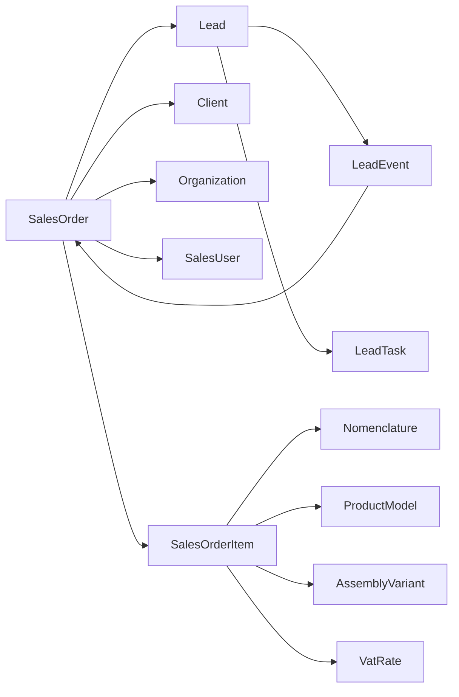

# Sport-Lead — Order card field links

**Code:** `SL-ORDER-CARD-FIELD-LINKS-v1`  
**Roadmap:** `3.5.1`  
**Route:** `/sales/orders/[id]`  
**Updated:** `2026-07-26`

## Purpose

Inventory every field shown on the customer order card and classify its platform link: live FK, joined display name, immutable snapshot, or demo/local until a later roadmap item.

## Entity graph

## Header / document fields

| UI field | Source | Link class | Platform target | Notes |
|----------|--------|------------|-----------------|-------|
| Number / title | `SalesOrder.number` / `title` | live | order row | |
| Status | `SalesOrder.status` | live | enum + `PATCH /orders/{id}/status` | Stage rail |
| Source lead | `SalesOrder.lead_id` | live FK | `/sales/leads/{id}` | Required |
| Client | `client_id` + `client_name` | live FK + joined name | Client; UI → `/sales/clients` (list; card `2.2.2`) | No dedicated client card yet |
| Organization | `organization_id` + `organization_name` | live FK + joined name | `/settings/organizations` | `PATCH .../organization` exists; display+link in `3.5.2` |
| Responsible | `responsible_id` + `responsible_name` | live FK + joined name | `SalesUser`; employees dir `2.4.2` | Name only until employees card |
| Amount / quantity / dates / source / category / sport / description | order columns | live | order row | Commercial totals also driven by items |
| Communications / notes / managers | local UI state + demo fixtures | demo-local | → `1.2.4` | Not persistent for API leads |
| Tasks panel | `LeadTask` via `lead_id` | live model / empty for API leads | Lead tasks | Order-scoped `order_id` deferred to `3.5.4` if needed |
| History | `LeadEvent` lead ∪ order | live | `GET /orders/{id}/history` | |

## Order line fields

| UI field | Source | Link class | Platform target |
|----------|--------|------------|-----------------|
| Nomenclature | `nomenclature_id` + `snapshot_name` | live FK + snapshot | Nomenclature / warehouse stock |
| Variant characteristics | `variant_snapshots` | snapshot | Characteristics catalog |
| Product model | `product_model_id` + article/name/size_type | live FK + snapshot | Product models (`6.1.*`); whitelist `6.1.11` |
| Assembly variant | `assembly_variant_id` + name/total | live FK + snapshot | `6.1.12` |
| Assembly operation lines | `assembly_operation_snapshots` | snapshot | Persisted; frontend map optional until Spec/TC |
| VAT | `vat_rate_id` + percent | live FK + snapshot | VAT rates directory |
| Qty / prices / discounts | commercial columns | live | Recalc service |

## Lead reuse notes (`3.2.5.7`)

- Model/assembly selection lives on the **order item**, not on the lead commercial block.
- Order card reuses PT-06-like workspace chrome (stage rail, communication column) after owner request `2026-07-26`; historical PT-07 migrate (`5.5.7` / `5.6.4`) remains closed — layout product revision is Stage **`3.5`**.
- Timeline merges lead and order events; messages remain empty for API leads until `1.2.4`.

## Gaps and follow-ups

1. Client entity card — Stage `2.2.*`
2. Persistent employees for responsible picker — `2.4.2`
3. Persistent tasks/notes/messages — `1.2.4`; optional `LeadTask.order_id` — `3.5.4`
4. Technical cards on order — `9.4.1`
5. Do not invent a parallel Client API inside Stage 3

## Evidence

- Models: `backend/app/models/sales.py`
- API: `backend/app/api/orders.py`
- Frontend: `frontend/lib/sales/order-details.ts`, `frontend/components/sales/sales-order-page.tsx`
