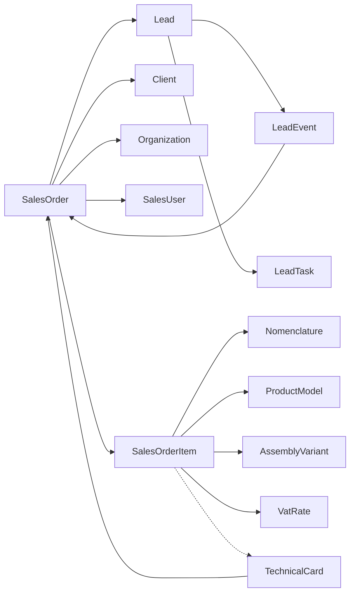

# Sport-Lead — Order card field links

**Code:** `SL-ORDER-CARD-FIELD-LINKS-v1`  
**Roadmap:** `3.5.1` (+ Stage `9.0.4` / `9.4.1` for tech-card gap `#4`)  
**Route:** `/sales/orders/[id]`  
**Updated:** `2026-07-26`

## Purpose

Inventory every field shown on the customer order card and classify its platform link: live FK, joined display name, immutable snapshot, or demo/local until a later roadmap item.

## Entity graph

`TechnicalCard` (Stage 9): one document per manufacturable `SalesOrderItem`; DB core `9.1.2` + generate API `9.2.1` + order UI `9.4.1` shipped. Wiring plan: § Gap `#4` below.

## Header / document fields

| UI field | Source | Link class | Platform target | Notes |
|----------|--------|------------|-----------------|-------|
| Number / title | `SalesOrder.number` / `title` | live | order row | |
| Status | `SalesOrder.status` | live | enum + `PATCH /orders/{id}/status` | Stage rail |
| Source lead | `SalesOrder.lead_id` | live FK | `/sales/leads/{id}` | Required |
| Client | `client_id` + `client_name` | live FK + joined name | Client; UI → `/sales/clients` (list; card `2.2.2`) | No dedicated client card yet |
| Organization | `organization_id` + `organization_name` | live FK + joined name | `/settings/organizations` | `PATCH .../organization` exists; display+link in `3.5.2` |
| Responsible | `responsible_id` + `responsible_name` | live FK + joined name | `SalesUser`; employees dir `2.4.2` | Name only until employees card |
| Amount / quantity / dates / source / category / sport / description | order columns | live | order row | Commercial totals also driven by items |
| Communications / notes / managers | local UI state + demo fixtures | demo-local | → `1.2.4` | Not persistent for API leads |
| Tasks panel | `LeadTask` via `lead_id` | live model / empty for API leads | Lead tasks | Order-scoped `order_id` deferred to `3.5.4` if needed |
| History | `LeadEvent` lead ∪ order | live | `GET /orders/{id}/history` | |
| Manufacturing / ТК summary | technical cards by order | live | Production `/production/tech-cards?orderId=` | Gap `#4` closed `9.4.1`; not commercial status |

## Order line fields

| UI field | Source | Link class | Platform target |
|----------|--------|------------|-----------------|
| Nomenclature | `nomenclature_id` + `snapshot_name` | live FK + snapshot | Nomenclature / warehouse stock |
| Variant characteristics | `variant_snapshots` | snapshot | Characteristics catalog |
| Product model | `product_model_id` + article/name/size_type | live FK + snapshot | Product models (`6.1.*`); whitelist `6.1.11` |
| Assembly variant | `assembly_variant_id` + name/total | live FK + snapshot | `6.1.12` |
| Assembly operation lines | `assembly_operation_snapshots` | snapshot | Persisted; frontend map optional until Spec/TC |
| VAT | `vat_rate_id` + percent snapshot; computed `vat_amount` (`3.3.2`) | live FK + snapshot + computed | VAT rates directory; amounts tax-inclusive |
| Qty / prices / discounts | commercial columns | live | Recalc service |
| Technical card link / status | `TechnicalCard` per manufacturable line | live | `/production/tech-cards/[id]` + status (`9.4.1`; ADR-016) |

## Lead reuse notes (`3.2.5.7`)

- Model/assembly selection lives on the **order item**, not on the lead commercial block.
- Order card reuses PT-06-like workspace chrome (stage rail, communication column) after owner request `2026-07-26`; historical PT-07 migrate (`5.5.7` / `5.6.4`) remains closed — layout product revision is Stage **`3.5`**.
- Timeline merges lead and order events; messages remain empty for API leads until `1.2.4`.

## Gap `#4` wiring plan (`9.0.4` → shipped in `9.4.1`)

**Status:** **shipped** `2026-07-26` (`9.4.1.*`).

**Single path rule:** order↔ТК integration lives only under Stage `9.4.1` on the existing order card host (`3.5`). Do not add a second tech-card module inside Stage 3.

### Surfaces on `/sales/orders/[id]`

| Surface | Behavior | Roadmap |
|---------|----------|---------|
| Per manufacturable line | Link to ТК document (or «нет ТК») + status badge | `9.4.1.1` |
| Aggregate strip / summary | Count open vs terminal cards; completeness from API `9.5.1` (`GET .../manufacturing-completeness`; FE may still derive locally) | `9.4.1.1` / `9.5.1` |
| Action: generate | Create missing cards for eligible lines via `9.2.1` API | `9.4.1.2` |
| Action: open list | Navigate to `/production/tech-cards?orderId={id}` | `9.4.1.2` |

Placement on the card: view mode **«Товары»** shows items + tech-card strip; dedicated mode **«Тех карты»**; UI chrome: `docs/tasks/v0.9.0-stage-9.0.3-tech-cards-ui-contract.md` (`SL-TECH-CARDS-UI-v1`). Full PT-02/07 production chrome remains `9.4.2` (stubs honor deep-links).

### Deep-links

| From | To |
|------|----|
| Order → list | `/production/tech-cards?orderId={salesOrderId}` |
| Order line → document | `/production/tech-cards/{techCardId}` |
| Document → order | `/sales/orders/{salesOrderId}` (PT-07 header meta) |
| Settings | `/settings/catalogs/tech-cards` (defaults only; not opened as order field) |

### Data dependencies (do not fake)

1. Domain: one ТК per manufacturable `SalesOrderItem` (ADR-016 / `9.1.1`).  
2. Generate + list-by-order API (`9.2.1`) — **shipped**.  
3. Order UI — **shipped** `9.4.1`; empty/error states only — **no demo technical cards**.  
4. Specs `7.*` / Routings `8.*` enrich composition and stage labels; order link/status uses header+status from API.

### Closeout when shipped

- `9.4.1.3` marks this gap **done** with evidence (components + API).  
- Evidence: `frontend/components/sales/sales-order-tech-cards-panel.tsx`, `frontend/lib/sales/order-tech-cards*.ts`, production deep-link stubs; task `docs/tasks/v0.9.0-stage-9.4.1-order-tech-cards-ui.md`.

## Gaps and follow-ups

1. Client entity card — Stage `2.2.*`
2. Persistent employees for responsible picker — `2.4.2`
3. Persistent tasks/notes/messages — `1.2.4`; optional `LeadTask.order_id` — `3.5.4`
4. Technical cards on order — **shipped `9.4.1`** (plan was `9.0.4`); full list/document UI `9.4.2`; settings `9.6`; UI contract `SL-TECH-CARDS-UI-v1`.
5. Do not invent a parallel Client API inside Stage 3

## Evidence

- Models: `backend/app/models/sales.py`, `backend/app/models/technical_card.py`
- API: `backend/app/api/orders.py`, `backend/app/api/technical_cards.py`
- Frontend: `frontend/lib/sales/order-details.ts`, `frontend/components/sales/sales-order-page.tsx`, `frontend/components/sales/sales-order-tech-cards-panel.tsx`
- Tech-card UI contract: `docs/tasks/v0.9.0-stage-9.0.3-tech-cards-ui-contract.md`
- Wiring task: `docs/tasks/v0.9.0-stage-9.0.4-order-tech-card-wiring.md`
- Order UI task: `docs/tasks/v0.9.0-stage-9.4.1-order-tech-cards-ui.md`
