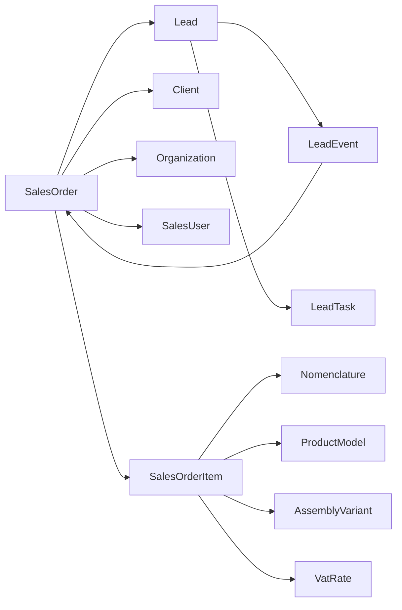

# Sport-Lead — Global Roadmap

**Code:** `SL-ROADMAP-v1`
**Updated:** `2026-08-06` (v1.00 Stage 23 Unified Work Tasks pointer; prior `0.4` / Stage 21–22 carry)  
**Project version:** `v0.9.0`
**Git branch:** `feature/v0.8.1-nomenclature-core`

**Canonical files:**
- roadmap: `docs/roadmap/roadmap.md`
- v1.00 roadmap (active early): `docs/roadmap/roadmap-v1.00.md` (+ HTML twin) — includes Stage **23** Work Tasks
- structure: `docs/architecture/project-structure.md`
- ERP-check: `docs/architecture/erp-check.md`

## Rules

- `[x]` means the roadmap item is completed and confirmed by code and applicable checks.
- `[ ]` means the roadmap item is not completed.
- For roadmap Markdown, only `[x]` and `[ ]` are used.
- Demo/local UI does not close a roadmap item that requires persistent production functionality.
- `docs/architecture/project-structure.md` is the main factual source for confirmed readiness.
- Separate task files are created only for the selected microtask before implementation starts.

## Current implementation boundary

Current confirmed contour:

`CRM → Sales orders → Nomenclature (core) + Pattern-base catalog (Stage 6 closed)`

Active Stage 4 work:

UNF-style primary warehouse nomenclature `4.10` (Склад → Номенклатура on `/warehouse/stock`: PT-04 tree+list absorbs categories; settings list/categories redirect); stock register MVP `4.6.5` (balance column from ledger, not on `Nomenclature` card); closed `4.7.2` remains historical for settings-only list; appearance polish of characteristic card → follow-up chat

Next commercial contour:

`Order-item model/assembly (3.2.5) → Order card UX + field links (3.5) → model routing whitelist+norms (6.1.17) → order routing pick (3.2.7) → smoke (3.2.6) → TC plan/fact materials (9.3.4) → shop material fact (11.5/11.6) → Specifications (plan+fact from TC + execution) → … → Администрирование`

Stage 8/9/11 note (`2026-07-28`): Spec↔ТК fixed; Stage 8 MVP + **`8.3` ProductionStage shipped; owner visual `8.2.2.6` OK**. `9.2.2` / `9.4.2` / `9.5.1` shipped; `9.4.1.4` OK; **owner visual `9.4.2.7` OK**. **`6.1.17` + `3.2.7` + smoke `3.2.6` shipped** (owner visuals OK). **`9.3.4` shipped; owner visual OK** on TC document for planned/fact materials, stage bind, gate messaging. **`9.3.5` shipped**: route TechOperation required materials prefill TC MATERIAL rows, formula wired, missing norm warning visible to manager. **`9.6` shipped**: settings page, persistence, generate/prefill wiring, and focused backend/frontend regressions completed on singleton `TechnicalCardSettings`. **`11.3.1`–`11.3.6` shipped**: shop platform (nav, queue, TC stage context + fact fields, tests, cross-shop kanban with adjacent DnD). **`11.4`–`11.10` shop modules shipped** (owner visuals OK through `11.10.5`). **`11.1.1` ProductionOrder/Batch shipped** (owner visual `11.1.1.5` OK `2026-07-30`). **`11.1.2` WorkCenter planning shipped** (owner visual `11.1.2.5` OK `2026-07-30`). **`11.2.1` aggregate fact shipped** (owner visual `11.2.1.4` OK `2026-07-30`). **`11.2.2.1`–`11.2.2.3` FG warehouse bridge** (ADR-019 + seed + shop modules) shipped. Remaining: `11.2.2.4`–`11.2.2.5` (wire needs `12.2`), Stage `12.1`+.

Dedupe notes (Sales Orders):
- Closed platform migrate `5.5.7` / `5.6.4` (PT-07) stays historical; **product layout revision** continues only in **`3.5`** (do not re-open PT-07 migrate).
- Informal lead-like card task `docs/tasks/v0.9.0-order-card-lead-appearance.md` folded into **`3.5`** (no parallel `3.1.4`).
- Item model/assembly `3.2.5` / smoke `3.2.6` stay separate from card chrome `3.5`.
- Cross-ref: persistent CRM lead comms `1.2.4`; client card `2.2.*`; employees `2.4.2`; tech-card order link gap `#4` / `9.4.1`.
- **Internal staff chat** (order + tech-card threads, @mentions, chat→microtasks, in-app notifications) → Stage **`19` closed** (`2026-08-04`, owner sign-off `19.5.3`) — not CRM lead UI (`1.2.4`), not external connectors (`1.4` / `16.1`), not design-only comments (`10.1.2`). Order filter «Коммуникация» (`3.5.7`) is the surface.

## Stage 0 — Platform and Infrastructure

### 0.1 — Core platform

- [x] 0.1.1 — Monorepo with `backend/` and `frontend/`
- [x] 0.1.2 — FastAPI, PostgreSQL, SQLAlchemy, and Alembic foundation
- [x] 0.1.3 — Next.js workspace shell, navigation, and shared UI layer
- [x] 0.1.4 — Docker Compose for local development (PostgreSQL; app processes run via `uvicorn` / `npm run dev`)
- [x] 0.1.5 — Documented environment contract (`Settings`, `.env.example`) — `v0.9.0`; evidence: `backend/app/config/settings.py`, `.env.example`
- [x] 0.1.6 — API liveness and readiness endpoints (database ping on `/health/ready`) — `v0.9.0`; evidence: `backend/app/main.py`

### 0.2 — Quality and documentation

- [x] 0.2.1 — Repository-level project checks and verification scripts
- [x] 0.2.2 — Canonical documentation set: roadmap, structure, ERP-check, ADR
- [x] 0.2.3 — Stable CI/CD pipeline for mandatory checks — `v0.9.0`; GitHub Actions aligned with `scripts/check_project.py` (`backend/requirements.txt`, `backend/` migrations, Node.js, PostgreSQL service); evidence: `.github/workflows/checks.yml`
- [x] 0.2.4 — Backend `pytest` and frontend unit tests in mandatory project checks — `v0.9.0`; evidence: `scripts/check_project.py`
- [x] 0.2.5 — TypeScript `tsc --noEmit` in mandatory project checks — `v0.9.0`; evidence: `scripts/check_project.py`

### 0.3 — Development and staging operations

- [x] 0.3.1 — Secrets and environment baseline for dev and staging (no production secrets in repo) — `v0.9.0`; evidence: `.env.example`, `.gitignore`
- [x] 0.3.2 — Structured application logging baseline for API and local runs — `v0.9.0`; `LOG_LEVEL`/`LOG_FORMAT`, loguru config, HTTP request log middleware; evidence: `backend/app/logging_config.py`, `backend/app/main.py`, `backend/tests/test_logging_config.py`
- [x] 0.3.3 — Documented database backup and restore on dev/staging — `v0.9.0`; evidence: `scripts/backup_db.ps1`, `scripts/restore_db.ps1`

### 0.4 — Platform performance

> **Moved to `v1.00` Stage 0** (`2026-08-02`): platform slow-data / list performance work lives in `docs/roadmap/roadmap-v1.00.md` (+ HTML twin) as Stage **0** (`0.1` full audit first, then known N+1 fixes). Do not execute under `v0.9.0`.

- [ ] 0.4.1 — Contract: list-page rules — **moved → v1.00** (`0.2.1`)
- [ ] 0.4.2 — P1 case product-models list N+1 — **moved → v1.00** (`0.2.2`)
- [ ] 0.4.3 — Audit pass: characteristics / warehouse stock / tech-cards — **moved → v1.00** (`0.2.3`)
- [ ] 0.4.4 — Shared guardrails + tests — **moved → v1.00** (`0.2.4`)
- [ ] 0.4.5 — Docs checkpoint — **moved → v1.00** (`0.2.5`)

## Stage 1 — CRM and Leads

### 1.1 — Sales workspace

- [x] 1.1.1 — Sales dashboard
- [x] 1.1.2 — Lead list, filters, and Kanban UI
- [x] 1.1.3.1 — Task + boundary for persistent leads workspace — `v0.9.0`; task `docs/tasks/v0.9.0-stage-1.1.3-persistent-leads-workspace.md`
- [x] 1.1.3.2 — Workspace: drop demo normalize / fake conversion fields; real reject/convert timestamps — `v0.9.0`; `toWorkspaceLead`
- [x] 1.1.3.3 — Frontend unit tests + ui-audit gap sync — `v0.9.0`; `lead-list-api.test.mjs`
- [x] 1.1.3.4 — Owner visual verification (leads list/kanban persistent filters) — owner OK `2026-07-31`
- [x] 1.1.3 — Fully persistent workspace without demo/local lead state — `v0.9.0`; owner visual OK `2026-07-31`
- [x] 1.1.4 — Leads list filters without demo `salesManagers` data on persistent routes — `v0.9.0`; options from loaded leads only

#### 1.1.5 — Dashboard pattern-model sales analysis

> Live top models table on `/sales/dashboard` (article, orders, units, amount, sewing). Task `docs/tasks/v0.9.0-stage-1.1.5-pattern-model-sales-dashboard.md`.

- [x] 1.1.5.1 — Contract + task / roadmap split — `v0.9.0`; task `docs/tasks/v0.9.0-stage-1.1.5-pattern-model-sales-dashboard.md`
- [x] 1.1.5.2 — Backend: `GET /analytics/pattern-model-sales` aggregation — `v0.9.0`
- [x] 1.1.5.3 — Dashboard UI panel + period/article filters — `v0.9.0`; `pattern-model-sales-panel.tsx`
- [x] 1.1.5.4 — Regression + docs sync — `v0.9.0`; `test_pattern_model_sales_1_1_5.py`
- [x] 1.1.5.5 — Owner visual verification (dashboard top models panel) — owner OK `2026-08-01`
- [x] 1.1.5 — Dashboard: top pattern-model sales analysis with filters — `v0.9.0`; owner visual OK `2026-08-01`

### 1.2 — Lead card

- [x] 1.2.1 — Lead detail route and page states
- [x] 1.2.2 — Customer, contact, and commercial data saving through API
- [x] 1.2.3 — Configurable stages and stage management
- [x] 1.2.4 — Persistent tasks, notes, timeline, and communications — CRM/lead contour (external + lead notes); **≠** internal order/ТК staff chat (Stage `19`)
  - [x] 1.2.4.1 — Contract + task / roadmap split (tasks-first slice to visual) — `v0.9.0`; task `docs/tasks/v0.9.0-stage-1.2.4-lead-tasks-persistence.md`
  - [x] 1.2.4.2 — Extend `LeadTask` model + Alembic migration — `v0.9.0`
  - [x] 1.2.4.3 — Lead tasks CRUD API + history events — `v0.9.0`
  - [x] 1.2.4.4 — Lead card FE wire for API tasks (create/edit/complete/reopen/reschedule/delete) — `v0.9.0`
- [x] 1.2.4.5 — Regression + docs sync — `v0.9.0`; `test_lead_tasks_1_2_4.py`
- [x] 1.2.4.6 — Owner visual verification (lead card tasks panel, API lead) — owner OK `2026-08-01`
- [x] 1.2.4.7 — Persistent lead notes — `v0.9.0`; owner visual OK `2026-08-01`
  - [x] 1.2.4.7.1 — `LeadNote` model + Alembic migration — `v0.9.0`
  - [x] 1.2.4.7.2 — Lead notes CRUD API (create/update/delete/pin) — `v0.9.0`
  - [x] 1.2.4.7.3 — Lead card FE wire for API notes — `v0.9.0`
  - [x] 1.2.4.7.4 — Regression + docs sync — `v0.9.0`; `test_lead_notes_1_2_4_7.py`
  - [x] 1.2.4.7.5 — Owner visual verification (lead card notes panel, API lead) — owner OK `2026-08-01`
- [x] 1.2.4.8 — Persistent lead communications contour — CRM/lead; **≠** Stage `19` — owner visual OK `2026-08-01`
  - [x] 1.2.4.8.1 — `LeadMessage` model + Alembic migration — `v0.9.0`
  - [x] 1.2.4.8.2 — Lead messages list/create API — `v0.9.0`
  - [x] 1.2.4.8.3 — Lead card FE wire for API communications — `v0.9.0`
  - [x] 1.2.4.8.4 — Regression + docs sync — `v0.9.0`; `test_lead_messages_1_2_4_8.py`
  - [x] 1.2.4.8.5 — Owner visual verification (lead card communications, API lead) — owner OK `2026-08-01`
- [x] 1.2.5 — Single lead detail data path (remove `lead-*` fixture IDs); actor from sales-users until `17.1.1` — owner visual OK `2026-08-01`
  - [x] 1.2.5.1 — Contract + task file — `v0.9.0`; `docs/tasks/v0.9.0-stage-1.2.5-lead-detail-single-path.md`
  - [x] 1.2.5.2 — `getLeadDetails` API-only; non-numeric → not found — `v0.9.0`
  - [x] 1.2.5.3 — Lead card/header drop demo/`lead-*` paths; actor from sales-users — `v0.9.0`
  - [x] 1.2.5.4 — Regression + docs sync — `v0.9.0`; `lead-detail-path-1-2-5.test.mjs`
  - [x] 1.2.5.5 — Owner visual verification (API lead card, no fixture IDs) — owner OK `2026-08-01`

### 1.3 — Lead lifecycle

- [x] 1.3.1 — Completion and rejection flow
- [x] 1.3.2 — Transactional conversion from lead to sales order
- [x] 1.3.3 — Deals boundary + CRM access-control contour (no separate Deal; ACL → `17.1.1`) — owner visual OK `2026-08-01`
  - [x] 1.3.3.1 — Contract: no `Deal` entity (conversion → `SalesOrder`); lead archive **out of scope** (converted/rejected suffice); ACL → `17.1.1` — `v0.9.0`; task `docs/tasks/v0.9.0-stage-1.3.3-crm-archive-deals-boundary.md`
  - [x] 1.3.3.2 — Lead soft-archive model + API — **cancelled** `2026-08-01` (owner: redundant with converted/rejected); dropped `n1c2d3e4f567`
  - [x] 1.3.3.3 — Leads workspace archive UI — **cancelled** `2026-08-01` (same)
  - [x] 1.3.3.4 — Retire demo `/sales/deals` page (redirect → orders) — `v0.9.0`
  - [x] 1.3.3.5 — Regression + docs sync — `v0.9.0`; `lead-archive-1-3-3.test.mjs` (deals redirect)
  - [x] 1.3.3.6 — Owner visual verification (deals redirect; no archive tab on leads) — owner OK `2026-08-01`

### 1.4 — CRM source integrations

> **Boundary (`2026-08-01`):** `1.4.1` / `1.4.2` closed in `v0.9.0` (core + mock). Real adapters `1.4.3` deferred to `v1.00` (microtasks `1.4.3.1`–`1.4.3.5` in `docs/roadmap/roadmap-v1.00.md`). Lead card send (`1.2.4.8`) stays on mock until then. Do not execute `1.4.3` under `v0.9.0`.

- [x] 1.4.1 — Collectors, parsers, and import normalization core
- [x] 1.4.2 — Mock communication connector core
- [ ] 1.4.3 — Real external lead-source and communication adapters — **moved → v1.00** (microtasks `1.4.3.1`–`1.4.3.5` in `docs/roadmap/roadmap-v1.00.md`)

## Stage 2 — Clients and Contacts

### 2.1 — Core entities and links

- [x] 2.1.1 — Client and contact entities linked to leads and orders
- [x] 2.1.2 — Saving client and contact data from CRM workflows

### 2.2 — Separate client workspace

- [x] 2.2.1 — Persistent client list and dedicated workspace — owner visual OK `2026-08-01`
  - [x] 2.2.1.1 — Contract + task — `v0.9.0`; `docs/tasks/v0.9.0-stage-2.2.1-persistent-clients-workspace.md`
  - [x] 2.2.1.2 — `GET /clients` list API (+ order aggregates) — `v0.9.0`; `api/clients.py`, `services/clients.py`
  - [x] 2.2.1.3 — FE `/sales/clients` from API (no demo substitution) — `v0.9.0`; `client-list-api.ts`
  - [x] 2.2.1.4 — Regression + docs sync — `v0.9.0`; `test_clients_2_2_1.py`, `client-list-mapping.test.mjs`
  - [x] 2.2.1.5 — Owner visual verification — owner OK `2026-08-01`
- [x] 2.2.2 — Separate client card — owner visual OK `2026-08-01`
  - [x] 2.2.2.1 — Contract + task (PT-05; history panel → `2.2.3`/v1.00) — `v0.9.0`
  - [x] 2.2.2.2 — `GET /clients/{id}` (+ related orders summary) — `v0.9.0`
  - [x] 2.2.2.3 — FE card route `/sales/clients/[clientId]` + list links — `v0.9.0`
  - [x] 2.2.2.4 — Regression + docs sync — `v0.9.0`
  - [x] 2.2.2.5 — Owner visual verification — owner OK `2026-08-01`
- [ ] 2.2.3 — Client lead and order history — **moved → v1.00** (microtasks `2.2.3.1`–`2.2.3.5` in `docs/roadmap/roadmap-v1.00.md`)
- [ ] 2.2.4 — Client folders on `/sales/clients` — **planned in v1.00** (`2.2.4.1`–`2.2.4.4`)

### 2.3 — Business data and quality

> **Moved to `v1.00`** (`2026-08-01`): entire `2.3` block carried with Stage 2 group (`2.2.3` + `2.3` + `2.4`) to `docs/roadmap/roadmap-v1.00.md` (+ HTML twin). Do not execute under `v0.9.0`.

- [ ] 2.3.1 — Legal details and banking data — **moved → v1.00** (`2.3.1.1`–`2.3.1.4`; INN / bank accounts / legal+actual address on card)
- [ ] 2.3.2 — Segmentation and duplicate detection — **moved → v1.00** (`2.3.2.1`–`2.3.2.4`)
- [ ] 2.3.3 — Settlements and financial client state — **moved → v1.00** (`2.3.3.1`–`2.3.3.5`)

### 2.4 — Organizations workspace

> **Moved to `v1.00`** (`2026-08-01`): entire `2.4` block carried with Stage 2 group to `docs/roadmap/roadmap-v1.00.md` (+ HTML twin). Do not execute under `v0.9.0`.

- [ ] 2.4.1 — Persistent organizations list and card on backend data (replace demo `organizationRecords`) — **moved → v1.00** (`2.4.1.1`–`2.4.1.5`)
- [ ] 2.4.2 — Persistent employees directory on backend data (replace demo `employeeRecords`) — **moved → v1.00** (`2.4.2.1`–`2.4.2.4`)

## Stage 3 — Sales Orders

### 3.1 — Core document

- [x] 3.1.1 — Persistent sales-order model, list, detail route, and status history
- [x] 3.1.2 — Manual creation and creation from lead conversion
- [x] 3.1.3 — Organization, client, contact, and responsible bindings

### 3.2 — Order items

- [x] 3.2.1 — Persistent commercial snapshot items
- [x] 3.2.2 — Decimal/Numeric totals and discount-percent recalculation
- [x] 3.2.3 — Sizes, color, and personalization snapshots
- [x] 3.2.4 — Nullable nomenclature and variant links with immutable snapshots

#### 3.2.5 — Product model and assembly variant on order items

> Moved from Stage `6.1.13` (`2026-07-22`): Stage 6 owns the pattern-base **catalog**; selection and snapshots live on the **sales-order item** (closer to Заказ покупателя than to nomenclature master / база лекал). Whitelist config stays on PRODUCT nomenclature card (`6.1.11`).

Goal:
After nomenclature selection, manager picks a model from the PRODUCT whitelist; size_type and model article autofill; then picks an assembly variant of that model. UI shows the assembly-variant field only after a model is selected (hidden without model; options = active variants of that model). When the selected model has ≥1 active assembly variant, the variant is **required** (not soft-optional) so Stage 7 specification and Stage 9 technical card can copy the assembly-operation snapshot. Snapshots keep old orders stable. Price/VAT stay separate commercial fields.

Dependencies:
- 3.2.4
- 6.1.11
- 6.1.12
- 6.2.7

Microtasks:
- [x] 3.2.5.1 — Define order-item relation + snapshot strategy (model id/article/size_type; variant id/name/total; operation-line child snapshot) — `v0.9.0`; evidence: `docs/architecture/order-item-model-assembly.md` (`SL-ORDER-ITEM-MODEL-ASSEMBLY-v1`)
- [x] 3.2.5.2 — Add nullable storage and migration — `v0.9.0`; Alembic `j1k2l3m4n567`; model: `SalesOrderItem` + `SalesOrderItemAssemblyOperationSnapshot`
- [x] 3.2.5.3 — Add schemas and service rules: model ∈ available list; variant ∈ selected model; require model when whitelist non-empty; **require assembly variant when selected model has ≥1 active variant** (per ADR-014; Spec/TC dependency) — `v0.9.0`; server snapshot fill; smoke: `backend/tests/test_order_item_model_assembly.py`
- [x] 3.2.5.4 — Add frontend selection flow in order item forms: after model — assembly-variant field (hidden without model; options = active variants of selected model); variant **required** when model has ≥1 active variant (Spec/TC dependency) — `v0.9.0`; `sales-order-items-unf-demo.tsx`; payload `assembly_variant_id`; mapper + `order-details.test.mjs`
- [x] 3.2.5.5 — Add regression tests (whitelist filter; foreign model/variant rejected; snapshot immutability) — `v0.9.0`; `backend/tests/test_order_item_model_assembly.py` (5 cases incl. catalog-edit immutability)
- [x] 3.2.5.6 — Visual verification — includes nomenclature pick modal (category tree + list, adaptive) on order-item field — `v0.9.0`; owner OK `2026-07-26`
- [x] 3.2.5.7 — Documentation checkpoint (lead reuse notes if applicable) — `v0.9.0`; evidence: `docs/architecture/order-card-field-links.md` § Lead reuse notes

Completion criteria:
- order chain is nomenclature → available model → assembly variant;
- autofill of size_type and model article works;
- assembly-variant field hidden until model selected; options = active variants of that model;
- variant required when selected model has ≥1 active variant (Stage 7 snapshot copy / Stage 9 TC need the assembly package);
- if model has zero active variants, variant remains optional until variants are configured (ADR-014 §5);
- backward-compatible nullable links; snapshots explicit.

#### 3.2.6 — Order-item model selection smoke

> Moved from Stage `6.4.1` (`2026-07-22`): full path including order-item selection is a Sales Orders checkpoint, not pattern-base catalog close.

Goal:
Prove PRODUCT → available models → model (size grid + assembly variants + sewing-ops catalog + **routing whitelist**) → order-item selection (assembly + **routing**) without Stage 7 document creation.

Dependencies:
- 3.2.5
- 3.2.7
- 6.1.11
- 6.1.12
- 6.1.17
- 6.2.7
- 6.3.5

Microtasks:
- [x] 3.2.6.1 — Script or manual smoke checklist (whitelist filter, autofill size_type/article, variant offer, **routing offer from model whitelist**, reject foreign model/routing) — `v0.9.0`; evidence: task `docs/tasks/v0.9.0-stage-3.2.6-order-item-model-smoke.md`; pytest `tests/test_order_item_model_selection_smoke_3_2_6.py`
- [x] 3.2.6.2 — Fix P0/P1 gaps found in smoke — `v0.9.0`; **none found** (smoke green)

Completion criteria:
- one reference path works on persistent API data;
- manager cannot select a model outside PRODUCT available list;
- manager cannot select a routing outside the selected model's whitelist.

#### 3.2.7 — Shop routing template on order items

> Owner ask `2026-07-27`: after model (+ assembly variant), manager picks a **routing preset** from the model's whitelist so generate ТК snapshots that route; mirrors assembly-variant selection (`3.2.5`).

Goal:
Sales-order item stores selected `ShopRoutingTemplate` from the product model's routing whitelist (not the global full catalog). Snapshot id+name for TC generate; catalog edits do not rewrite old orders.

Dependencies:
- 3.2.5
- 6.1.17
- 8.2.3

Microtasks:
- [x] 3.2.7.1 — Snapshot strategy: `routing_template_id` + name on `SalesOrderItem`; amend `docs/architecture/order-item-model-assembly.md` — `v0.9.0`; evidence: `order-item-model-assembly.md` §2/§4.5/§5/§6 (`3.2.7.1`); task `docs/tasks/v0.9.0-stage-3.2.7-order-item-routing.md`
- [x] 3.2.7.2 — Migration + schemas; require routing when model whitelist has ≥1 active link (mirror assembly rule); reject foreign routing — `v0.9.0`; evidence: Alembic `q8r9s0t1u234`; `SalesOrderItem.routing_template_*`; `sales_order_items._resolve_routing_snapshot`; smoke `tests/test_order_item_routing_3_2_7.py`
- [x] 3.2.7.3 — Order item UI: routing select after model; options = model whitelist only; hidden without model — `v0.9.0`; evidence: `sales-order-items-unf-demo.tsx` column «Маршрут»; `loadProductModelActiveRoutings`; mapper `order-details.ts`
- [x] 3.2.7.4 — Regression tests (foreign routing rejected; snapshot immutability) — `v0.9.0`; evidence: `tests/test_order_item_routing_3_2_7.py` (foreign / inactive / name immutability)
- [x] 3.2.7.5 — Visual verification — owner OK `2026-07-27`

Completion criteria:
- order chain is nomenclature → model → assembly variant → routing ∈ model whitelist;
- TC generate can prefer order-item routing snapshot over model default alone;
- Stage 6 assembly variants remain the cost contour (unchanged).

### 3.3 — Financial document scope

#### 3.3.1 — Order-level discount

> Percent on order after line `line_amount` totals; ADR-003 amend. Task `docs/tasks/v0.9.0-stage-3.3.1-order-level-discount.md`.

- [x] 3.3.1.1 — ADR-003 amend + domain contract (order `discount_percent` / computed `discount_amount` / `items_subtotal`) — `v0.9.0`; task `docs/tasks/v0.9.0-stage-3.3.1-order-level-discount.md`
- [x] 3.3.1.2 — DB migration + model + `_recalculate_order` service — `v0.9.0`; Alembic `c0d1e2f3a456`
- [x] 3.3.1.3 — API: expose fields + PATCH order discount percent — `v0.9.0`; `PATCH /orders/{id}/discount`; evidence `test_order_discount_3_3_1.py`
- [x] 3.3.1.4 — Order card UI: edit % + show subtotal / discount / total — `v0.9.0`; evidence: `sales-order-metrics.tsx`, `order-discount-actions.ts`, `order-details.ts` / `order-discount.test.mjs`
- [x] 3.3.1.5 — Regression tests + docs sync — `v0.9.0`; evidence: `test_order_discount_3_3_1.py`, `order-discount.test.mjs`, `order-card-metrics.test.mjs`; project-structure + erp-check

#### 3.3.2 — Tax and VAT model

> Per-line VAT mode (в сумме / сверху) + persist computed `vat_amount` on lines/order. `VatRate` directory + line rate picker already shipped. Task `docs/tasks/v0.9.0-stage-3.3.2-tax-vat-model.md`. ADR-005 amend. Transfer rule for price docs.

- [x] 3.3.2.1 — ADR-005 amend + domain contract + task / roadmap split — `v0.9.0`; evidence: ADR-005/003 notes; task `docs/tasks/v0.9.0-stage-3.3.2-tax-vat-model.md`
- [x] 3.3.2.2 — DB: `price_includes_vat` + line/order `vat_amount` (+ migration) — `v0.9.0`; Alembic `e2f3a4b5c678`
- [x] 3.3.2.3 — Service recalculate + API `vat_amount` / `amount_net` / `line_total` / mode — `v0.9.0`
- [x] 3.3.2.4 — UI: toolbar BadgePercent «НДС в сумме/сверху» (apply all lines) + VAT totals — `v0.9.0`; `sales-order-items-unf-demo.tsx` / metrics
- [x] 3.3.2.5 — Regression tests + docs sync (transfer rule) — `v0.9.0`; `test_order_vat_3_3_2.py`, `vat-rates.test.mjs`

#### 3.3.3 — Currency, quotations, and invoices

> Currency MVP (RUB) + КП / счёт as order children with VAT transfer rule; print consumes Stage 18. Task `docs/tasks/v0.9.0-stage-3.3.3-currency-quotations-invoices.md`. ADR-005 amend.

- [x] 3.3.3.1 — ADR-005 amend + domain contract + task / roadmap split — `v0.9.0`; evidence: ADR-005; task `docs/tasks/v0.9.0-stage-3.3.3-currency-quotations-invoices.md`
- [x] 3.3.3.2 — DB: `SalesOrder.currency_code` (+ migration); order API/UI read — `v0.9.0`; Alembic `f3a4b5c6d789`; evidence `test_order_currency_3_3_3_2.py`
- [x] 3.3.3.3 — Quotation model/API + create-from-order (VAT/currency snapshot) — `v0.9.0`; Alembic `g4b5c6d7e890`; `POST /orders/{id}/quotations`
- [x] 3.3.3.4 — Invoice model/API + create-from-order (optional from quotation) — `v0.9.0`; `POST /orders/{id}/invoices`
- [x] 3.3.3.5 — Order card documents tree: live КП/счёт + create actions — `v0.9.0`; `sales-order-documents-tree.tsx`
- [x] 3.3.3.6 — Regression + print handoff note + docs sync — `v0.9.0`; `test_sales_commercial_docs_3_3_3.py`
- [x] 3.3.3.7 — Owner visual verification (documents: create КП/счёт on order card) — owner OK `2026-07-31`

### 3.4 — Order execution

#### 3.4.1 — Design and approval states in order flow

> Sales-side `design_approval_status` + gate before `production`. Stage 10 owns design **assets** (`10.1`); staff/client operational approval UX = order status field + Stage `19` chat/microtasks (`10.2` cancelled). Task `docs/tasks/v0.9.0-stage-3.4.1-design-approval-order-flow.md`. ADR-003 amend.

- [x] 3.4.1.1 — ADR-003 amend + domain contract + task / roadmap split — `v0.9.0`; task `docs/tasks/v0.9.0-stage-3.4.1-design-approval-order-flow.md`
- [x] 3.4.1.2 — DB: `SalesOrder.design_approval_status` (+ migration) — `v0.9.0`; Alembic `h5c6d7e8f901`
- [x] 3.4.1.3 — Service production gate + `PATCH /orders/{id}/design-approval` — `v0.9.0`
- [x] 3.4.1.4 — Order card UI: show + edit design approval — `v0.9.0`; `order-design-approval-field.tsx`
- [x] 3.4.1.5 — Regression + docs sync — `v0.9.0`; `test_design_approval_3_4_1.py`
- [x] 3.4.1.6 — Owner visual verification (design approval on order card) — owner OK `2026-07-31`

#### 3.4.2 — Reserve, production, shipping, payment, and closure workflow

> Sales markers `payment_status`/`paid_amount` + `material_reserve_status`; closure gate requires paid. Warehouse reserve / payment ledger / ship docs stay Stage 12/14. Task `docs/tasks/v0.9.0-stage-3.4.2-order-execution-workflow.md`. ADR-003 amend.

- [x] 3.4.2.1 — ADR-003 amend + domain contract + task / roadmap split — `v0.9.0`; task `docs/tasks/v0.9.0-stage-3.4.2-order-execution-workflow.md`
- [x] 3.4.2.2 — DB: payment + material reserve columns (+ migration) — `v0.9.0`; Alembic `i6d7e8f9a012`
- [x] 3.4.2.3 — Service closure payment gate + `PATCH …/payment` + `PATCH …/material-reserve` — `v0.9.0`
- [x] 3.4.2.4 — Order card UI: live payment metrics + reserve control — `v0.9.0`
- [x] 3.4.2.5 — Regression + docs sync — `v0.9.0`; `test_order_execution_3_4_2.py`
- [x] 3.4.2.6 — Owner visual verification (payment + reserve on order card) — owner OK `2026-07-31`

- [x] 3.4.3 — Orders list route `loading.tsx` / `error.tsx` and surfaced network errors (no silent empty list) — `v0.9.0`; `sales/orders/loading.tsx` + `error.tsx`; `getOrderList` try/catch; gap closed in `ui-audit.md`

### 3.5 — Order card UX and platform links

> Owner request `2026-07-26`: compact order card layout, view filters, field-link map. Prior lead-like chrome (`docs/tasks/v0.9.0-order-card-lead-appearance.md`) is the baseline; PT-07 migrate (`5.5.7` / `5.6.4`) remains closed. Execute after `3.2.5`, before smoke `3.2.6`.

Goal:
Compact header (stage rail above; no meta strip; no header «Написать»/«Статус»); merged requisites + source lead; metrics on the right; full-width history; comments left + order tasks beside; view filters Все / Сведения / Товары / Коммуникация; wire existing platform FKs; create new catalog/model only if a gap remains.

> Boundary (`2026-07-28`): filter «Коммуникация» and current comments/tasks panels stay UX chrome from `3.5`. **Persistent internal colleague chat** on the order (and linked technical cards), `@mention`, and chat-spawned microtasks are owned by Stage **`19`** — do not re-open closed `3.5.*` for that domain. Further lead/order card UX parity and messaging unify → **Stage `20`** in `docs/roadmap/roadmap-v1.00.md` (`2026-08-05`).

Dependencies:
- 3.1.3
- 3.2.5
- 5.6.4 (historical PT-07 baseline)

Field-link schema (`3.5.1`):



Microtasks:
- [x] 3.5.1 — Inventory fields on `/sales/orders/[id]` + platform link map — `v0.9.0`; evidence: `docs/architecture/order-card-field-links.md` (`SL-ORDER-CARD-FIELD-LINKS-v1`)
- [x] 3.5.2 — Wire existing live links in UI (EntityLink: lead, clients list, organizations) — `v0.9.0`; `sales-order-page.tsx`
- [x] 3.5.3 — Fill gaps via existing catalogs/models (tasks from source `LeadTask`; expose `client_id` / `organization_id` / `responsible_id`) — `v0.9.0`; `order-details.ts` + tasks panel
- [x] 3.5.4 — Create directory/model/section only if gap remains — **not required**: lead-scoped `LeadTask` sufficient; no parallel Client API
- [x] 3.5.5 — Compact header: remove meta strip; remove «Написать»/«Статус»; stage rail above header — `v0.9.0`; `sales-order-header.tsx`
- [x] 3.5.6 — Body: merge «Основные сведения» + source lead/description; metrics right; history full width; comments left + «Задачи по заказу» — `v0.9.0`; `sales-order-page.tsx`
- [x] 3.5.7 — View filters under header: Все / Сведения о заказе / Товары / Коммуникация — `v0.9.0`; `order-card-view-mode.ts`
- [x] 3.5.8 — Regression tests (view modes, header, field id mapping) — `v0.9.0`; `order-card-view-mode.test.mjs` + `order-details.test.mjs`
- [x] 3.5.9 — Owner visual verification (desktop + mobile matrix) — owner OK `2026-07-31`; stack `<1300` / `1300–1699` / `1700+`; collapse items/tech/history in «Все»; documents filter-only; sidebar force-compact ≤1299
- [x] 3.5.10 — Docs checkpoint (erp-check / project-structure / PT-06-based order card note; PT-07 historical) — `v0.9.0`

Completion criteria:
- header compact; status only via stage rail;
- view modes hide/show sections without breaking item persistence;
- field-link schema documented; existing FKs surfaced;
- no duplicate PT-07 migrate work; shell contracts preserved.

## Stage 4 — Nomenclature

### 4.1 — Persistent core

- [x] 4.1.1 — `v0.8.1` persistent nomenclature CRUD, card, search, activity, and base price (`Nomenclature.article` later removed in `4.7.11`)
- [x] 4.1.2 — Nullable order-item link with independent commercial snapshot

### 4.2 — Classification and typed fields

- [x] 4.2.1 — `v0.8.2` nomenclature types and category hierarchy
- [x] 4.2.2 — `v0.8.3` units-of-measure directory and `storage_unit_id`
- [x] 4.2.3 — `v0.8.4` typed custom fields with category inheritance — historical; SoT superseded by ADR-015 / `4.8`

### 4.3 — Workspace and card

- [x] 4.3.1 — `v0.8.5` separate workspace and editable card
- [x] 4.3.2 — `v0.8.8h` direct free assignment of custom fields in the card — historical; card values now via characteristics API (`4.8.6`)
#### 4.3.3 — Audit history, archive flow, and bulk operations

> Boundary: card/list audit trail + soft archive (`is_active`) + multi-select bulk on warehouse list. **≠** catalog file I/O (`4.5` / ADR-020) and **≠** global ops journal (`18.4`).

- [x] 4.3.3.1 — Persistent nomenclature history (FIFO cap) + append on create/update/copy/media + `GET /nomenclatures/{id}/history` — `v0.9.0`; evidence: `nomenclature_history` / `a8b9c0d1e234`, `services/nomenclature_history.py`, `tests/test_nomenclature_history_4_3_3_1.py`; task `docs/tasks/v0.9.0-stage-4.3.3-nomenclature-audit-archive-bulk.md`
- [x] 4.3.3.2 — Card UI: ActivityTimeline from history API (replace synthetic created/updated-only) — `v0.9.0`
- [x] 4.3.3.3 — Archive/restore UX polish on card + warehouse list filter for archived — `v0.9.0`
- [x] 4.3.3.4 — Bulk archive/activate on `/warehouse/stock` multi-select — `v0.9.0`
- [x] 4.3.3.5 — Regression tests + erp-check / project-structure sync — `v0.9.0`; backend+FE smoke; erp-check / project-structure / contours A synced

### 4.4 — Characteristics, variants, and media

- [x] 4.4.1 — `v0.8.6` characteristics and variants
- [x] 4.4.2 — `v0.8.7` image media lifecycle
- [x] 4.4.3 — `v0.8.8a` to `v0.8.8g` card layout and interaction contour
- [x] 4.4.4 — `v0.8.8i` product-characteristics directory
#### 4.4.5 — Non-image file attachments

> Extend existing `nomenclature_media` (no second table). Images stay gallery/primary; non-images are downloadable attachments (pdf/office/zip/txt/csv). Max 10 MB. `is_primary` only for images.

- [x] 4.4.5.1 — Backend: allowlisted non-image mimes + primary-only-for-images + history wording — `v0.9.0`; evidence: `services/media.py`, `schemas/media.py`; task `docs/tasks/v0.9.0-stage-4.4.5-nomenclature-file-attachments.md`
- [x] 4.4.5.2 — Card UI: «Вложения» block (upload/download/delete) separate from image carousel — `v0.9.0`; evidence: `nomenclature-card.tsx`
- [x] 4.4.5.3 — Regression tests + docs sync — `v0.9.0`; evidence: `test_nomenclature_attachments_4_4_5.py`, `nomenclature-attachments-4-4-5.test.mjs`

#### 4.4.6 — Variant pricing, barcodes, and external sync

> ADR-010 amend: variant may carry optional `price` (override of card `base_price`), unique `barcode`, and opaque `external_code` for later 1C. **No** live 1C exchange here — that remains `16.2.1` / ADR-020 contour D.

- [x] 4.4.6.1 — ADR-010 amend + DB columns (`price`, `barcode`, `external_code`) + schemas — `v0.9.0`; Alembic `b9c0d1e2f345`; task `docs/tasks/v0.9.0-stage-4.4.6-variant-pricing-barcodes.md`
- [x] 4.4.6.2 — API update + order UI suggests variant price when selected — `v0.9.0`; evidence: `services/characteristics.py`, `sales-order-items.tsx` + `effectiveVariantUnitPrice`
- [x] 4.4.6.3 — Card UI: variants block with editable price / barcode / external_code — `v0.9.0`; evidence: `nomenclature-variants-block.tsx`
- [x] 4.4.6.4 — Regression tests + docs sync — `v0.9.0`; evidence: `test_variant_pricing_4_4_6.py`, `nomenclature-variant-pricing-4-4-6.test.mjs`

### 4.5 — Import and export

> Decision (`ADR-020`, owner `2026-07-30`): **hybrid**. Catalog file I/O stays on the section toolbar (nomenclature first); thin shared parse/validate lib; domain inline import (`9.3.2`, SizeGrid) stays in-section only; universal job shell + 1C later (`16.3` / `16.2.1`). Print-forms `18.3` ≠ data export. Inventory: `docs/architecture/import-export-contours.md`. **Owner visual OK** (`2026-07-30`) for import drawer + export on `/warehouse/stock` (incl. extended columns; CSV multi-value separator `|` / `sep=,` for Excel RU).

Goal:
Ship nomenclature import/export as catalog actions on `/warehouse/stock` (and settings card if needed), reusing a shared parse library — not a separate Administration nav module yet.

Dependencies:
- ADR-012 / ADR-020
- `4.2` / `4.10` nomenclature workspace

- [x] 4.5.0 — ADR-020 hybrid import/export contours + inventory — `v0.9.0`; evidence: `docs/architecture/decisions/ADR-020-import-export-hybrid.md`, `docs/architecture/import-export-contours.md`; task `docs/tasks/v0.9.0-stage-4.5-import-export-adr-020.md`

#### 4.5.1 — Nomenclature import

- [x] 4.5.1.1 — Shared parse/validate library (CSV/XLSX helpers, row-error DTO, dry-run envelope) — no section-specific SoT — `v0.9.0`; evidence: `app/schemas/file_io.py`, `app/services/file_io.py`, `tests/test_file_io_4_5_1_1.py`; task `docs/tasks/v0.9.0-stage-4.5.1.1-shared-file-io.md`
- [x] 4.5.1.2 — Nomenclature import API: map columns → validate → dry-run → commit (service layer; master-directory only) — `v0.9.0`; evidence: `POST /nomenclatures/import`, `services/nomenclature_import.py`, `tests/test_nomenclature_import_4_5_1_2.py`; task `docs/tasks/v0.9.0-stage-4.5.1.2-nomenclature-import-api.md`
- [x] 4.5.1.3 — UI: Import action on nomenclature workspace toolbar (`/warehouse/stock`) — `v0.9.0`; evidence: `nomenclature-import-drawer.tsx`, `importNomenclaturesFile`, `nomenclature-import-4-5-1-3.test.mjs`; task `docs/tasks/v0.9.0-stage-4.5.1.3-nomenclature-import-ui.md`; **template download** wired with `4.5.2` (`import-template`, same columns as export); **owner visual OK** (`2026-07-30`)
- [x] 4.5.1.4 — Regression tests (happy path, row errors, dry-run vs commit) — `v0.9.0`; evidence: `test_nomenclature_import_4_5_1_2.py` + template round-trip in `test_nomenclature_export_4_5_2.py`

#### 4.5.2 — Nomenclature export

- [x] 4.5.2.1 — Nomenclature export API (filter-aware file download) — `v0.9.0`; evidence: `GET /nomenclatures/export`, `services/nomenclature_export.py`, shared `nomenclature_file_columns.py`; task `docs/tasks/v0.9.0-stage-4.5.2-nomenclature-export.md`
- [x] 4.5.2.2 — UI: Export action on nomenclature workspace toolbar — `v0.9.0`; evidence: toolbar «Экспорт» + import drawer «Шаблон CSV/XLSX»; `nomenclature-export-4-5-2.test.mjs`; **owner visual OK** (`2026-07-30`)
- [x] 4.5.2.3 — Regression tests (columns, filter scope) — `v0.9.0`; evidence: `tests/test_nomenclature_export_4_5_2.py`; multi-photo CSV shift fixed (`LIST_VALUE_SEPARATOR=|`, `sep=,`, QUOTE_NONNUMERIC)

#### 4.5.4 — Sewing operations import / export

Toolbar CSV/XLSX on `/settings/catalogs/sewing_operations` (ADR-020 contour A). `folder_path` + `work_center_codes`. Templates library out of scope.

- [x] 4.5.4.1 — Sewing-operation import/export API + shared columns + template — `v0.9.0` `2026-08-24`; `/sewing-operations/import|export|import-template`; `sewing_operation_import/export/file_columns`; task `docs/tasks/v0.9.0-stage-4.5.4-sewing-operation-import-export.md`
- [x] 4.5.4.2 — UI: Import/Export on sewing-operations list toolbar — `v0.9.0` `2026-08-24`; `sewing-operations-workspace` + `sewing-operation-import-drawer`
- [x] 4.5.4.3 — Regression tests — `v0.9.0` `2026-08-24`; `test_sewing_operation_import_export_4_5_4.py` + `sewing-operation-import-export-4-5-4.test.mjs`
- [x] 4.5.4.4 — Owner visual verification — `/settings/catalogs/sewing_operations` Import/Export + template — **owner visual OK** (`2026-08-24`)

### 4.6 — Unified catalog (materials consolidation)

Decision (`ADR-012`, owner `2026-07-23`): **materials are a nomenclature type** (`MATERIAL`), not a separate directory. Standalone `materials` catalog/API/table must be removed after cutover. Stock balances stay outside the nomenclature card.

- [x] 4.6.1 — Approve migration plan from `materials` rows to `nomenclatures` with type `MATERIAL` — `2026-07-23`; evidence: `docs/architecture/materials-nomenclature-migration-plan.md`
- [x] 4.6.2 — Migrate data, preserve articles, and stop dual write paths — `2026-07-23`; Alembic `z6a7b8c9d012`; dual-write stopped by removing `/materials` write surface in `4.6.4`
- [x] 4.6.3 — Remove Materials nav entry; materials are filtered nomenclature type only (no separate menu) — `2026-07-23`; `frontend/lib/navigation.ts`
- [x] 4.6.4 — Delete `/materials` API, frontend routes/components, and `materials` table/data after cutover — `v0.9.0`; evidence: drop migration `a1b2c3d4e567` (guarded), API/model/schemas removed; UI/nav leftovers cleared; stock stays out of Nomenclature (`4.6.5`); residual: depends on sibling cutover `z6a7b8c9d012` having run first

#### 4.6.5 — Stock register MVP (balances via movements; not on `Nomenclature`)

> Owner / УНФ (`2026-07-26`): колонка «Остаток» на списке номенклатуры считается из **регистра проводок**, не хранится на карточке `Nomenclature` (`ADR-012`). Полные склады/ячейки/партии/документы движений — Stage 12; этот блок — минимальный регистр по `nomenclature_id` для колонки и фильтра на `4.10`.

Goal:
MVP ledger: post stock movements, project balance per nomenclature; wire list column/filter on warehouse nomenclature workspace. Never copy balance/min-stock onto `Nomenclature` row.

Dependencies:
- 4.6.4 (materials gone; stock not on master card)
- ADR-012
- 4.10.3 (list surface for column; can stub zero until API)

- [x] 4.6.5.1 — ADR/note: register model (movement lines + balance projection); boundary vs `Nomenclature` / Stage 12 — **owned by Stage `12.0` / ADR-019** — closed with `12.0.1` / `11.2.2.1` (`2026-07-30`)
- [x] 4.6.5.2 — Migration: movement/ledger tables (Decimal qty; `nomenclature_id`; direction/type; timezone-aware `posted_at`); optional single default warehouse stub if needed for later FK — **owned by `12.2.1`** — closed with `12.2.1` (`z7a8b9c0d123` + warehouses `y6z7a8b9c012`; `2026-07-30`)
- [x] 4.6.5.3 — Services + API: post movement, read balance by nomenclature (and list balances for list page) — **owned by `12.2.2`–`12.2.3`** — closed with `12.2.2`/`12.2.3` (`POST /stock/documents`, live `GET /stock/balances`; `2026-07-30`)
- [x] 4.6.5.4 — Wire column «Остаток» + filter «все / с остатком» on warehouse nomenclature list (`4.10`) — `v0.9.0` via `4.10.6`; live qty from ledger `12.2.2`–`12.2.3`
- [x] 4.6.5.5 — Regression tests (post in/out → balance; never write balance onto `Nomenclature` row) — **owned by `12.2.4`** — closed with `12.2.4` (`test_stock_register_12_2_4.py`; `2026-07-30`)
- [x] 4.6.5.6 — Docs sync: erp-check / project-structure when register ships; Stage 12 remains for FG docs/bins/lots/inventory — **owned by `12.2.5`** — closed with `12.2.5` (`2026-07-30`)

### 4.7 — Nomenclature UI parity with product-models (canonical catalog templates)

Owner ask (`2026-07-23`): `/settings/catalogs/nomenclature` list+card must match `/settings/catalogs/product-models` templates (`DS-PT-02-CATALOG` / `DS-PT-08-CATALOG`).

Dependencies:
- 5.6.5 / 6.0.3.5 (canonical product-model templates)
- 4.3.1

- [x] 4.7.1 — Align nomenclature list with product-models: shared toolbar + row list (not card tiles) — `v0.8.1`; evidence: `frontend/components/settings/nomenclature-workspace.tsx` (PT-02 toolbar + DataTable rows)
- [x] 4.7.2 — Remove left category tree block from nomenclature workspace — `v0.8.1`; evidence: `frontend/components/settings/nomenclature-workspace.tsx` (TreeListSplit/CategoryTree removed); category tree UX → 4.9 (directory only); **amendment `2026-07-26`:** primary tree+list lives on warehouse `4.10` (UNF); do not restore tree on settings list PT-02
- [x] 4.7.3 — Align nomenclature card (`/settings/catalogs/nomenclature/[id]`) with product-models card chrome/layout — `v0.8.1`; `DS-PT-08-CATALOG`; `VersionedWorkspace` + `CatalogVersionedCardLayout`; evidence: `nomenclature-card.tsx`, `nomenclature-media-carousel.tsx`; shell contracts preserved
- [x] 4.7.4 — Map backend nomenclature fields into card requisites by domain logic (remap schema/UI if needed) — `v0.8.1`; core fields in «Основные реквизиты» via `category_id`/`storage_unit_id` (legacy `category`/`unit` derived); custom fields → «Дополнительные реквизиты»; no demo data; existing PATCH API
- [x] 4.7.5 — Port materials quick-preview right panel into nomenclature list route, then drop materials-only preview — `2026-07-23`; `NomenclatureInspector` on list; materials nav removed (`4.6.3`); legacy materials surface deleted in `4.6.4`
- [x] 4.7.6 — Card «Дополнительные реквизиты»: add form with Название + Значение and autocomplete against existing definitions/options — `2026-07-23`; `NomenclatureAddCustomFieldForm`; evidence: `nomenclature-card.tsx`, `nomenclature-add-custom-field-form.tsx`
- [x] 4.7.7 — Expose «Дополнительные реквизиты» as Settings → Номенклатура directory (`/settings/catalogs/custom-fields`) — `2026-07-23`; **superseded by `4.8.5`** (nav removed; redirect → product-characteristics); DS-SHELL-01/02 visual contracts preserved
- [x] 4.7.8 — Unique custom-field `name` (case-insensitive) + card form auto-fill existing name; icon confirm/cancel — `2026-07-23`; Alembic `b2c3d4e5f678`; service `_assert_unique_name`; evidence: `nomenclature-add-custom-field-form.tsx`, `test_lead_conversion.py`
- [x] 4.7.9 / **B2** — Nomenclature create panel fullscreen over list (fix: docked `CreateDrawer` rendered under rows) — `2026-07-23`; `CreateDrawer` variant `fullscreen`; evidence: `create-drawer.tsx`, `nomenclature-create-panels.tsx`, `nomenclature-workspace.tsx`; ADR-013 updated
- [x] 4.7.10 — Owner visual: confirm nomenclature create field order/rules after `4.7.9` — `2026-07-24`; block1 50/50 name+price | type+category+unit; block2 optional unchanged; legacy category/unit derived hidden; evidence: `nomenclature-create-panels.tsx`, task `docs/tasks/v0.9.0-stage-4.7.10-nomenclature-create-visual.md`
- [x] 4.7.11 / **B3** — Drop `Nomenclature.article` (артикул актуален на `ProductModel` / variant; номенклатура идентифицируется `id`+name) — `2026-07-23`; Alembic `e6f7a8b9c012` (after sewing duration rev fix `d5e6f7a8b901`); evidence: model/schemas/services/API/UI; ADR-012/014 notes; variant + product-model articles unchanged

### 4.8 — Unify characteristics catalog (absorb custom fields)

Owner ask (`2026-07-23`): «Дополнительные реквизиты» дублируют характеристики — оставить один справочник; карточку `/product-characteristics/[id]` с inline CRUD значений; удаление только без использования / журнала (`18.4` stub). ADR-015.

- [x] 4.8.1 — ADR-015 + roadmap/HTML microtasks — `2026-07-23`; `ADR-015-unified-characteristics-catalog.md`
- [x] 4.8.2 — Expand `Characteristic*` schema; migrate `CustomField*` data; drop custom tables — `2026-07-23`; Alembic `f7a8b9c0d123`; `/custom-fields` API unmounted; orphan modules removed in `4.8.7`
- [x] 4.8.3 — DELETE definition/option + usage guards + journal stub hook — `2026-07-23`; `characteristic_operations_journal.py`; usage blocks in `characteristics` API
- [x] 4.8.4 — Characteristic detail card: main info (name/code/type) + values inline edit/save/delete; owner visual — `2026-07-23`; `characteristic-card.tsx`; **layout confirmed by owner**; appearance/content polish deferred to follow-up chat
- [x] 4.8.5 — Remove «Дополнительные реквизиты» nav; expand create kinds; redirect `/custom-fields` — `2026-07-23`; `navigation.ts` (product-characteristics only); redirect page
- [x] 4.8.6 — Nomenclature card: unified block on characteristics API; remove custom-fields UI — `2026-07-24`; card/form → `characteristics-actions`; `NomenclatureAddCharacteristicForm`; deleted `custom-fields-actions.ts` + dead workspace; dropped `CustomField*` aliases; redirect `/custom-fields` kept; evidence: `nomenclature-card.tsx`, `nomenclature-add-characteristic-form.tsx`, `nomenclature-paths.test.mjs`
- [x] 4.8.7 — Regression tests + project-structure / erp-check sync — `2026-07-24`; deleted orphan `custom_fields` api/models/schemas/services; materials sources already gone (stale `.pyc` cleared); focused suite `test_characteristics_catalog_4_8.py` (unmount + definition DELETE guards + journal stub); evidence: pytest 5 passed with materials unmount check

### 4.9 — Categories catalog UX (warehouse tree)

Owner ask (`2026-07-23`): nomenclature **category** = warehouse/catalog hierarchy; **nomenclature type** (`SERVICE|PRODUCT|GOODS|MATERIAL`) is accounting/card behavior and must NOT restrict which category a row can use. Decoupling shipped in `4.9.1`. Category directory (`4.9.2`): indented tree-table at `/settings/catalogs/nomenclature-categories` with outline numbers `1 / 1.1 / 1.1.2`. **Do not** restore category tree on `/settings/catalogs/nomenclature` list — closed `4.7.2` remains. **Follow-up `4.10` (UNF):** primary tree+list + category CRUD moves to Склад → Номенклатура; this directory is absorbed (redirect/remove).

Dependencies:
- 4.2.1 (category hierarchy data model — already done)
- 4.7.2 (tree stays OFF nomenclature list — constraint)
- 5.5.4 / DS-PT-04 (`TreeListSplit` / `TreePane` primitives — reuse, do not fork second tree chrome)
- ADR-006 (nomenclature types/categories) — amend or successor ADR as needed in 4.9.1

- [x] 4.9.1 — Decouple category from nomenclature type: amend ADR-006 (or short ADR note); remove UI filter of categories by type; remove backend type-match validation (`NomenclatureCategoryRuleError` / equivalent); any nomenclature type may sit in any category; regression tests — `2026-07-23`; ADR-006 amendment; service no longer matches types; card/create show all active categories; evidence: `test_nomenclature_category_type_decouple.py`, `nomenclature-category-resolve.test.mjs`
- [x] 4.9.2 — Tree UI on `/settings/catalogs/nomenclature-categories`: hierarchical display with numbering/path like `1`, `1.1`, `1.1.2`, `2`, `2.1` (from `sort_order` + depth or explicit display codes); reuse DS-PT-04 primitives (`TreePane` / `TreeListSplit`) or indented tree-table within PT-02 — prefer PT-04 if it fits directory CRUD; keep EditDrawer/create patterns already used — `2026-07-23`; indented tree-table + collapse (directory *is* the tree; PT-04 split deferred); evidence: `nomenclature-category-tree.ts`, `nomenclature-categories-workspace.tsx`, `nomenclature-category-tree.test.mjs`
- [x] 4.9.3 — Tree CRUD: create child under selected node, edit parent, reorder/`sort_order`, soft deactivate; cycle-safe parent changes — `2026-07-24`; create-child + ↑/↓ sibling reorder; parent select excludes descendants; soft deactivate via EditDrawer; evidence: `nomenclature-categories-workspace.tsx`, `nomenclature-category-tree.ts`, `test_nomenclature_category_type_decouple.py`
- [x] 4.9.4 — Nomenclature card + create: category select shows all active categories (path or number label), no type filter; persist `category_id` correctly — `2026-07-23`; outline labels via `buildCategoryTreeRows`; type change no longer clears category; evidence: `nomenclature-card.tsx`, `nomenclature-create-panels.tsx`
- [x] 4.9.5 — Owner visual: categories tree + card/create category picker — `2026-07-26`; owner OK; default collapsed folders, hide №/code, Pencil/Plus actions, expand on parent click, Windows-like nesting; card/create picker already shipped in `4.9.4`; evidence: `nomenclature-categories-workspace.tsx`, `nomenclature-category-tree.ts`, task `docs/tasks/v0.9.0-stage-4.9.5-categories-tree-owner-visual.md`

### 4.10 — Warehouse nomenclature (UNF-style unified PT-04)

Owner ask (`2026-07-26`, UNF reference): primary UX «всё в одном месте» — **Склад → Номенклатура** (`/warehouse/stock`, title rename from «Остатки»). One `DS-PT-04` workspace: left category tree + list (name / unit / price / **Остаток** from register) + create + inspector. Filter: selected category **node ∪ descendants**; type chips. Category CRUD moves into this tree (absorb settings categories directory). Settings list `/settings/catalogs/nomenclature` → redirect here; card stays `/settings/catalogs/nomenclature/[id]`; UoM / types / characteristics stay in Settings. Balance column from `4.6.5` register — never fields on `Nomenclature`. Separate nav «Остатки» **не** возвращать. Not a pixel clone of 1C chrome (no Sell/Buy/cart/analogues in this block).

Amendment to closed `4.7.2`: tree stays OFF settings PT-02 list; **primary** tree+list is this warehouse page.

Dependencies:
- 4.7.1 / 4.7.5 (list chrome / inspector)
- 4.9.2 / 4.9.5 (category tree lib + folder UX)
- 5.5.4 / DS-PT-04 (`TreeListSplit` / `TreePane` / `TreeListContent`)
- ADR-012
- 4.6.5 / `12.2` for live balance column (shipped)

- [x] 4.10.1 — Nav: title «Остатки» → «Номенклатура»; href stays `/warehouse/stock`; DS-SHELL-01/02 visual contracts preserved — `v0.9.0`; evidence: `frontend/lib/navigation.ts`, `frontend/lib/navigation.test.mjs`
- [x] 4.10.2 — Route shell: `frontend/app/(workspace)/warehouse/stock/page.tsx` (+ loading/error); load nomenclature, categories, units, media via `frontend/lib/nomenclature.ts` — `v0.9.0`; evidence: `warehouse/stock/{page,loading,error}.tsx`, `lib/warehouse-nomenclature.ts`, shell component; PT-04 workspace → `4.10.3`
- [x] 4.10.3 — Unified PT-04 workspace: TreePane categories (reuse `nomenclature-category-tree` / folder UX `4.9.5`) + list/filters/inspector (from `nomenclature-workspace`); filter node∪descendants; type chips; create via `NomenclatureCreatePanels`; row open → settings card — `v0.9.0`; evidence: `warehouse-nomenclature-workspace.tsx`, `nomenclature-category-folder-tree.tsx`, `filterByCategoryListScope`; category CRUD in tree → `4.10.4`
- [x] 4.10.4 — Category CRUD in tree (create child / edit / reorder / soft deactivate) — move UX from categories directory into this pane — `v0.9.0`; evidence: `nomenclature-category-folder-tree.tsx` (Pencil/Plus/↑↓), EditDrawer + soft deactivate in `warehouse-nomenclature-workspace.tsx`, actions revalidate `/warehouse/stock`
- [x] 4.10.5 — Nav cleanup: remove or redirect Settings «Категории номенклатуры»; redirect Settings «Номенклатура» list → `/warehouse/stock`; card URL unchanged — `v0.9.0`; evidence: redirects on list + categories pages; nav/settings hub cleaned; card `/settings/catalogs/nomenclature/[id]` + back links → warehouse
- [x] 4.10.6 — Balance column + stock filter wired to `4.6.5` API; no fake demo balances — `v0.9.0`; chrome via `4.10.6`; live qty from ledger `12.2.2`–`12.2.3`
- [x] 4.10.7 — Tests (nav, redirects, tree filter, create, balance column contract) + owner visual vs UNF layout intent (PT-04, portal DS — not 1C chrome clone) — `v0.9.0`; owner visual OK (`2026-07-26`); evidence: `navigation.test.mjs`, `nomenclature-category-tree.test.mjs` (`filterByCategoryListScope`), `stock-balances-filter.test.mjs`, `test_stock_balances.py`, redirects settings list/categories → `/warehouse/stock`, create via `NomenclatureCreatePanels`; active-nav longest-match fix; `DS-SHELL-01`/`DS-SHELL-02` visual contracts preserved

### Confirmed create field layout (`4.7.10`)

```
Блок 1 (50/50):
  left:  Наименование* → Базовая цена (+ валюта)
  right: Тип → Категория → Ед. хранения
Блок 2: Наименование для печати → Описание
```

## Stage 5 — Design System and Platform Templates

Goal:
Create a single visual and layout foundation so new modules use approved page templates and existing pages migrate without redesigning the interface from scratch.

### 5.1 — Audit and inventory

#### 5.1.1 — Routes and page types

Goal:
Build a factual map of frontend routes and classify platform pages.

Microtasks:
- [x] 5.1.1.1 — Audit existing routes, layouts and page types — `v0.9.0`; evidence: `docs/design-system/ui-audit.md`
- [x] 5.1.1.2 — Audit loading, error and empty states — `v0.9.0`; evidence: `docs/design-system/ui-audit.md` § Loading / error / empty audit
- [x] 5.1.1.3 — Audit persistent versus demo/local data — `v0.9.0`; evidence: `docs/design-system/ui-audit.md` § Persistent versus demo/local audit
- [x] 5.1.1.4 — Document reference and migration pages — `v0.9.0`; evidence: `docs/design-system/ui-audit.md` § Reference and migration pages

#### 5.1.2 — Component inventory

- [x] 5.1.2.1 — Inventory shared UI components — `v0.9.0`; evidence: `docs/design-system/component-inventory.md`
- [x] 5.1.2.2 — Inventory domain components — `v0.9.0`; evidence: `docs/design-system/component-inventory.md`
- [x] 5.1.2.3 — Identify duplicates and overlapping responsibilities — `v0.9.0`; evidence: `docs/design-system/component-inventory.md` § Duplicates
- [x] 5.1.2.4 — Define keep, unify, replace and deprecate decisions — `v0.9.0`; evidence: `docs/design-system/component-inventory.md` § Keep / unify / replace / deprecate

#### 5.1.3 — Layout and scrolling audit

- [x] 5.1.3.1 — Audit AppShell and workspace layouts — `v0.9.0`; evidence: `docs/design-system/layout-scrolling-audit.md`
- [x] 5.1.3.2 — Audit page widths and content containers — `v0.9.0`; evidence: `docs/design-system/layout-scrolling-audit.md`
- [x] 5.1.3.3 — Audit nested and double scrolling — `v0.9.0`; evidence: `docs/design-system/layout-scrolling-audit.md`
- [x] 5.1.3.4 — Audit sticky and fixed elements — `v0.9.0`; evidence: `docs/design-system/layout-scrolling-audit.md`
- [x] 5.1.3.5 — Define target scrolling rules — `v0.9.0`; evidence: `docs/design-system/layout-scrolling-audit.md`

#### 5.1.4 — Responsive audit

- [x] 5.1.4.1 — Define responsive verification matrix — `v0.9.0`; evidence: `docs/design-system/responsive-audit.md`
- [x] 5.1.4.2 — Audit desktop layouts — `v0.9.0`; owner visual pass OK (1920/1600/1440/1280, expanded+compact); evidence: `docs/design-system/responsive-audit.md`
- [x] 5.1.4.3 — Audit laptop layouts — `v0.9.0`; owner visual pass OK (1280/1024); evidence: `docs/design-system/responsive-audit.md`
- [x] 5.1.4.4 — Audit tablet layouts — `v0.9.0`; owner visual pass OK (1024/768); evidence: `docs/design-system/responsive-audit.md`
- [x] 5.1.4.5 — Audit mobile layouts — `v0.9.0`; owner visual pass OK (390); left sidebar hidden below `md`, topbar menu carries sections; evidence: `docs/design-system/responsive-audit.md`
- [x] 5.1.4.6 — Register visual bug microtasks — `v0.9.0`; no confirmed `B1+` from responsive visual pass; pre-seed candidates dismissed or deferred (see `responsive-audit.md`)

### 5.2 — Design tokens

#### 5.2.1 — Visual foundations

- [x] 5.2.1.1 — Audit existing token sources — `v0.9.0`; evidence: `docs/design-system/token-sources-audit.md`
- [x] 5.2.1.2 — Define semantic color tokens — `v0.9.0`; Decision A (`#1f5eff`); evidence: `docs/design-system/color-tokens.md`, `frontend/app/globals.css`
- [x] 5.2.1.3 — Define typography scale — `v0.9.0`; Inter + display→caption; evidence: `docs/design-system/typography-tokens.md`, `frontend/app/globals.css`
- [x] 5.2.1.4 — Define spacing scale — `v0.9.0`; 4px grid `space-0…12`; evidence: `docs/design-system/spacing-tokens.md`, `frontend/app/globals.css`
- [x] 5.2.1.5 — Define borders, radius and shadows — `v0.9.0`; evidence: `docs/design-system/surface-tokens.md`, `frontend/app/globals.css`
- [x] 5.2.1.6 — Define component sizes — `v0.9.0`; control 32/40/44 + icons/avatars/shell refs; evidence: `docs/design-system/component-size-tokens.md`
- [x] 5.2.1.7 — Define interaction states — `v0.9.0`; evidence: `docs/design-system/interaction-tokens.md`; owner visual OK (`2026-07-21`)

#### 5.2.2 — Responsive and layer tokens

- [x] 5.2.2.1 — Define breakpoints — `v0.9.0`; evidence: `docs/design-system/breakpoint-tokens.md`
- [x] 5.2.2.2 — Define content width rules — `v0.9.0`; evidence: `docs/design-system/content-width-tokens.md`
- [x] 5.2.2.3 — Define z-index layers — `v0.9.0`; evidence: `docs/design-system/z-index-tokens.md`
- [x] 5.2.2.4 — Define motion rules — `v0.9.0`; evidence: `docs/design-system/motion-tokens.md`
- [x] 5.2.2.5 — Prepare token migration plan — `v0.9.0`; evidence: `docs/design-system/token-migration-plan.md`

### 5.3 — Platform shell

#### 5.3.1 — Navigation shell

- [x] 5.3.1.1 — Standardize sidebar — `v0.9.0`; tokenized without redesign; evidence: `docs/design-system/shell-sidebar-standardization.md`; owner visual OK (`2026-07-21`)
- [x] 5.3.1.2 — Standardize topbar — `v0.9.0`; tokenized; section title removed by product request; evidence: `docs/design-system/shell-topbar-standardization.md`; **owner visual check pending**
- [x] 5.3.1.3 — Standardize workspace tabs — `v0.9.0`; `WorkspaceTabs` removed from AppShell (product request); component deleted
- [x] 5.3.1.4 — Define responsive navigation — `v0.9.0`; evidence: `docs/design-system/shell-responsive-navigation.md`; matrix aligned with implemented `md`/`lg`/`xl` shell behaviour and `5.1.4` owner pass

> Removed by product (`2026-07-21`): former `5.3.1.5` Verify keyboard navigation — keyboard-first platform navigation is not planned.

#### 5.3.2 — Page shell

- [x] 5.3.2.1 — Standardize PageLayout — `v0.9.0`; `PageLayout` + `DS-PAGE-01`; evidence: `docs/design-system/shell-page-layout-standardization.md`; smoke: nomenclature-types
- [x] 5.3.2.2 — Standardize PageHeader — `v0.9.0`; canonical = `PageToolbar` (`DS-PAGE-02`); evidence: `docs/design-system/shell-page-header-standardization.md`
- [x] 5.3.2.3 — Standardize page actions — `v0.9.0`; `PageActions` + `DS-PAGE-03`; evidence: `docs/design-system/shell-page-actions-standardization.md`
- [x] 5.3.2.4 — Standardize content containers — `v0.9.0`; `DS-PAGE-04`; evidence: `docs/design-system/shell-content-containers-standardization.md`
- [x] 5.3.2.5 — Standardize scrolling ownership — `v0.9.0`; `DS-PAGE-05`; evidence: `docs/design-system/shell-scrolling-ownership.md`
- [x] 5.3.2.6 — Add shared loading and error boundaries — `v0.9.0`; `DS-PAGE-06`; `page-state.tsx` + workspace loading/error; nomenclature 404→`notFound()`; lead retry=`reset`; evidence: `docs/design-system/shell-page-state-boundaries.md`
- [x] 5.3.2.7 — Settings catalog routes: segment loading/error boundaries for custom-fields, units-of-measure, and product-characteristics list — `v0.9.0`; `loading.tsx` + `error.tsx` (`PageLoadingState` / `PageErrorState`)
- [x] 5.3.2.8 — Nomenclature card: reliable `notFound()` when the record is missing — `v0.9.0`; numeric-id guard + segment `not-found`/`loading`/`error`

### 5.4 — Shared UI components

#### 5.4.1 — Forms

- [x] 5.4.1.1 — Text and numeric inputs — `v0.9.0`; `Input`/`Textarea`; evidence: `docs/design-system/form-controls-standardization.md`
- [x] 5.4.1.2 — Select and combobox — `v0.9.0`; `Select` + `CityAutocomplete` on shared chrome
- [x] 5.4.1.3 — Checkbox, radio and switch — `v0.9.0`; `Checkbox`/`Radio`/`Switch`
- [x] 5.4.1.4 — Date and money controls — `v0.9.0`; `DateInput`/`MoneyInput`
- [x] 5.4.1.5 — Validation and help states — `v0.9.0`; `Field` help/error + `invalid`
- [x] 5.4.1.6 — Disabled and read-only states — `v0.9.0`; portal disabled/readonly styles; owner visual OK (`2026-07-21`); evidence: `docs/design-system/form-controls-standardization.md`

#### 5.4.2 — Actions and feedback

- [x] 5.4.2.1 — Buttons and icon actions — `v0.9.0`; `Button`/`IconButton`; `DS-ACTION-01`; evidence: `docs/design-system/actions-buttons-standardization.md`; owner visual OK (`2026-07-21`)
- [x] 5.4.2.2 — Status badges — `v0.9.0`; `StatusBadge`/`DS-BADGE-01`; evidence: `docs/design-system/status-badges-standardization.md`; owner visual OK (`2026-07-21`)
- [x] 5.4.2.3.1 — Adopt create inspector/drawer as platform standard — `v0.9.0`; эталон = materials `EntityInspector` create; ADR-013
- [x] 5.4.2.3.2 — Extract shared CreateDrawer shell — `v0.9.0`; `frontend/components/ui/create-drawer.tsx` (docked + overlay)
- [x] 5.4.2.3.3 — Migrate nomenclature create to CreateDrawer — `v0.9.0`; номенклатура/категория docked справа
- [x] 5.4.2.3.4 — Migrate lead create to CreateDrawer — `v0.9.0`; overlay; form controls + toast on success
- [x] 5.4.2.3.5 — Migrate order/deal/task create (replace DemoActionDialog) — `v0.9.0`; `DemoCreateDrawer` overlay (+ clients)
- [x] 5.4.2.3.6 — Migrate remaining nomenclature-section catalog creates (UoM, characteristics, custom fields) — `v0.9.0`; customField kind in CreateDrawer; inline create removed
- [x] 5.4.2.3.7 — Define modal-vs-drawer boundaries and visual verification — `v0.9.0`; evidence: `docs/design-system/create-modal-drawer-boundaries.md`; owner visual OK (`2026-07-21`) for section `5.4.2`
- [x] 5.4.2.4 — Toast and inline feedback — `v0.9.0`; `ToastProvider`/`InlineAlert`; `DS-FEEDBACK-01`; evidence: `docs/design-system/toast-inline-feedback-standardization.md`
- [x] 5.4.2.5 — Loading, empty and error states — `v0.9.0`; EmptyState adoption + in-page alerts; `DS-FEEDBACK-02`; evidence: `docs/design-system/empty-error-states-standardization.md`; owner visual OK (`2026-07-21`)
- [x] 5.4.2.6 — Finish `EmptyState` and shared load-error banners on remaining catalog list pages — `v0.9.0`; EmptyState on PT-02 catalog lists (`5.5.2.5`); segment error UI via `5.3.2.7`

#### 5.4.3 — Data presentation

- [x] 5.4.3.1 — Table foundation — `v0.9.0`; `DS-TABLE-01`; `data-table.tsx`
- [x] 5.4.3.2 — Filter toolbar — `v0.9.0`; `DS-FILTER-01`; `filter-toolbar.tsx`
- [x] 5.4.3.3 — Pagination and totals — `v0.9.0`; `DS-LIST-01`; `list-pagination.tsx`
- [x] 5.4.3.4 — Tabs and compact tabs — `v0.9.0`; `DS-TABS-01`; CompactTabs on lead tasks/history
- [x] 5.4.3.5 — Activity timeline — `v0.9.0`; `DS-TIMELINE-01`; `activity-timeline.tsx`
- [x] 5.4.3.6 — Tasks and comments panels — `v0.9.0`; `DS-PANEL-01`; `entity-panel.tsx`
- [x] 5.4.3.7 — Entity links and inline editing — `v0.9.0`; `DS-LINK-01`; `entity-link.tsx`; evidence: `docs/design-system/data-presentation-standardization.md`; owner visual OK (`2026-07-21`) for section `5.4.3`

### 5.5 — Page templates

#### 5.5.1 — PT-01 Dashboard

- [x] 5.5.1.1 — Define template contract — `v0.9.0`; `DS-PT-01`; evidence: `docs/design-system/pt-01-dashboard.md`
- [x] 5.5.1.2 — Implement reference layout — `v0.9.0`; `SalesDashboard` → `PageLayout`/`PageContent` + `ui/section-card` (D1); deleted `dashboard/section-card.tsx` / `metric-card.tsx`; `PageContent width="full"`
- [x] 5.5.1.3 — Add responsive rules — `v0.9.0`; matrix in `pt-01-dashboard.md`; KPI `ResponsiveGrid`; section grids `md`/`xl`
- [x] 5.5.1.4 — Verify on Sales Dashboard — owner visual OK (`2026-07-21`); full-bleed width confirmed

#### 5.5.2 — PT-02 List/Table Workspace

- [x] 5.5.2.1 — Define template contract — `v0.9.0`; `DS-PT-02`; evidence: `docs/design-system/pt-02-list-table.md`
- [x] 5.5.2.2 — Implement reference layout — `v0.9.0`; `/sales/clients` `ClientsTable` → `PageLayout` + `MetricCard` + DS-TABLE/FILTER/LIST
- [x] 5.5.2.3 — Add responsive table behaviour — `v0.9.0`; `md+` local x-scroll table; `<md` card stack (R3); mobile full-width filter/toolbar fields
- [x] 5.5.2.4 — Verify on organizations or clients — owner visual OK (`2026-07-22`); `/sales/clients` + orders toolbar full-width at 390px
- [x] 5.5.2.5 — Migrate nomenclature catalog list routes — `v0.9.0`; PT-02 shell + left `EditDrawer`; product-characteristics, units-of-measure, nomenclature-categories, nomenclature-types; evidence: `docs/tasks/v0.9.0-catalog-settings-pt02-lists.md`

#### 5.5.3 — PT-03 Kanban Workspace

- [x] 5.5.3.1 — Define template contract — `v0.9.0`; `DS-PT-03`; evidence: `docs/design-system/pt-03-kanban.md`
- [x] 5.5.3.2 — Standardize board structure — `v0.9.0`; portal `KanbanColumn`/`KanbanBoard`; `LeadWorkspace`/`KanbanPage` → `PageLayout` + `MetricCard`
- [x] 5.5.3.3 — Define mobile fallback — `v0.9.0`; local board x-scroll + snap; full-width toolbar (R2)
- [x] 5.5.3.4 — Verify on Leads Kanban — owner visual OK (`2026-07-22`); `/sales/leads`

#### 5.5.4 — PT-04 Tree + List Workspace

- [x] 5.5.4.1 — Define template contract — `v0.9.0`; `DS-PT-04`; evidence: `docs/design-system/pt-04-tree-list.md`
- [x] 5.5.4.2 — Standardize tree and content panes — `v0.9.0`; `TreePane` / `TreeListSplit` / `TreeListContent`; flush strip+table; collapsible dock
- [x] 5.5.4.3 — Add responsive tree drawer — `v0.9.0`; R5; docked/collapsible `lg+`, left drawer `<lg` via toolbar «Группы»
- [x] 5.5.4.4 — Verify on Nomenclature Workspace — owner visual OK (`2026-07-22`); historical PT-04 tree check; tree later removed from nomenclature list (`4.7.2`); list now PT-02 row workspace

#### 5.5.5 — PT-05 Simple Entity Card

- [x] 5.5.5.1 — Define template contract — `v0.9.0`; `DS-PT-05`; evidence: `docs/design-system/pt-05-simple-entity-card.md`
- [x] 5.5.5.2 — Implement reference card — `v0.9.0`; `SimpleEntityCard` + `CharacteristicCard`; `notFound()` + segment not-found
- [x] 5.5.5.3 — Add responsive layout — `v0.9.0`; stacked form/`SectionCard` below `md`; table local x-scroll
- [x] 5.5.5.4 — Verify on organization or client — owner visual OK (`2026-07-22`); factual ref: characteristic card + list (`DS-PT-05` / `5.5.2.5` list shell)

#### 5.5.6 — PT-06 Complex Entity Card

- [x] 5.5.6.1 — Define template contract — `v0.9.0`; `DS-PT-06`; evidence: `docs/design-system/pt-06-complex-entity-card.md`
- [x] 5.5.6.2 — Standardize entity header — `v0.9.0`; `LeadHeader` `data-complex-entity-header`; portal surface tokens
- [x] 5.5.6.3 — Standardize stage and metrics area — `v0.9.0`; stage rail kept; metrics → `SectionCard` + `MetricCard`
- [x] 5.5.6.4 — Standardize section grid — `v0.9.0`; portal section shells; `ComplexEntityCard` + `PageLayout`
- [x] 5.5.6.5 — Standardize activity tabs — `v0.9.0`; `CompactTabs` (`DS-TABS-01`) on narrow bands
- [x] 5.5.6.6 — Define responsive collapse — `v0.9.0`; R4; tabbed panels `<lg`, multi-panel `lg+`
- [x] 5.5.6.7 — Verify on Lead Card — `v0.9.0`; owner **`5.5.6 visual OK`** (`2026-07-22`); tablet stage rail + header grid in `lead-header.tsx`

#### 5.5.7 — PT-07 Document Card

- [x] 5.5.7.1 — Define template contract — `v0.9.0`; `DS-PT-07`; evidence: `docs/design-system/pt-07-document-card.md`
- [x] 5.5.7.2 — Standardize document header — `v0.9.0`; `SalesOrderHeader` + `EntityHeader` (`data-document-header`)
- [x] 5.5.7.3 — Standardize tabular section — `v0.9.0`; `SalesOrderItems` → `SectionCard`; local `overflow-x-auto`
- [x] 5.5.7.4 — Standardize totals and actions — `v0.9.0`; `ListTotals` footer; row save/delete unchanged
- [x] 5.5.7.5 — Define responsive behaviour — `v0.9.0`; contract + stacked sections; line grid local scroll
- [x] 5.5.7.6 — Verify on Customer Order Card — `v0.9.0`; owner **`5.5.7 visual OK`** (`2026-07-22`); later product layout revision → Stage **`3.5`** (do not re-open)

#### 5.5.8 — PT-08 Versioned Workspace

- [x] 5.5.8.1 — Define template contract — `v0.9.0`; `DS-PT-08`; evidence: `docs/design-system/pt-08-versioned-workspace.md`
- [x] 5.5.8.2 — Define active version and history — `v0.9.0`; version bar + history section in contract
- [x] 5.5.8.3 — Define draft and published states — `v0.9.0`; `StatusBadge` state matrix in contract
- [x] 5.5.8.4 — Define compare and restore UX — `v0.9.0`; modal compare + confirm restore (demo)
- [x] 5.5.8.5 — Prepare reference Model Card — `v0.9.0`; `/settings/catalogs/product-models/demo-reference`; `ProductModelCard`

### 5.6 — Reference migrations

> Stage 5 design-platform close (`2026-07-22`): template migrations formalized from prior PT owner visual OKs. Lead **data / block composition** deferred to Stage 1 CRM detailing (owner follow-up). Nomenclature card **pixel HTML parity** polish remains optional under Stage 1/catalog backlog if needed.

- [x] 5.6.1 — Migrate Sales Dashboard — `v0.9.0`; PT-01 alignment (`5.5.1.*`); demo banner; `ui-audit` → reference; prior **`5.5.1 visual OK`**
- [x] 5.6.2 — Migrate Leads Kanban — `v0.9.0`; PT-03 (`LeadWorkspace`); `ui-audit`; prior **`5.5.3 visual OK`**
- [x] 5.6.3 — Migrate Lead Card — `v0.9.0`; PT-06 (`LeadPage`); prior **`5.5.6 visual OK`**; data/composition → Stage 1
- [x] 5.6.4 — Migrate Customer Order Card — `v0.9.0`; PT-07 (`SalesOrderPage`); prior **`5.5.7 visual OK`**; product layout revision → **`3.5`** (PT-06-like chrome; PT-07 contract remains historical)
- [x] 5.6.5 — Migrate Nomenclature Workspace — `v0.9.0`; PT-04; prior **`5.5.4 visual OK`**
- [x] 5.6.6 — Migrate Nomenclature Card — `v0.9.0`; PT-06 secondary + segment boundaries (`5.3.2.8`); HTML pixel parity optional later
- [x] 5.6.7 — Create reference Model Card shell — `v0.9.0`; PT-08 demo `/settings/catalogs/product-models/demo-reference` (`5.5.8.5`)

### 5.7 — Responsive and accessibility verification

> Closed with Stage 5 platform checkpoint (`2026-07-22`): cumulative owner visual OK across PT-01…PT-07 reference pages and responsive rules; shell keyboard-first nav cancelled earlier (`5.3.1.5` removed). Deeper CRM/ERP a11y passes follow module detailing.

- [x] 5.7.1 — Desktop matrix — `v0.9.0`; covered via PT owner verifies + `responsive-rules.md` / `responsive-audit.md`
- [x] 5.7.2 — Laptop matrix — `v0.9.0`; same evidence
- [x] 5.7.3 — Tablet matrix — `v0.9.0`; PT-06 tablet stage rail; PT-02/03/04 mobile/tablet passes
- [x] 5.7.4 — Mobile matrix — `v0.9.0`; owner passes at 390px on lists/kanban/cards
- [x] 5.7.5 — Horizontal overflow verification — `v0.9.0`; local overflow rules in PT contracts
- [x] 5.7.6 — Keyboard navigation — `v0.9.0`; platform keyboard-first nav not planned; focus rings via interaction tokens
- [x] 5.7.7 — Focus visibility — `v0.9.0`; `interaction-tokens.md` / portal focus ring
- [x] 5.7.8 — Contrast verification — `v0.9.0`; `color-tokens.md` Decision A baseline
- [x] 5.7.9 — Visual regression checklist — `v0.9.0`; `page-design-checklist.md` + PT verification sections

### 5.8 — Design checkpoint

> Owner Stage 5 close (`2026-07-22`): design platform (tokens, shell, shared UI, PT-01…PT-08, reference migrations) accepted. Module CRM/ERP logic and data composition continue in Stages 1+ / 6+.

- [x] 5.8.1 — Design documentation complete — `v0.9.0`; `docs/design-system/*` contracts PT-01…PT-08
- [x] 5.8.2 — Tokens approved — `v0.9.0`; Stage `5.2.*` shipped
- [x] 5.8.3 — Platform shell approved — `v0.9.0`; `DS-SHELL-01`/`02` protected; Stage `5.3.*`
- [x] 5.8.4 — Page templates approved — `v0.9.0`; Stage `5.5.*` complete
- [x] 5.8.5 — Reference pages approved — `v0.9.0`; Stage `5.6.*` + prior visual OKs
- [x] 5.8.6 — Critical visual bugs fixed — `v0.9.0`; P0/P1 visual blockers closed in Stage 5; residual product polish → module stages
- [x] 5.8.7 — New modules required to use templates — `v0.9.0`; rule in `AGENTS.md` / design-system README; Stage `6.0.3` maps new UIs to PT contracts

## Stage 6 — База лекал

> Structure note (`2026-07-22`, amended `2026-08-02`): modules `6.1` Models / `6.2` Size grids / `6.3` **Sewing operations** (replaces Patterns/`PatternSet`) + **folder tree catalog** (`6.3.11`) + **operation templates library** (`6.3.12`) + **apply template to assembly** (`6.3.13`); `6.0` shell and ADR; `6.4` catalog checkpoint. Agreed domain: **1 model = 1 size type (men/women/kids) = 1 article**; assembly/finishing variants live on the model; PRODUCT nomenclature holds **available pattern models** whitelist; sewing ops = leaf catalog rows under optional folders. Commercial assembly packages are Stage 6 catalog (before Specs). **Order-item selection of model/assembly variant is Stage `3.2.5`** (moved from former `6.1.13`). Stage 8 keeps shop-floor routings / work centers / execution — not a second place to invent manager-facing assembly variants. Stages 7+ include Technical cards (Stage 9).

Goal:
Собрать справочник моделей изделий для лидов, заказа покупателя, спецификации и технической карты: плоская модель (артикул + тип размера), размерная сетка 1:1, справочник операций пошива в **иерархии папок** (родитель/потомок) плюс библиотека шаблонов-заготовок, варианты сборки/отделки с операциями и стоимостью; на номенклатуре PRODUCT — whitelist доступных моделей.

> Stage 6 catalog close (`2026-07-22`): masters + UI + owner visual OK. Kids Mosmade seed cancelled (`6.2.2.7`). Order binding → `3.2.5` / smoke `3.2.6`. Reopened contour (`2026-08-02`): `6.3.11`–`6.3.13` (folder tree + templates + apply).

### 6.0 — Module shell and contracts

#### 6.0.1 — Pattern-base architecture package

Goal:
Single agreed boundary for flat product models, size grids, patterns, assembly variants, and PRODUCT available-models whitelist vs nomenclature variants, specifications, shop routings, and technical cards.

Dependencies:
- 4.1.1
- 4.2.1
- ADR-004
- ADR-006
- ADR-010

Microtasks:
- [x] 6.0.1.1 — Document module boundaries and shared terminology (ADR package): ProductModel, SizeGrid, PatternSet, AssemblyVariant, AssemblyOperationLine; rule `1 model = 1 size_type = 1 article` — `v0.9.0`; evidence: `docs/architecture/decisions/ADR-014-pattern-base-product-models-boundary.md`
- [x] 6.0.1.2 — Define cross-links: PRODUCT «доступные модели лекал», order-item selection chain, specification copy of assembly operations, Stage 8 shop-routing boundary — `v0.9.0`; ADR-014 §§ 3–4
- [x] 6.0.1.3 — Define empty available-models policy and MVP operation lines (inline name+cost vs shared operations catalog) — `v0.9.0`; ADR-014 §§ 5–6 (empty whitelist → model optional; non-empty → required; MVP lines = inline name+cost)
- [x] 6.0.1.4 — Documentation checkpoint — `v0.9.0`; ADR-014 accepted; Stage 9 tech-card ADR reserved as **ADR-016** (ADR-015 = unified characteristics catalog); task: `docs/tasks/v0.9.0-stage-6.0.1-pattern-base-adr.md`

Completion criteria:
- ADR(s) approved; no parallel master for model/pattern/assembly-variant data;
- nomenclature variant ≠ product model ≠ assembly variant ≠ Stage 8 shop routing.

#### 6.0.2 — Settings navigation contour

Goal:
Users discover models, size grids, and patterns from one settings section.

Dependencies:
- 6.0.1

Microtasks:
- [x] 6.0.2.1 — Add navigation entries in `frontend/lib/navigation.ts` — `v0.9.0`; settings group `pattern-base` (models / size grids / **sewing operations**; was patterns); evidence: `frontend/lib/navigation.ts`, `frontend/lib/navigation.test.mjs`
- [x] 6.0.2.2 — Route group placeholders for list/card routes — `v0.9.0`; list shells + size-grid placeholders; **patterns routes removed `2026-07-22`** → `/settings/catalogs/sewing_operations`; evidence: `frontend/app/(workspace)/settings/catalogs/{product-models,size-grids,sewing_operations}/`
- [x] 6.0.2.3 — Smoke: shell links resolve (no demo data) — `v0.9.0`; owner visual OK (`2026-07-22`); HTTP 200 shells without demo rows; `DS-SHELL-01`/`DS-SHELL-02` visual contract preserved; task: `docs/tasks/v0.9.0-stage-6.0.2-pattern-base-navigation.md`

Completion criteria:
- section visible in settings; routes exist without 404 shell.

#### 6.0.3 — Page template references

Goal:
List and card UIs follow approved PT contracts before feature fill. Product-model routes are the **canonical catalog templates** for directories, sections, and categories.

Dependencies:
- 5.5.2
- 5.5.5

Microtasks:
- [x] 6.0.3.1 — Map models/size grids/patterns lists to PT-02 — `v0.9.0`; evidence: `docs/design-system/stage-6.0.3-pattern-base-pt-mapping.md`
- [x] 6.0.3.2 — Map model and pattern cards to PT-05/PT-06 or reference model shell (`5.6.7`); model card includes assembly-variants block — `v0.9.0`; model+pattern → PT-08; size-grid → PT-05; assembly-variants = PT-08 body block
- [x] 6.0.3.3 — Map PRODUCT nomenclature card block «доступные модели лекал» to existing nomenclature card template — `v0.9.0`; no new PT; PRODUCT-only section on existing card
- [x] 6.0.3.4 — Record breakpoints in design-system task evidence — `v0.9.0`; matrix 1920…390 in mapping doc; task: `docs/tasks/v0.9.0-stage-6.0.3-pattern-base-pt-mapping.md`
- [x] 6.0.3.5 — Promote product-model list/card as canonical catalog directory templates — `v0.9.0`; `/settings/catalogs/product-models` → `DS-PT-02-CATALOG`; `/settings/catalogs/product-models/[id]` → `DS-PT-08-CATALOG`; evidence: `docs/design-system/pt-02-catalog-list.md`, `pt-08-catalog-card-layout.md`, mapping update

Completion criteria:
- template IDs documented per workspace/card before implementation iterations;
- catalog directories / sections / categories reuse product-model list+card templates (not Clients / not ad-hoc chrome).

### 6.1 — Модели изделий (Product Models)

#### 6.1.1 — Product model domain contract

Goal:
Define the flat product-model catalog used in leads, sales orders, specifications, and technical cards: one size type and one article per model; boundaries against nomenclature, size grids, patterns, assembly variants, and production.

Dependencies:
- 4.1.1
- 4.4.1
- 6.0.1

Microtasks:
- [x] 6.1.1.1 — Document model fields and lifecycle: article (unique), name, size_type (men/women/kids), description, status — `v0.9.0`; evidence: `docs/architecture/product-model-domain.md` §2
- [x] 6.1.1.2 — Define 1:1 links to size grid and pattern set; no nested gender contours inside one model — `v0.9.0`; domain §3
- [x] 6.1.1.3 — Define versioning and status rules — `v0.9.0`; domain §4 (`draft`/`active`/`archived` MVP; PT-08 versions in `6.1.6`)
- [x] 6.1.1.4 — Review lead / order-item / specification / technical-card integration constraints — `v0.9.0`; domain §5
- [x] 6.1.1.5 — Documentation checkpoint — `v0.9.0`; task: `docs/tasks/v0.9.0-stage-6.1.1-product-model-domain.md`

Completion criteria:
- model contour has a single agreed source of truth;
- flat rule `1 model = 1 size_type = 1 article` is explicit;
- dependencies on grids, patterns, assembly variants, and specs are explicit.

#### 6.1.2 — Database core for product models

Goal:
Create the persistent database foundation for product models (article, size_type, status) and optional versioning hooks.

Dependencies:
- 6.1.1

Microtasks:
- [x] 6.1.2.1 — Add SQLAlchemy model entities including unique article and size_type — `v0.9.0`; `backend/app/models/product_model.py`
- [x] 6.1.2.2 — Add Alembic migration with upgrade and downgrade — `v0.9.0`; `j0k1l2m3n456_add_product_models.py`
- [x] 6.1.2.3 — Add Pydantic read/write schemas — `v0.9.0`; `backend/app/schemas/product_model.py`
- [x] 6.1.2.4 — Add backend regression tests for persistence — `v0.9.0`; `backend/tests/test_product_models.py` (create/read/update + unique article)

Completion criteria:
- product-model data is stored in PostgreSQL;
- migration is reversible;
- tests cover create/read/update and uniqueness rules.

#### 6.1.3 — Create and list API for product models

Goal:
Users can create and browse product models through backend API.

Dependencies:
- 6.1.2

Microtasks:
- [x] 6.1.3.1 — Add repository list and create operations — `v0.9.0`; `backend/app/repositories/product_models.py`
- [x] 6.1.3.2 — Add service validation for unique article and status defaults — `v0.9.0`; `backend/app/services/product_models.py` (default `draft`; 409 on duplicate article)
- [x] 6.1.3.3 — Add POST and GET endpoints — `v0.9.0`; `/product-models` list/create + get by id
- [x] 6.1.3.4 — Add OpenAPI and regression tests — `v0.9.0`; `test_product_models.py` (operationIds unique; duplicate → 409)

Completion criteria:
- API creates and lists models;
- duplicate articles are rejected;
- regression tests pass.

#### 6.1.4 — Update API for product models

Goal:
Users can change model data and keep it consistent after reload.

Dependencies:
- 6.1.3

Microtasks:
- [x] 6.1.4.1 — Add update schema — `v0.9.0`; `ProductModelUpdate` (no status; status via `6.1.5` actions)
- [x] 6.1.4.2 — Add repository update operation — `v0.9.0`; `apply_product_model_updates`
- [x] 6.1.4.3 — Add service validation for editable fields — `v0.9.0`; unique article; `size_type` only while `draft`
- [x] 6.1.4.4 — Add PATCH endpoint — `v0.9.0`; `PATCH /product-models/{id}`
- [x] 6.1.4.5 — Add regression tests — `v0.9.0`; `test_product_models.py`
Completion criteria:
- model data is updated in PostgreSQL;
- validation errors are explicit;
- repeat open shows saved changes.

#### 6.1.5 — Product model status MVP

Goal:
Models support draft/active (or equivalent) before full version history.

Dependencies:
- 6.1.4

Microtasks:
- [x] 6.1.5.1 — Add status fields and validation rules — `v0.9.0`; catalog `draft`/`active`/`archived` (fields from `6.1.2`)
- [x] 6.1.5.2 — Add service rules for activation and deactivation — `v0.9.0`; `activate_product_model` / `archive_product_model` (+ reactivate archived)
- [x] 6.1.5.3 — Add API endpoints for status actions — `v0.9.0`; `POST …/activate`, `POST …/archive`
- [x] 6.1.5.4 — Add backend regression tests — `v0.9.0`; `test_product_model_status_actions_api`

Completion criteria:
- statuses are persistent and validated;
- UI can show status without full versioning.

#### 6.1.6 — Product model versioning and archival

Goal:
Controlled version history and archival beyond status MVP.

Dependencies:
- 6.1.5

Microtasks:
- [x] 6.1.6.1 — Add version entity rules and migration if required — `v0.9.0`; `ProductModelVersion` + `k1l2m3n4o567_add_product_model_versions.py`
- [x] 6.1.6.2 — Add service rules for version create/activate/archive — `v0.9.0`; create draft / publish (≤1 published) / archive; initial v1 on model create
- [x] 6.1.6.3 — Add API endpoints for version actions — `v0.9.0`; `/product-models/{id}/versions` (+ publish/archive)
- [x] 6.1.6.4 — Add backend regression tests — `v0.9.0`; `test_product_model_version_lifecycle_api`

Completion criteria:
- versions are traceable;
- state changes are covered by tests.

#### 6.1.7 — Product-model workspace and list

Goal:
Users can open a dedicated product-model workspace and browse the catalog. This list is the **canonical `DS-PT-02-CATALOG` etalon** for settings directories, sections, and categories.

Dependencies:
- 6.1.3
- 6.0.3

Microtasks:
- [x] 6.1.7.1 — Add frontend types and API client — `v0.9.0`; `frontend/lib/product-models.ts`
- [x] 6.1.7.2 — Add list route in the settings workspace route group — `v0.9.0`; `/settings/catalogs/product-models` → API list (`DS-PT-02-CATALOG` etalon; `6.0.3.5`)
- [x] 6.1.7.3 — Add workspace UI with loading and error states — `v0.9.0`; `ProductModelsWorkspace` + segment loading/error
- [x] 6.1.7.4 — Add frontend regression tests — `v0.9.0`; `frontend/lib/product-models.test.mjs`
- [x] 6.1.7.5 — Visual verification — `v0.9.0`; owner OK `2026-07-22`
- [x] 6.1.7.6 / **B1** — Restore `DS-PT-02-CATALOG` toolbar sequence after product-type filter regression — `v0.9.0`; owner ask `2026-07-23`; locked order: **Search → Reset search → Filter → Reset filter → Print**; Print toggles leading row checkboxes; domain filters (status/type) only in Filter popover; Create (`Plus`) stays in toolbar `end`; evidence: `product-models-workspace.tsx`, `docs/design-system/pt-02-catalog-list.md`

Completion criteria:
- workspace opens through a real route;
- list data comes from API;
- loading and error states are explicit;
- route remains the catalog-list template reference for directories / sections / categories;
- toolbar icon order matches `DS-PT-02-CATALOG` (B1 / `6.1.7.6`).

#### 6.1.8 — Product-model card route

Goal:
Users can open a dedicated product-model card shell. This card is the **canonical `DS-PT-08-CATALOG` etalon** for versioned settings directories (and the layout reference for catalog section/category cards that need the same chrome).

Dependencies:
- 6.1.7

Microtasks:
- [x] 6.1.8.1 — Add detail route and page shell — `v0.9.0`; `/settings/catalogs/product-models/[id]` → API card (`DS-PT-08-CATALOG` etalon; `6.0.3.5`); `demo-reference` kept as PT-08 demo
- [x] 6.1.8.2 — Add card view state (article, size_type, description, status) — `v0.9.0`; `ProductModelPersistentCard` + version bar from API
- [x] 6.1.8.3 — Add not-found, loading, and error states — `v0.9.0`; segment boundaries + numeric guard
- [x] 6.1.8.4 — Add frontend regression tests — `v0.9.0`; `parseProductModelRouteId` / `toProductModelVersionViews`
- [x] 6.1.8.5 — Visual verification — `v0.9.0`; owner OK `2026-07-22`; requisites polish follow-up `6.1.10.5`

Completion criteria:
- card URL uses the real route structure;
- page handles loading, missing, and error states correctly;
- route remains the catalog-card template reference for versioned directories / analogous section cards.

#### 6.1.9 — Product-model create flow

Goal:
Users can create models from the workspace (CreateDrawer).

Dependencies:
- 6.1.4
- 6.1.8

Microtasks:
- [x] 6.1.9.1 — Add create form and drawer host (article, size_type, name, description) — `v0.9.0`; `ProductModelCreateDrawer` + list «Создать»
- [x] 6.1.9.2 — Add submit actions and validation mapping — `v0.9.0`; `createProductModel` server action; `validateProductModelCreateDraft`
- [x] 6.1.9.3 — Add frontend regression tests — `v0.9.0`; `product-models.test.mjs` create-draft validation
- [x] 6.1.9.4 — Visual verification — `v0.9.0`; owner OK `2026-07-22`

Completion criteria:
- create flow saves through API;
- validation errors are visible.

#### 6.1.10 — Product-model edit flow

Goal:
Users can edit models on the card.

Dependencies:
- 6.1.9

Microtasks:
- [x] 6.1.10.1 — Add edit form and save/cancel blocks — `v0.9.0`; card requisites edit + toolbar Save/Cancel
- [x] 6.1.10.2 — Add dirty guard where required — `v0.9.0`; cancel / back / beforeunload when dirty
- [x] 6.1.10.3 — Add frontend regression tests — `v0.9.0`; `isProductModelRequisitesDirty` / create-draft validation reuse
- [x] 6.1.10.4 — Visual verification — `v0.9.0`; owner OK `2026-07-22`
- [x] 6.1.10.5 — Requisites block visual polish — `v0.9.0`; owner OK `2026-07-22`; responsive 1/2/4-col field grid; status edit-gated; accent field layout (name/article/size/status/description); workspace placeholder text synced to `6.2` / sewing-ops; evidence: `product-model-persistent-card.tsx`
- [x] 6.1.10.6 — Pattern meta fields on model card — `v0.9.0`; `patterns_path` (2 cols), `constructor_name` (1 col), `patterns_created_on` (date, 1 col); migration `x4y5z6a7b890`; edit+view in «Основные реквизиты»

Completion criteria:
- reopened card shows saved changes;
- edit errors are explicit.

#### 6.1.11 — Available pattern models on PRODUCT nomenclature

Goal:
PRODUCT nomenclature card holds a whitelist «доступные модели лекал» so order entry cannot pick a model outside the allowed set.

Dependencies:
- 4.1.1
- 4.2.1
- 6.1.4
- 6.0.1

Microtasks:
- [x] 6.1.11.1 — Add M2M (or link table) `nomenclature_id` ↔ `product_model_id` with sort order — `v0.9.0`; `NomenclatureProductModel`
- [x] 6.1.11.2 — Add migration and schemas; allow links only when `nomenclature_type == PRODUCT` — `v0.9.0`; `o5p6q7r8s901`; schemas in `product_model.py`
- [x] 6.1.11.3 — Add service validation (active models; reject SERVICE/GOODS/MATERIAL; empty-list policy from ADR) — `v0.9.0`; `nomenclature_product_models` service
- [x] 6.1.11.4 — Add API + PRODUCT nomenclature card UI for managing available models — `v0.9.0`; `/nomenclatures/{id}/available-models`; `NomenclatureAvailableModelsBlock`
- [x] 6.1.11.5 — Add regression tests (foreign model rejected; non-PRODUCT link rejected) — `v0.9.0`; `test_nomenclature_available_models.py`

Completion criteria:
- PRODUCT stores a persistent available-models list;
- invalid links are rejected;
- manager error path is closed at API level, not only in UI.

#### 6.1.12 — Assembly variants on product model

Goal:
Each product model owns assembly/finishing variants (e.g. «С отстрочкой», «Без отстрочки») with ordered operation lines, per-line cost, and variant total — manager-facing packages before Stage 7/8.

Dependencies:
- 6.1.4
- 6.1.8
- 6.0.1

Microtasks:
- [x] 6.1.12.1 — Define AssemblyVariant + AssemblyOperationLine entities (sequence, operation name or id, Decimal cost; total = Σ lines) — `v0.9.0`; `AssemblyVariant` / `AssemblyOperationLine` in `product_model.py`; domain §6
- [x] 6.1.12.2 — Add Alembic migration, schemas, repository/service CRUD — `v0.9.0`; `p6q7r8s9t012`; `repositories/assembly_variants.py`; `services/assembly_variants.py`
- [x] 6.1.12.3 — Add API endpoints scoped to product model — `v0.9.0`; `/product-models/{id}/assembly-variants` (+ lines CRUD/reorder)
- [x] 6.1.12.4 — Add model-card UI block for variants and operation lines — `v0.9.0`; `AssemblyVariantsBlock` on PT-08 card main slot
- [x] 6.1.12.5 — Add regression tests (ordering, totals, inactive variants) — `v0.9.0`; `test_assembly_variants.py`; frontend helpers in `product-models.test.mjs`
- [x] 6.1.12.6 — Visual verification — `v0.9.0`; owner OK `2026-07-22`

Completion criteria:
- variants and operation costs persist on the model;
- totals are consistent and tested;
- Stage 8 shop routings are not required for this MVP package.

> Moved `2026-07-22`: former **`6.1.13`** (use model + assembly variant in sales-order items) → Stage **`3.2.5`**. Pattern-base Stage 6 stops at catalog masters + PRODUCT whitelist UI; commercial line selection is Заказ покупателя.

#### 6.1.14 — Тип изделия (product type) directory

Goal:
Add pattern-base directory **Тип изделия** (product/garment type), separate from nomenclature type.

Dependencies:
- 6.0.2
- 6.1.3

Microtasks:
- [x] 6.1.14.1 — Domain + CRUD model/API for product types (name, active, sort) — `v0.9.0`; `ProductType` + `/product-types`
- [x] 6.1.14.2 — Settings nav under База лекал + list UI (PT-02 catalog) — `v0.9.0`; `/settings/catalogs/product-types`; DS-SHELL-01/02 visual contracts preserved (nav data only)
- [x] 6.1.14.3 — Migration, schemas, regression tests — `v0.9.0`; Alembic `y5z6a7b8c901`; `backend/tests/test_product_types.py`

#### 6.1.15 — Product type on model card requisites

Goal:
Link product model → product type; place field in «Основные реквизиты» under «Путь к лекалам», width 1 column.

Dependencies:
- 6.1.14
- 6.1.10.6

Microtasks:
- [x] 6.1.15.1 — Add nullable `product_type_id` FK + migration/schemas/API — `a1b2c3d4e515`; DTO includes `product_type_name`; iter `2026-07-23`
- [x] 6.1.15.2 — Card UI: select under `patterns_path`, 1-col grid span — `product-model-persistent-card.tsx`
- [x] 6.1.15.3 — Regression tests — `test_product_models.py::test_product_model_product_type_link_and_list_filter`

#### 6.1.16 — Product type on product-models list

Goal:
Show Тип изделия on `/settings/catalogs/product-models` list (column and/or filter).

Dependencies:
- 6.1.15

Microtasks:
- [x] 6.1.16.1 — Include product type in list API/DTO — `product_type_id` + `product_type_name`; list filter `product_type_id`
- [x] 6.1.16.2 — Render on product-models workspace rows — column + type filter select
- [x] 6.1.16.3 — Visual smoke — list/card wired (`product_type` column + filter); owner visual OK pending (not a separate reopen — note only)

#### 6.1.17 — Model routing whitelist + operation material norms

> Owner ask `2026-07-27`: on `/settings/catalogs/product-models/[id]` add block **Варианты маршрутов** (whitelist of existing `ShopRoutingTemplate`, UX like assembly variants — no duplicate routing CRUD). On model+routing link store **operation norms** (`norm_qty_per_item` + unit) bound to `production_stage_id` / `tech_operation_id` — plan hint for 1 unit (e.g. 0.7 пм/футболка). Actual material qty on TC is **fact** entered by цех (`9.3.4` / `11.5`–`11.6`), not a hard BOM×order-qty. ADR-014/017 amend. Replaces single-select-only story of early `8.2.3.4` for multi-preset models.

Goal:
Each product model owns an ordered whitelist of shop routing templates (default ∈ whitelist) and per-link operation material norms used as planned consumption hints on technical cards.

Dependencies:
- 6.1.8
- 6.1.12
- 8.2.1
- 8.3
- ADR-014
- ADR-017

Microtasks:
- [x] 6.1.17.1 — Domain: `ProductModelRoutingLink` + `ProductModelOperationNorm` (model+routing+stage/op, Decimal norm, unit); ADR-014/017 amend; task `docs/tasks/v0.9.0-stage-6.1.17-model-routing-norms.md` — `v0.9.0`; evidence: `docs/architecture/product-model-domain.md` §7; ADR-014 entity table; ADR-017 §3
- [x] 6.1.17.2 — Migration + schemas + service CRUD scoped to product model — `v0.9.0`; evidence: Alembic `p7q8r9s0t123`; models/schemas `ProductModelRoutingLink` / `ProductModelOperationNorm`; `repositories/product_model_routings.py`, `services/product_model_routings.py`; smoke `tests/test_product_model_routings_6_1_17.py`
- [x] 6.1.17.3 — API `/product-models/{id}/routings` (+ norms); `default_routing_template_id` must ∈ whitelist when set; list filter active only — `v0.9.0`; evidence: `api/product_models.py` routings endpoints; `tests/test_product_model_routings_api_6_1_17_3.py`
- [x] 6.1.17.4 — UI block «Варианты маршрутов» on PT-08 model card (add/remove/reorder/default + norms editor); do **not** duplicate `/settings/catalogs/routings` CRUD — `v0.9.0`; evidence: `product-model-routings-block.tsx`, `product-model-routing-add-drawer.tsx`, `lib/product-model-routings.ts`; default select respects whitelist
- [x] 6.1.17.5 — Regression tests (foreign routing rejected; default ∈ whitelist; norm validation) — `v0.9.0`; evidence: `tests/test_product_model_routings_6_1_17_5.py` (+ service/API smokes); FE `lib/product-model-routings.test.mjs`
- [x] 6.1.17.6 — Visual verification — owner OK `2026-07-27`

Completion criteria:
- model card can attach multiple active shop routings without cloning the routing master;
- operation norms persist per model+routing+stage/op and are Decimal-safe;
- Stage 8 catalog remains the only SoT for routing stage sequences.

#### 6.1.18 — Product-model folders catalog tree

> Owner ask: folder tree on `/settings/catalogs/product-models` like sewing operations (`6.3.11`) — create/rename/delete folders, ↑↓ sibling folders, create model into folder, move existing models into folders; create drawer folder pick.

Goal:
Users organize the product-models list in a collapsible folder tree without changing the flat `1 model = 1 size_type = 1 article` domain rule.

Dependencies:
- 6.1.7
- 6.1.9
- 6.3.11 (UI pattern reference)

Microtasks:
- [x] 6.1.18.1 — Domain: `ProductModelFolder` (`parent_id`, `name`, sibling `sort_order`); `ProductModel.folder_id` nullable + `sort_order`; cycle-safe parents; empty-folder delete — `v0.9.0`; evidence: `docs/architecture/product-model-domain.md` §2.3
- [x] 6.1.18.2 — DB migration `c6d7e8f9a012` (folder table + model `folder_id`/`sort_order`; up/down) — `v0.9.0`; evidence: `backend/alembic/versions/c6d7e8f9a012_add_product_model_folders.py`
- [x] 6.1.18.3 — API: `/product-model-folders` CRUD + move-sibling; model create/update/list with `folder_id`/`sort_order` — `v0.9.0`; evidence: `api/product_models.py` folders_router; `services/product_model_folders.py`; `tests/test_product_model_folders_6_1_18.py`
- [x] 6.1.18.4 — UI: folder tree on `/settings/catalogs/product-models` (collapse/expand, create folder/child, ↑↓, delete empty, create model into folder, move model, create-drawer folder pick) — `v0.9.0`; evidence: `product-models-workspace.tsx`, `product-model-create-drawer.tsx`, `lib/product-models.ts` tree helpers; bulk/single move via `CatalogFolderMoveModal` (`catalog-folder-move-modal.tsx`)
- [x] 6.1.18.5 — Regression tests + owner visual — FE tree helpers shipped (`product-models.test.mjs`); BE `test_product_model_folders_6_1_18.py`; mass move modal shipped; **owner visual OK** `2026-08-03` (folders + mass move)

Completion criteria:
- list shows folders then models by `sort_order` under each parent;
- empty folders can be deleted; non-empty delete rejected;
- models can move to root or any folder without breaking existing card/list columns.

#### 6.1.19 — Folder default sewing-operation template

> Owner ask (`2026-08-02`): bind **one** sewing-operation template to a product-model folder/category (e.g. «Футболки, майки» → «Футболка базовая»). New models in that folder auto-receive a base assembly variant seeded from the template; lines stay editable on the model (add/remove/edit). No silent overwrite of existing assembly lines when template/folder default changes or model is moved.

Goal:
Category folders carry an optional default `SewingOperationTemplate`; create-model seeds copy-on-pick ops into a «Базовый» assembly variant.

Dependencies:
- 6.1.18
- 6.3.12
- 6.3.13

Microtasks:
- [x] 6.1.19.1 — Domain: `ProductModelFolder.default_sewing_operation_template_id` nullable FK; seed rules; no live sync after apply — `v0.9.0`; evidence: `docs/architecture/product-model-domain.md` §2.3
- [x] 6.1.19.2 — DB migration `d7e8f9a0b123` (FK ON DELETE SET NULL; up/down) — `v0.9.0`; evidence: `backend/alembic/versions/d7e8f9a0b123_add_folder_default_sewing_template.py`
- [x] 6.1.19.3 — API folder create/update/read + create-model seed «Базовый» from folder template — `v0.9.0`; evidence: `services/product_model_folders.py`, `services/product_models.py` `_seed_folder_default_sewing_template`
- [x] 6.1.19.4 — UI: bind template on folder; show binding in tree; create into folder uses seed — `v0.9.0`; evidence: `catalog-folder-template-modal.tsx`, `product-models-workspace.tsx`
- [x] 6.1.19.5 — Regression tests + owner visual — BE `test_folder_default_sewing_template_6_1_19.py`; **owner visual OK** `2026-08-03`

Completion criteria:
- folder can bind at most one template (or none);
- new model in bound folder gets «Базовый» variant with snapshot lines from template;
- model card can still add/remove/edit ops; template edit does not rewrite existing variants;
- move into folder does not replace non-empty assembly.

### 6.2 — Размерные сетки (Size Grids)

> Decision (`2026-07-22`): **Variant A** — separate `SizeGrid` per `size_type` (`men`/`women`/`kids`). Reference seed from [Mosmade size tables](https://mosmade.ru/about/tablitsy-razmerov/). Import proceeds **one row at a time** (verify, then continue). Domain: `docs/architecture/size-grids-domain.md`.

#### 6.2.1 — Size-grid architecture

Goal:
Define the dedicated size-grid contour used by models (1:1) and future order size selection.

Dependencies:
- 6.1.1

Microtasks:
- [x] 6.2.1.1 — Define size-grid domain and naming rules — `v0.9.0`; Variant A; evidence: `docs/architecture/size-grids-domain.md`
- [x] 6.2.1.2 — Define 1:1 link to product model (one grid per model; shared reference grids allowed for Mosmade seed until later ADR) — `v0.9.0`; domain §4
- [x] 6.2.1.3 — Define growth groups and measurements scope — `v0.9.0`; S/N/T height ranges + ОГ/ОТ/ОБ min/max; domain §2–§3
- [x] 6.2.1.4 — Documentation checkpoint — `v0.9.0`; task: `docs/tasks/v0.9.0-stage-6.2-size-grids-mosmade.md`

Completion criteria:
- size-grid scope is isolated from ad-hoc order-item size snapshots;
- no multi-gender grids under one model;
- terminology is stable for backend and frontend.

#### 6.2.2 — Size-grid database core

Goal:
Create the persistent storage for size grids, sizes, and growth groups; seed Mosmade reference data row-by-row.

Dependencies:
- 6.2.1

Microtasks:
- [x] 6.2.2.1 — Add SQLAlchemy entities — `v0.9.0`; `backend/app/models/size_grid.py`
- [x] 6.2.2.2 — Add Alembic migration — `v0.9.0`; `s9t0u1v2w345_add_size_grids_mosmade_first_row.py`
- [x] 6.2.2.3 — Add schemas and backend read tests — `v0.9.0`; schemas + `GET /size-grids`; `backend/tests/test_size_grids.py`
- [x] 6.2.2.4 — Seed Mosmade men grid + **one** row (RU `46` / INT `S`) — `v0.9.0`; owner verify before remaining rows; evidence: seed helper + migration insert
- [x] 6.2.2.5 — Seed remaining Mosmade men rows — `v0.9.0`; 18 rows; migration `v2w3x4y5z678`
- [x] 6.2.2.6 — Seed Mosmade women grid + rows — `v0.9.0`; «Женская (Mosmade)» 14 rows; same migration
- [x] 6.2.2.7 — ~~Optional: Mosmade kids reference grid (modal table)~~ — **cancelled** `2026-07-22` (no current business need)

Completion criteria:
- grids and their items are stored persistently;
- migration is reversible;
- Mosmade import is incremental and verified.

#### 6.2.3 — Size-grid read API (write cancelled for Stage 6)

Goal:
Read-only catalog API for size grids in Stage 6. Mutations are **not** part of pattern-base MVP.

> Amended `2026-07-22`: create/update/delete of size grids requires an authorized role (auth/roles not implemented yet). Write work moved to Stage `17.1.2` (see `17.1.2.4`). Former write microtasks `6.2.3.1`–`6.2.3.3` are **cancelled** (not blocking Stage 6).

Dependencies:
- 6.2.2

Microtasks:
- [x] 6.2.3.0 — Read API for list/detail (shipped with `6.2.2.3`) — `v0.9.0`; `GET /size-grids`, `GET /size-grids/{id}`
- [x] 6.2.3.1 — ~~Add repository and service write CRUD~~ — **cancelled** `2026-07-22` → `17.1.2.4`
- [x] 6.2.3.2 — ~~Add write endpoints~~ — **cancelled** `2026-07-22` → `17.1.2.4`
- [x] 6.2.3.3 — ~~Add backend regression tests for write path~~ — **cancelled** `2026-07-22` → `17.1.2.4`

Completion criteria:
- read API supports list/get for catalog UI;
- write path is explicitly owned by access-control stage, not Stage 6.

#### 6.2.4 — Size-grid list workspace

Goal:
Users can browse size grids in a list workspace.

Dependencies:
- 6.2.2
- 6.0.3

Microtasks:
- [x] 6.2.4.1 — Add frontend types and API client — `v0.9.0`; `frontend/lib/size-grids.ts`
- [x] 6.2.4.2 — Add workspace/list route (PT-02) — `v0.9.0`; `/settings/catalogs/size-grids` → `SizeGridsWorkspace`
- [x] 6.2.4.3 — Add loading and error states — `v0.9.0`; segment loading/error + EmptyState
- [x] 6.2.4.4 — Add frontend regression tests — `v0.9.0`; `frontend/lib/size-grids.test.mjs`
- [x] 6.2.4.5 — Visual verification — `v0.9.0`; owner OK `2026-07-22`

Completion criteria:
- list uses real API data;
- workspace states are explicit.

#### 6.2.5 — Size-grid card route

Goal:
Users can open a size-grid card shell.

Dependencies:
- 6.2.4

Microtasks:
- [x] 6.2.5.1 — Add detail route and page shell — `v0.9.0`; `/settings/catalogs/size-grids/[id]` → `SizeGridCard` (PT-05)
- [x] 6.2.5.2 — Add not-found, loading, and error states — `v0.9.0`; `not-found.tsx` + segment boundaries
- [x] 6.2.5.3 — Add frontend regression tests — `v0.9.0`; `parseSizeGridRouteId` in `size-grids.test.mjs`
- [x] 6.2.5.4 — Visual verification — `v0.9.0`; owner OK `2026-07-22`

Completion criteria:
- card route is stable;
- empty and error states work.

#### 6.2.6 — Size-grid create and edit forms

Goal:
Authorized users can create and edit grids and size rows on the card.

> Amended `2026-07-22`: edit UI deferred with write API to Stage `17.1.2` (role-gated). Stage 6 card remains **read-only** after visual OK. Former microtasks below are **cancelled** as Stage-6 work (tracked under `17.1.2.4`).

Dependencies:
- 6.2.5
- 17.1.2

Microtasks:
- [x] 6.2.6.1 — ~~Add create flow~~ — **cancelled** `2026-07-22` → `17.1.2.4`
- [x] 6.2.6.2 — ~~Add edit forms for grid and lines~~ — **cancelled** `2026-07-22` → `17.1.2.4`
- [x] 6.2.6.3 — ~~Add validation mapping~~ — **cancelled** `2026-07-22` → `17.1.2.4`
- [x] 6.2.6.4 — ~~Add frontend regression tests~~ — **cancelled** `2026-07-22` → `17.1.2.4`
- [x] 6.2.6.5 — ~~Visual verification~~ — **cancelled** `2026-07-22` → `17.1.2.4`

Completion criteria:
- Stage 6 does not ship unauthenticated grid mutation UI;
- role-gated edit is delivered with `17.1.2.4`.

#### 6.2.7 — Link size grids to product models

Goal:
A product model references exactly one size grid matching its size_type.

Dependencies:
- 6.1.4
- 6.2.2
- 6.2.5

Microtasks:
- [x] 6.2.7.1 — Add backend relation field on product model (single size_grid_id) — `v0.9.0`; `ProductModel.size_grid_id` FK → `size_grids`
- [x] 6.2.7.2 — Add migration and schema updates — `v0.9.0`; `w3x4y5z6a789`; schemas Create/Update/Read
- [x] 6.2.7.3 — Add service and API validation — `v0.9.0`; size_type match; required on activate; clear on incompatible size_type change
- [x] 6.2.7.4 — Add frontend selection on model card — `v0.9.0`; single «Размерная сетка» in requisites (`size_type` derived); draft revert + journal-ops guard stub (`18.4`)
- [x] 6.2.7.5 — Add regression tests — `v0.9.0`; `test_product_model_size_grid_link_api`; frontend dirty/draft helpers

Completion criteria:
- product models store a valid 1:1 size-grid relation;
- invalid relations are rejected.

### 6.3 — Операции пошива (Sewing Operations)

> Amended `2026-07-22`: former «Лекала / PatternSet» contour withdrawn; Stage `6.3` is a sewing-operations catalog (`name` + `cost` + …).  
> Amended `2026-08-02`: **folder tree** for ops catalog (`6.3.11`, parent/child like nomenclature categories), named operation-template library (`6.3.12`), apply template → assembly variant (`6.3.13`). Task: `docs/tasks/v0.9.0-stage-6.3.11-sewing-op-sort-and-templates.md`.

#### 6.3.1 — Sewing-operation domain architecture

Goal:
Define flat `SewingOperation` catalog (name, cost) and boundaries vs assembly variant lines and Stage 8 shop operations.

Dependencies:
- 6.1.1
- 6.0.1

Microtasks:
- [x] 6.3.1.1 — Define sewing-operation entity fields and uniqueness — `v0.9.0`; evidence: `docs/architecture/sewing-operations-domain.md`
- [x] 6.3.1.2 — Document boundary vs inline `AssemblyOperationLine` and withdrawn `PatternSet` — `v0.9.0`; ADR-014 amendment + domain §3
- [x] 6.3.1.3 — Documentation checkpoint — `v0.9.0`; task: `docs/tasks/v0.9.0-stage-6.3-sewing-operations.md`

Completion criteria:
- sewing-ops contour is clearly separated from models, pattern files, and Stage 8 routings;
- no model→pattern_set link in Stage 6.

#### 6.3.2 — Sewing-operation database core

Goal:
Create persistent flat sewing-operations table.

Dependencies:
- 6.3.1

Microtasks:
- [x] 6.3.2.1 — Add SQLAlchemy entity `SewingOperation` — `v0.9.0`; `backend/app/models/sewing_operation.py`
- [x] 6.3.2.2 — Add Alembic migration — `v0.9.0`; `q7r8s9t0u123_add_sewing_operations.py`
- [x] 6.3.2.3 — Add backend regression tests — `v0.9.0`; `backend/tests/test_sewing_operations.py`

Completion criteria:
- sewing operations are persistent;
- migration is reversible.

#### 6.3.3 — Sewing-operation CRUD API

Goal:
Backend catalog CRUD for sewing operations.

Dependencies:
- 6.3.2

Microtasks:
- [x] 6.3.3.1 — Add repository and service CRUD — `v0.9.0`
- [x] 6.3.3.2 — Add endpoints `/sewing-operations` — `v0.9.0`
- [x] 6.3.3.3 — Add backend regression tests — `v0.9.0`; unique name, cost ≥ 0, delete

Completion criteria:
- API supports list/create/get/update/delete;
- validation is tested.

#### 6.3.4 — Sewing-operation list workspace

Goal:
Users browse sewing operations in a PT-02 catalog list like product-models.

Dependencies:
- 6.3.3
- 6.0.3

Microtasks:
- [x] 6.3.4.1 — Add frontend types and API client — `v0.9.0`; `frontend/lib/sewing-operations.ts`
- [x] 6.3.4.2 — Add workspace/list route (PT-02) — `v0.9.0`; `/settings/catalogs/sewing_operations`
- [x] 6.3.4.3 — Add loading and error states — `v0.9.0`
- [x] 6.3.4.4 — Add frontend regression tests — `v0.9.0`; `frontend/lib/sewing-operations.test.mjs`
- [x] 6.3.4.5 — Visual verification — `v0.9.0`; owner OK `2026-07-22`

Completion criteria:
- catalog list uses persistent API data;
- chrome matches `DS-PT-02-CATALOG` etalon (product-models).

#### 6.3.5 — Sewing-operation create and edit UI

Goal:
Users create and edit sewing operations (name, cost) from the list workspace.

Dependencies:
- 6.3.4

Microtasks:
- [x] 6.3.5.1 — Add CreateDrawer flow — `v0.9.0`; `SewingOperationCreateDrawer`
- [x] 6.3.5.2 — Add inline edit and delete on list — `v0.9.0`; `SewingOperationsWorkspace`
- [x] 6.3.5.3 — Add server actions — `v0.9.0`; `sewing-operation-actions.ts`
- [x] 6.3.5.4 — Visual verification — `v0.9.0`; owner OK `2026-07-22`

Completion criteria:
- forms save through API;
- validation is visible in UI.

#### 6.3.6 — Wire sewing operations into assembly variant lines

Goal:
Pick from sewing-operations catalog when building `AssemblyVariant` (copy-on-pick snapshot; nullable `sewing_operation_id`).

Dependencies:
- 6.1.12
- 6.3.5

Microtasks:
- [x] 6.3.6.1 — Decide FK vs copy-on-pick for `AssemblyOperationLine` — `v0.9.0`; copy-on-pick + nullable `sewing_operation_id`
- [x] 6.3.6.2 — Backend schema/API if FK or picker endpoint needed — `v0.9.0`; migration `r8s9t0u1v234`; create/add via `sewing_operation_ids`
- [x] 6.3.6.3 — Model-card assembly UI picker — `v0.9.0`; right `CreateDrawer` with checkboxes + live total
- [x] 6.3.6.4 — Regression tests — `v0.9.0`; `test_assembly_variant_from_sewing_operations_catalog`

Completion criteria:
- managers can reuse catalog rows without breaking existing inline snapshots.

#### 6.3.8 — Operation execution time (duration seconds)

Goal:
Add normative **время выполнения операции** (`duration_seconds`) to the sewing-operations catalog; snapshot onto assembly lines; show on list rows and model assembly totals.

Dependencies:
- 6.3.6

Microtasks:
- [x] 6.3.8.1 — Add `duration_seconds` to `SewingOperation` + Alembic — `2026-07-23`; `d5e6f7a8b901`
- [x] 6.3.8.2 — Snapshot `duration_seconds` on `AssemblyOperationLine` (copy-on-pick) — `2026-07-23`
- [x] 6.3.8.3 — List/create/edit UI + model card per-line time and «Время сборки 1 изделия …» total — `2026-07-23`; evidence: `sewing-operations-workspace.tsx`, `assembly-variants-block.tsx`
- [x] 6.3.8.4 — Regression tests — `2026-07-23`; `test_sewing_operations.py`, `test_assembly_variants.py`, `sewing-operations.test.mjs`

#### 6.3.9 — Quantity per item and line sum

Goal:
Add **количество операций на 1 изделие** (`quantity_per_item`) to the sewing-operations catalog; compute **сумма** = `cost × quantity_per_item`; snapshot onto assembly / order lines; show qty / price / sum on model card and tech-card sewing ops.

Dependencies:
- 6.3.8

Microtasks:
- [x] 6.3.9.1 — Add `quantity_per_item` to `SewingOperation` + Alembic + snapshot on `AssemblyOperationLine` / order-item assembly ops — `2026-07-27`; `o6p7q8r9s012`; totals = Σ(cost×qty)
- [x] 6.3.9.2 — Catalog list/create/edit: qty + sum columns — `2026-07-27`; evidence: `sewing-operations-workspace.tsx`, `sewing-operation-create-drawer.tsx`
- [x] 6.3.9.3 — Product-model assembly variants + tech-card sewing ops: qty / цена / сумма — `2026-07-27`; evidence: `assembly-variants-block.tsx`, `tech-card-detail-workspace.tsx`
- [x] 6.3.9.4 — Regression tests — `2026-07-27`; `test_sewing_operations.py`, `test_assembly_variants.py`, `sewing-operations.test.mjs`, `product-models.test.mjs`

#### 6.3.10 — Sewing operation ↔ sewing-shop equipment

> Owner ask `2026-07-31`: bind `WorkCenter` (цех Пошив / `code=sewing`) to sewing-operations catalog. M:N; not routing/TC equipment (`11.1.2`).

Goal:
Catalog operations can list compatible sewing-shop equipment; picker rejects non-sewing WorkCenters.

Dependencies:
- 6.3.5
- 11.1.2.3 (WorkCenter catalog)

Microtasks:
- [x] 6.3.10.1 — Domain/ADR amend + task file — `v0.9.0`; evidence: `sewing-operations-domain.md`, ADR-014/017 notes; task `docs/tasks/v0.9.0-stage-6.3.10-sewing-op-equipment.md`
- [x] 6.3.10.2 — DB: M:N link table + migration + model — `v0.9.0`; Alembic `d1e2f3a4b567`; `sewing_operation_work_centers`; evidence `test_sewing_operation_work_centers_6_3_10_2.py`
- [x] 6.3.10.3 — API: `work_center_ids` on sewing-operations + sewing-stage validation — `v0.9.0`; evidence `test_sewing_operation_work_centers_6_3_10_3.py`; WC list filters `production_stage_code`/`production_stage_id`
- [x] 6.3.10.4 — UI: multi-select оборудования on sewing-op create/edit (цех Пошив only) — `v0.9.0`; evidence: `sewing-operation-equipment-picker.tsx`, create/edit on sewing-ops catalog
- [x] 6.3.10.5 — Regression tests + docs / project-structure sync — `v0.9.0`; evidence: `test_sewing_operation_work_centers_6_3_10_2/3/5.py`, `test_sewing_operations.py`, `test_assembly_variants.py`, `sewing-operations.test.mjs`; project-structure + erp-check

#### 6.3.11 — Sewing operations folder tree catalog

> Owner ask `2026-08-02` (amended same day): organize `/settings/catalogs/sewing_operations` as a **folder hierarchy** (parents/children like Windows folders / nomenclature categories `4.9`–`4.10`), not a flat A→Z list or flat `sort_order`-only strip. Sibling order inside a folder via `sort_order` + ↑/↓. No DnD-only without persistence. Soft-status on **operations** still out of scope.

Goal:
Users browse and manage sewing operations in a collapsible folder tree: folders nest; leaf rows remain `SewingOperation` (cost/qty/duration/equipment). Folders are navigation containers only (not copy-on-pick targets for assembly).

Dependencies:
- 6.3.3
- 6.3.5
- 4.9.5 / 4.10.3 (folder-tree UX pattern to reuse)

Microtasks:
- [x] 6.3.11.1 — Domain amend: `SewingOperationFolder` (or equivalent) with `parent_id`, `name`, sibling `sort_order`; `SewingOperation.folder_id` nullable (root allowed); cycle-safe parents; uniqueness rules; folders ≠ assembly snapshot targets — `v0.9.0`; `docs/architecture/sewing-operations-domain.md`; ADR-014 amend; task `docs/tasks/v0.9.0-stage-6.3.11-sewing-op-sort-and-templates.md`
- [x] 6.3.11.2 — DB: folder table + op `folder_id` + sibling `sort_order` on folders and ops; backfill existing ops to root with order by `lower(name)`; Alembic up/down — `v0.9.0`; Alembic `a4b5c6d7e890`
- [x] 6.3.11.3 — API: folder CRUD (create child / rename / move parent / sibling reorder); ops create/update with `folder_id` + sibling reorder; list/tree read; reject cycles and folder-as-op misuse — `v0.9.0`; `/sewing-operation-folders` + `/sewing-operations/.../move-sibling`
- [x] 6.3.11.4 — UI: folder tree on `/settings/catalogs/sewing_operations` (collapse/expand, create folder/child, move op into folder, ↑/↓ siblings); reuse patterns from `nomenclature-category-folder-tree` / `4.9.5` where fit; keep create/edit op drawers — `v0.9.0`; owner visual OK `2026-08-02`; evidence: `sewing-operations-workspace.tsx`, `sewing-operation-create-drawer.tsx`; bulk/single move via `CatalogFolderMoveModal` (`2026-08-02`)
- [x] 6.3.11.5 — Regression tests + docs sync (domain/ADR-014 note; project-structure / erp-check on close) — `v0.9.0`; `test_sewing_operation_folders_6_3_11.py`; `sewing-operations.test.mjs` tree helpers

Completion criteria:
- catalog is folder-navigable with persisted parent/child + sibling order;
- pickers for assembly (`6.3.6`) / templates (`6.3.12`) still select **leaf operations** only.

#### 6.3.12 — Sewing operation templates (library)

> Owner ask `2026-08-02`: library of named «заготовки» — ordered packs of catalog sewing operations under База лекал.

Goal:
Named `SewingOperationTemplate` + ordered `SewingOperationTemplateLine` (`sewing_operation_id`, `sequence`). Template lines reference live catalog ops (no cost/qty/duration snapshot on template). Snapshot only on apply to assembly (`6.3.13`). UI: fullscreen modal from `/settings/catalogs/sewing_operations` (composition = folder tree); not a separate nav route. Not Stage 8 `TechOperation`.

Dependencies:
- 6.3.11.1 (domain package)
- 6.3.5

Microtasks:
- [x] 6.3.12.1 — Domain + ADR-014 amend: template vs `SewingOperation` vs `AssemblyVariant` vs Stage 8 TechOp; copy-on-apply rules — `v0.9.0`; `docs/architecture/sewing-operations-domain.md` §2.3; ADR-014 amend `2026-08-02`
- [x] 6.3.12.2 — DB: tables + unique template name + line sequence uniqueness; Alembic up/down — `v0.9.0`; Alembic `b5c6d7e8f901`
- [x] 6.3.12.3 — API CRUD templates + replace/reorder lines (only existing sewing ops) — `v0.9.0`; `/sewing-operation-templates` (+ `PUT …/lines`)
- [x] 6.3.12.4 — UI list + create/edit + template composition (pick ops, ↑/↓ lines) — `v0.9.0`; fullscreen modal on sewing ops catalog; composition folder tree; `sewing-operation-templates-modal.tsx`
- [x] 6.3.12.5 — Nav «База лекал»: templates via ops catalog (no separate route); `DS-SHELL-01` / `DS-SHELL-02` visual contracts preserved — `v0.9.0`; `frontend/lib/navigation.ts` (ops only)
- [x] 6.3.12.6 — Regression tests + docs; owner visual pass templates modal (+ folder-tree composition) — `v0.9.0`; owner visual OK `2026-08-02`; `test_sewing_operation_templates_6_3_12.py`, `sewing-operation-templates.test.mjs`; modal on sewing ops catalog

Completion criteria:
- managers can maintain reusable ordered packs of sewing operations;
- templates do not duplicate Stage 8 TechOp or per-model `AssemblyVariant`.

#### 6.3.13 — Apply template to assembly variant

Goal:
On product-model assembly variant: apply a sewing-operation template → copy-on-pick `AssemblyOperationLine` snapshots (`operation_name`, `cost`, `quantity_per_item`, `duration_seconds`, `sewing_operation_id`) + `sequence`. Default **append** to end of sequence (confirm); API flag + UI confirm for **replace**. Equipment links from catalog are **not** copied (same as `6.3.10`).

Dependencies:
- 6.3.6
- 6.3.12.3

Microtasks:
- [x] 6.3.13.1 — Service: apply template → assembly lines (append/replace); no equipment copy — `v0.9.0`; `apply_sewing_operation_template_to_variant`
- [x] 6.3.13.2 — API endpoint on assembly variant (or sewing-ops drawer action) — `v0.9.0`; `POST …/apply-sewing-template`; drawer prefill via template picker
- [x] 6.3.13.3 — UI: template picker on model-card assembly sewing-ops drawer — `v0.9.0`; блок «Из шаблона» + folder tree ops; `assembly-variant-sewing-ops-drawer.tsx`
- [x] 6.3.13.4 — Regression tests + docs; owner visual on model card — `v0.9.0`; owner visual OK `2026-08-02`; `test_apply_sewing_template_6_3_13.py`, `mergeTemplateOperationIds`; drawer «Из шаблона»

Completion criteria:
- one template apply creates consistent snapshot lines like single-op pick (`6.3.6`);
- catalog/template edits do not rewrite existing variant lines.

#### 6.3.7 — PatternSet withdrawal checkpoint

Goal:
Confirm PatternSet / patterns routes / model→pattern link are fully removed from Stage 6 scope and docs.

Dependencies:
- 6.3.1

Microtasks:
- [x] 6.3.7.1 — Remove `/settings/catalogs/patterns` routes and nav entry — `v0.9.0`
- [x] 6.3.7.2 — Amend ADR-014 and product-model domain (drop `pattern_set_id`) — `v0.9.0`
- [x] 6.3.7.3 — Sync roadmap HTML / project-structure / PT mapping — `v0.9.0`

Completion criteria:
- no live PatternSet master or patterns nav item remains in Stage 6.

### 6.4 — Pattern-base catalog checkpoint

#### 6.4.1 — End-to-end smoke scenario

> Moved `2026-07-22`: order-item path smoke → Stage **`3.2.6`** (depends on `3.2.5`). Stage 6 catalog close does not wait on sales-order binding.

Dependencies:
- 3.2.5

Microtasks:
- [x] 6.4.1.1 — ~~Script or manual smoke checklist (whitelist filter, autofill size_type/article, variant offer, reject foreign model)~~ — **moved** `2026-07-22` → `3.2.6.1`
- [x] 6.4.1.2 — ~~Fix P0/P1 gaps found in smoke~~ — **moved** `2026-07-22` → `3.2.6.2`

Completion criteria:
- order-item smoke owned by Sales Orders (`3.2.6`); Stage 6 remains catalog-complete without it.

#### 6.4.2 — Readiness documentation sync

Goal:
Factual readiness reflected in project-structure and erp-check.

Dependencies:
- 6.4.3

Microtasks:
- [x] 6.4.2.1 — Update project-structure checklist items — `v0.9.0`; model-base catalog v1 closed; order-item binding → `3.2.5`
- [x] 6.4.2.2 — Update erp-check pattern-base / assembly-variant lines — `v0.9.0`; sewing-ops visual closed; order binding tracked under Stage 3

Completion criteria:
- canonical docs match implemented contour.

#### 6.4.3 — Owner visual pass

Goal:
Owner confirms list/card UX on approved responsive matrix.

Dependencies:
- 6.1.7
- 6.1.12
- 6.2.4
- 6.3.4

Microtasks:
- [x] 6.4.3.1 — Visual pass: models list/card (incl. assembly variants block) — `v0.9.0`; owner OK `2026-07-22`
- [x] 6.4.3.2 — Visual pass: size grids list/card — `v0.9.0`; owner OK `2026-07-22`
- [x] 6.4.3.3 — Visual pass: sewing-operations list (`/settings/catalogs/sewing_operations`) — `v0.9.0`; owner OK `2026-07-22`
- [x] 6.4.3.4 — Visual pass: PRODUCT nomenclature available-models block — `v0.9.0`; owner OK `2026-07-22`; order selection flow → `3.2.5.6`

Completion criteria:
- owner sign-off recorded in roadmap evidence or task file.


## Stage 7 — Specifications

> **Moved to `v1.00`** (`2026-08-01`): entire Stage 7 carried to `docs/roadmap/roadmap-v1.00.md` + HTML twin `docs/erp/status/roadmap-v1.00.html`. Do not execute under `v0.9.0`. Checkboxes below remain for historical trace until `v0.9.0` close archive.

### 7.1 — Domain and persistence

#### 7.1.1 — Specification architecture

Goal:
Define specification as a **document** (not a module / not a posting): a **сводный отчёт план + факт** for 1С cost reporting on a production batch of sales order №X (ADR-004/016 amend `2026-07-26`). Plan blocks from filled technical card; fact blocks from batch / stage results / material movements. Spec is **not** a prerequisite for TC generate. TC remains order-line composition SoT. Form = read-mostly blocks from related fields (edit only with elevated rights).

Dependencies:
- 6.1.1
- 6.1.12
- 3.2.5
- 6.3.5
- 9.3.1 (TC composition SoT)
- ADR-004
- ADR-016

Microtasks:
- [ ] 7.1.1.1 — Define specification entities and version lifecycle (from TC / batch context; plan draft vs final plan+fact report) — **moved → v1.00**
- [ ] 7.1.1.2 — Define material, accessory, norm, and substitute scope sourced from TC composition (+ fact consumption binding) — **moved → v1.00**
- [ ] 7.1.1.3 — Define copy/read contract: assembly + op volumes from order-item / TC; performers / time from execution — not live model edit — **moved → v1.00**
- [ ] 7.1.1.4 — Documentation checkpoint (Documents registry = link index only; no per-type contour) — **moved → v1.00**

Completion criteria:
- specification is explicitly a **plan+fact report document** derived from filled TC + execution;
- Stage 7 does not hard-block Stage 8 or TC generate;
- Spec does not replace raw fact storage; Documents index is out of Stage 7 scope as a separate per-type module.

#### 7.1.2 — Specification database core

Goal:
Create the persistent storage for specifications and their versions.

Dependencies:
- 7.1.1

Microtasks:
- [ ] 7.1.2.1 — Add SQLAlchemy entities — **moved → v1.00**
- [ ] 7.1.2.2 — Add Alembic migration — **moved → v1.00**
- [ ] 7.1.2.3 — Add schemas and backend regression tests — **moved → v1.00**

Completion criteria:
- specification data is stored persistently;
- migration is reversible;
- tests cover persistence and version structure.

### 7.2 — Specification workflows

#### 7.2.1 — Specification CRUD API

Goal:
Users can create, view, and update specifications through API.

Dependencies:
- 7.1.2

Microtasks:
- [ ] 7.2.1.1 — Add repository and service CRUD — **moved → v1.00**
- [ ] 7.2.1.2 — Add endpoints — **moved → v1.00**
- [ ] 7.2.1.3 — Add backend regression tests — **moved → v1.00**

Completion criteria:
- API supports CRUD for specifications;
- validation and error cases are tested.

#### 7.2.2 — Specification workspace and card

Goal:
Users can open and review the Spec document (plan+fact blocks) attached to its parent context (order / batch / TC links). Prefer document-style read-mostly card; free edit only with rights. **Do not** invent a full Sales→Документы registry in this item — that index is a later cross-cut (ADR-004). Temporary list/detail under a Spec-owned route is OK until Documents filter exists.

Dependencies:
- 7.2.1

Microtasks:
- [ ] 7.2.2.1 — Add frontend types and API client — **moved → v1.00**
- [ ] 7.2.2.2 — Add workspace/list route (interim; later subsumed by Documents filter) — **moved → v1.00**
- [ ] 7.2.2.3 — Add detail card (plan+fact blocks; rights-gated edit) — **moved → v1.00**
- [ ] 7.2.2.4 — Add loading/error states — **moved → v1.00**
- [ ] 7.2.2.5 — Add frontend regression tests — **moved → v1.00**
- [ ] 7.2.2.6 — Visual verification — **moved → v1.00**

Completion criteria:
- specification card uses real API data;
- form is block-based plan+fact; not a second editable BOM master;
- route states are explicit.

#### 7.2.3 — Link specifications to technical card / order context

Goal:
Specification document is formed **from a filled technical card** (plan) **plus** execution fact when available: materials/norms from TC composition; operations/volumes/time/performers from TC op lines + stage results / batch fact; assembly snapshot from order-item / TC. Soft-link back onto TC (`specification_version_id`) is optional after approve — not required for generate. Spec lives with parent; Documents registry only lists a link (ADR-004).

Dependencies:
- 6.1.6
- 3.2.5
- 9.3.1
- 7.2.1

Microtasks:
- [ ] 7.2.3.1 — Add backend relation fields (technical_card / order item / model / variant / batch references as approved) — **moved → v1.00**
- [ ] 7.2.3.2 — Add migration and schemas for specification material + operation (+ fact) lines (snapshot/read from TC + execution) — **moved → v1.00**
- [ ] 7.2.3.3 — Add service: create Spec version from TC composition + assembly snapshot (plan); refresh fact blocks from execution — **moved → v1.00**
- [ ] 7.2.3.4 — Add service validation for active/approved versions where applicable — **moved → v1.00**
- [ ] 7.2.3.5 — Add workspace/card integration showing plan+fact blocks sourced from TC / execution — **moved → v1.00**
- [ ] 7.2.3.6 — Add regression tests (immutability vs later TC/model edits after Spec approve) — **moved → v1.00**

Completion criteria:
- specification is created from filled TC (+ fact binding), not required before TC generate;
- later edits to model variants / open TC drafts do not rewrite approved Spec versions;
- only allowed versions/links can be used.

## Stage 8 — Routings

> Boundary note (`2026-07-22`, amended `2026-07-26`): manager-facing **assembly variants** (operation packages + costs on the product model) are Stage `6.1.12` / order selection `3.2.5`; Spec outbound from TC is Stage `7.2.3` (not a Stage 8 dep). Stage 8 covers **shop-floor routings**, **ProductionStage (цех)** catalog (`8.3`), quality checkpoints, and the **TechOperation** catalog (volume units; ops belong to a цех) — not a duplicate commercial assembly catalog and **not** `SewingOperation` (Stage `6.3`, name+cost). **WorkCenter** = оборудование/место внутри цеха, not the цех itself. **Маршрут** = последовательность цехов (gates ТК). Full shop-floor execution UIs per цех → Stage `11.3`–`11.10`. **Stage 7 is not a hard dependency of Stage 8** (Spec↔ТК fix).

### 8.1 — Domain and persistence

#### 8.1.1 — Routing architecture

Goal:
Define shop-routing scope, work centers, quality checkpoints, and how they relate to Stage 6 assembly variants and Stage 9 technical-card snapshot execution (Spec Stage 7 is outbound later — not required here).

Dependencies:
- 6.1.1
- 6.1.12
- ADR-004
- ADR-016

Microtasks:
- [x] 8.1.1.1 — Define routing entities and sequencing rules (distinct from AssemblyVariant); ordered stages reference TechOperation (`8.1.3`) where volume/unit applies — `v0.9.0`; ADR-017
- [x] 8.1.1.2 — Define links to ProductModel default routing, TC snapshot / stage results, and future production fact (Spec soft only) — `v0.9.0`; ADR-017 §3
- [x] 8.1.1.3 — Documentation checkpoint (ADR-017) — `v0.9.0`; evidence: `docs/architecture/decisions/ADR-017-shop-routing-domain.md`; task `docs/tasks/v0.9.0-stage-8.1.1-routing-adr-017.md`

Completion criteria:
- routing contour is distinct from production fact and from Stage 6 commercial assembly variants;
- operation order and quality checkpoints are explicit;
- stage lines can bind to TechOperation without inventing a second cost catalog;
- Stage 7 Spec is not required to ship Stage 8.

#### 8.1.2 — Routing database core

Goal:
Create the persistent storage for routings, operations, and work centers.

Dependencies:
- 8.1.1

Microtasks:
- [x] 8.1.2.1 — Add SQLAlchemy entities — `v0.9.0`; `shop_routing.py`, `tech_operation.py`
- [x] 8.1.2.2 — Add Alembic migration — `v0.9.0`; `l3m4n5o6p789`
- [x] 8.1.2.3 — Add schemas and backend regression tests — `v0.9.0`; `tests/test_shop_routings_8.py`

Completion criteria:
- routing data is stored persistently;
- migration is reversible;
- tests cover basic persistence rules.

#### 8.1.3 — Shop tech operations catalog (Тех операции)

Goal:
Flat catalog of shop-floor **TechOperation** rows with volume units for planned volumes on technical cards — distinct from Stage 6 `SewingOperation` (commercial cost).

Dependencies:
- 8.1.1 (boundary vs routing stages)
- ADR-014 (SewingOperation stays cost contour)

Microtasks:
- [x] 8.1.3.1 — Domain: name, code, `volume_unit` (`linear_meters` | `pieces`), optional default stage kind; boundary vs `SewingOperation` / AssemblyVariant — `v0.9.0`; ADR-017
- [x] 8.1.3.2 — Seed MVP rows: Сублимационная печать (`linear_meters`), Термоперенос (`linear_meters`), Пошив (`pieces`), ВТО (`pieces`), Упаковка (`pieces`) — `v0.9.0`; migration seed
- [x] 8.1.3.3 — DB + migration + schemas + API CRUD (settings/catalog `/settings/catalogs/tech-operations`) — `v0.9.0`
- [x] 8.1.3.4 — Bind TechOperation into routing template stage lines — `v0.9.0`; FK on `shop_routing_stage_lines`
- [x] 8.1.3.5 — Regression tests + docs checkpoint — `v0.9.0`; `test_shop_routings_8.py`; task `docs/tasks/v0.9.0-stage-8-routings-ship.md`

Completion criteria:
- TechOperation catalog is persistent and editable without touching SewingOperation;
- MVP five operations with correct volume units exist;
- routing stage lines can reference TechOperation;
- technical-card prefill path (`9.3.3`) has a documented source.

#### 8.1.4 — TechOperation required materials

Goal:
Some TechOperation rows carry a default BOM of required materials per one operation volume unit, so technical cards can prefill MATERIAL lines from the route without inventing a second material catalog.

Dependencies:
- 8.1.3
- 8.3
- ADR-017

Microtasks:
- [x] 8.1.4.1 — Domain: child `required_materials` on TechOperation (MATERIAL nomenclature + qty per one `volume_unit` of the operation; e.g. sublimation paper 1 m and ink 10 g per 1 linear meter) — ADR-017 amend; task `docs/tasks/v0.9.0-stage-8.1.4-tech-op-materials.md` — `v0.9.0`
- [x] 8.1.4.2 — DB + migration + schemas + API + settings UI on `/settings/catalogs/tech-operations` for required materials rows — `v0.9.0`; Alembic `s0t1u2v3w456`; settings drawers
- [x] 8.1.4.3 — Regression tests + docs checkpoint — `v0.9.0`; `test_tech_operations_8_1_4.py`; consumed by `9.3.5`

Completion criteria:
- TechOperation may optionally own required MATERIAL rows without touching SewingOperation;
- quantities are stored per one operation `volume_unit`;
- settings UI edits the child rows persistently and round-trips through API.

### 8.2 — Routing workflows

#### 8.2.1 — Routing CRUD API

Goal:
Users can create, view, and update routings through API.

Dependencies:
- 8.1.2

Microtasks:
- [x] 8.2.1.1 — Add repository and service CRUD — `v0.9.0`
- [x] 8.2.1.2 — Add endpoints — `v0.9.0`; `/shop-routings`, `/work-centers`
- [x] 8.2.1.3 — Add backend regression tests — `v0.9.0`; sequencing validation covered


Completion criteria:
- API supports CRUD for routings;
- validation and sequencing constraints are covered.

#### 8.2.2 — Routing workspace and card

Goal:
Users can manage routings in a dedicated frontend flow.

Dependencies:
- 8.2.1

Microtasks:
- [x] 8.2.2.1 — Add frontend types and API client — `v0.9.0`; `lib/shop-routings.ts`, `lib/tech-operations.ts`
- [x] 8.2.2.2 — Add workspace/list route — `v0.9.0`; `/settings/catalogs/routings`
- [x] 8.2.2.3 — Add detail card and edit forms — `v0.9.0`; `/settings/catalogs/routings/[id]`
- [x] 8.2.2.4 — Add loading/error states — `v0.9.0`
- [x] 8.2.2.5 — Add frontend regression tests — `v0.9.0`; `shop-routings.test.mjs`, `tech-operations.test.mjs`, `navigation.test.mjs`
- [x] 8.2.2.6 — Visual verification — owner OK `2026-07-28`; re-check after `8.3` passed (routing UI uses catalog цех, not free-text «Этап»)


Completion criteria:
- routing workspace uses real API data;
- card is editable and stable;
- route states are explicit.

#### 8.2.3 — Link shop routings to models / variants and order context

Goal:
A shop routing can be linked to a product model / assembly variant where needed for production execution; order/technical-card flow reuses the approved shop plan without replacing Stage 6 manager packages.

Dependencies:
- 3.2.5
- 8.2.1

Microtasks:
- [x] 8.2.3.1 — Add backend relation fields — `v0.9.0`; `ProductModel.default_routing_template_id`
- [x] 8.2.3.2 — Add migration and schemas — `v0.9.0`; in `l3m4n5o6p789`
- [x] 8.2.3.3 — Add service validation for approved routing selection — `v0.9.0`; active template required
- [x] 8.2.3.4 — Add model-card / variant integration notes (no duplicate assembly-variant CRUD) — `v0.9.0`; model card select only
- [x] 8.2.3.5 — Add order-context / technical-card integration notes — `v0.9.0`; generate snapshot in `technical_cards.py`
- [x] 8.2.3.6 — Add regression tests — `v0.9.0`; routing CRUD + sequencing; TC snapshot covered by service wire-up
- [x] 8.2.3.7 — Wire generate / apply-routing to model routing whitelist (`6.1.17`); reject foreign routing; keep global `/shop-routings` catalog master — `v0.9.0`; `_ensure_routing_template_allowed_for_model`; prefer order-item routing on generate
- [x] 8.2.3.8 — Docs checkpoint + regression tests for whitelist validation on apply-routing / generate — `v0.9.0`; `test_technical_cards_8_2_3_7.py`

Completion criteria:
- model/variant-to-shop-routing relation is persistent and validated when required;
- order-context reuse path is documented and technically prepared;
- Stage 6 assembly variants remain the manager-facing source for costed operation packages;
- after `6.1.17` / `8.2.3.7`, TC may only apply routings from the selected model's whitelist (when non-empty).

### 8.3 — Production stages (цеха) domain amend

Goal:
Separate **цех (ProductionStage)** from TechOperation and WorkCenter. Routing lines reference цеха; TechOperations belong to a цех; WorkCenter = optional equipment inside a цех. Unblocks Stage `11.3`–`11.10` shop modules. Seed цеха: Дизайн → Раскрой → Печать → Пошив → ВТО → ОТК → Упаковка (сублимация / DTF / термоперенос = ops of Печать).

Dependencies:
- 8.2.1
- 8.2.2
- 8.2.3
- ADR-017 (amend)

Microtasks:
- [x] 8.3.1 — Amend ADR-017: `ProductionStage`; `TechOperation.production_stage_id`; routing line → `production_stage_id` (+ optional op / WorkCenter); deprecate free-text-as-SoT `stage_label`; task `docs/tasks/v0.9.0-stage-8.3-production-stages.md` — `v0.9.0`
- [x] 8.3.2 — Migration + seed 7 цехов; backfill existing routing lines / TC stage snapshots where possible — `v0.9.0`; Alembic `m4n5o6p7q890`
- [x] 8.3.3 — API + settings UI каталога цехов; TechOperation card: bind to цех; routing UI: step = цех select; WorkCenter → «Оборудование» — `v0.9.0`; `/settings/catalogs/production-stages`
- [x] 8.3.4 — Wire generate / `stage_results` / op-volume prefill on production stage id — `v0.9.0`
- [x] 8.3.5 — Regression tests + docs checkpoint; owner visual routings after amend — `v0.9.0`; `test_production_stages_8_3.py`; owner visual `8.2.2.6` OK `2026-07-28`

Completion criteria:
- цех ≠ TechOperation ≠ WorkCenter in model and UI;
- маршруты are sequences of catalog цехов;
- TC gates can snapshot stable stage ids for shop modules `11.3`–`11.10`.

## Stage 9 — Технические карты (Technical Cards)

> Owner ask `2026-07-26`: разработать раздел **Производство → Техкарты** и настройки **Администрирование → Техкарты**; сразу зафиксировать связь с карточкой заказа (field-link gap **#4** в `docs/architecture/order-card-field-links.md` → `9.4.1`); согласовать интерфейсы списка, фильтров, тулбара, шапки и документа ТК до кода.

> Domain note (`2026-07-26`): stage gates follow **цеха from routing** (`ProductionStage` / `8.3` shipped). Full per-цех execution UIs (кто / что / время / на чём) are Stage `11.3`–`11.10` — do **not** expand PT-07 document into full shop modules.

Goal:
Производственный документ на одну производимую позицию заказа (номенклатура типа Продукция / Полуфабрикат): связи с моделью, лекалами, материалами и маршрутом; таблица поштучных характеристик (размер, персонализация и т.д.) внутри одного документа; строки тех операций с объёмами (из `8.1.3`); прохождение **цехов** с фиксацией результата и жёсткими stage gates. Заказ готов по производству, когда все технические карты по заказу завершены. Печатный макет 2×A4 — Stage `18.3` (Excel = print visual SoT), не замена экранного PT-07.

Dependencies:
- 3.2.4
- 3.2.5 / 3.5 (order item snapshots + order card field-link map gap `#4`)
- 4.2.1
- 6.1.4, 6.1.11, 6.1.12, 6.2.7, 6.3.5
- 8.1.3 (TechOperation catalog — prefill soft until shipped)
- 8.2.3 (routing template snapshot on generate)
- 8.3 (ProductionStage catalog — soft until shipped; stable цех ids for gates / shop modules)
- ADR-004
- ADR-016 (tech-card domain — Spec outbound later via Stage 7; **not** hard dep; ADR-014 pattern-base; ADR-015 characteristics)
- ADR-017 (shop routing / ProductionStage — when amended in `8.3`)

Placement (nav — data only in `frontend/lib/navigation.ts`; **DS-SHELL-01/02** visual contracts preserved):

| Surface | Nav group | Title | Route (planned) | Template |
|---------|-----------|-------|-----------------|----------|
| Working list + document | Производство | Техкарты | `/production/tech-cards`, `/production/tech-cards/[id]` | PT-02 list + PT-07 document |
| Settings | Администрирование (Settings) | Техкарты | `/settings/catalogs/tech-cards` (+ optional `[id]` / sections) | PT-02 catalog / PT-05 sections |
| Order link | Продажи → Заказ | gap `#4` | actions/links on `/sales/orders/[id]` → generate / open ТК | host = order card (`3.5`) |

UI contract proposal (agree before implement; refine in ADR-016 / task file):

> **Confirmed `9.0.3` (`2026-07-26`):** `docs/tasks/v0.9.0-stage-9.0.3-tech-cards-ui-contract.md` (`SL-TECH-CARDS-UI-v1`). Amendments: production list = PT-02 workspace; settings = PT-02-CATALOG; filters MVP vs deferred; no orphan create (generate-from-order only). **Amend Excel/print align (`2026-07-26`):** numbering `{orderNo}-{cardSeq}`; body block «Операции / объёмы»; print 2×A4 via `18.3.8`.

**Список (PT-02, `/production/tech-cards`)**
- Columns: № ТК (`{orderNo}-{cardSeq}`), заказ (EntityLink), позиция / номенклатура snapshot, модель, статус, текущий участок, qty / unit-lines done, updated_at.
- Empty / load-error via shared EmptyState + segment error (no demo substitution).

**Фильтры**
- Chip / FilterToolbar: статус; участок (routing stage); заказ (search/select); период updated; «мои» / open-only (optional).
- Deep-link from order: `?orderId=` prefilters list (`9.4.1.2`).
- MVP vs deferred: see `9.0.3` task (period / «мои» deferred).

**Тулбар (PT-02 / catalog icon order where applicable)**
- Search → Reset search → Filter → Reset filter → Print (selection mode if needed).
- End: primary «Сформировать из заказа» (opens order picker or uses `orderId` context) — generate uses real API (`9.2.1`), not demo. No orphan «+ Создать» without order line.

**Шапка документа (PT-07 header)**
- Back to list (and/or back to order).
- Title: № ТК + nomenclature/model short label.
- Status badge + current stage; meta: заказ (link), order line, qty, dates, responsible/performer when known.
- Header actions: stage complete / rollback (role-gated later), open order, print (registry `18.3` / tech-card A4×2 `18.3.8` — stub OK until then).

**Документ ТК (PT-07 body)**
- Block «Состав»: модель, лекала, материалы / planned composition (from Spec version when ready), assembly-variant snapshot ref; optional design mockup link (Stage 10 when ready).
- Block «Поштучно»: unit-lines table (N = qty) — size type, size, surname/personalization, print number, notes; aggregate import by columns expands into unit lines while preserving SoT = N rows.
- Block «Операции / объёмы»: TechOperation snapshot rows — operation name, volume (`Decimal`), unit (`linear_meters` | `pieces`), stage binding (`9.3.3`).
- Block «Маршрут / участки»: stage timeline + results (performer, timestamps, scrap/rework); strict gates (`9.2.2.2`).
- Block «История»: active collapsible timeline block, collapsed by default.
- Order manufacturing completeness indicator when all sibling cards terminal (`9.5`).
- Print layout Side1/Side2 A4 consumes the same domain fields via `18.3.8` (Excel = print visual SoT).

**Настройки (Администрирование → Техкарты)**
- Domain params owned by Stage 9 (not a parallel Stage 18 catalog): eligible nomenclature types; numbering template default `{orderNo}-{cardSeq}`; default unit-line field set; display labels for stages (binding to Stage 8 routing templates — no duplicate shop-routing editor here); soft status labels if needed beyond enum.
- TechOperation catalog owned by Stage `8.1.3` — **not** a second editor under Stage 9 settings.
- Stage 18 owns only shell / print-forms registry / ops journal; tech-card settings stay under this Stage 9 settings surface.
- Settings list chrome: `DS-PT-02-CATALOG` (see `9.0.3`).

### 9.0 — Placement microtasks

Goal:
Nav + settings shell placement and UI contract checkpoint before domain persistence.

Dependencies:
- 5.5.2 / 5.5.7 (PT-02 / PT-07)
- 0.1.3 (nav data source)

Microtasks:
- [x] 9.0.1 — Nav: add Производство → Техкарты (`/production/tech-cards`); keep existing production items; DS-SHELL-01/02 visual contracts preserved (nav data only) — `v0.9.0`; evidence: `frontend/lib/navigation.ts`, `navigation.test.mjs`; task `docs/tasks/v0.9.0-stage-9.0.1-production-tech-cards-nav.md`
- [x] 9.0.2 — Settings nav: Администрирование → Техкарты (`/settings/catalogs/tech-cards`); placement rules vs Stage 18 shell — `v0.9.0`; evidence: `navigation.ts`, settings hub, `navigation.test.mjs`; task `docs/tasks/v0.9.0-stage-9.0.2-settings-tech-cards-nav.md`
- [x] 9.0.3 — UI contract checkpoint: list / filters / toolbar / header / document / settings (this Stage 9 intro) confirmed or amended in task file before first UI build — `v0.9.0`; evidence: `docs/tasks/v0.9.0-stage-9.0.3-tech-cards-ui-contract.md` (`SL-TECH-CARDS-UI-v1`); Excel/print align amend `2026-07-26` (hyphen numbering, op-volume block)
- [x] 9.0.4 — Order field-link gap `#4` wiring plan documented in `order-card-field-links.md` (cross-ref `9.4.1`) — `v0.9.0`; evidence: `docs/architecture/order-card-field-links.md` § Gap `#4`; task `docs/tasks/v0.9.0-stage-9.0.4-order-tech-card-wiring.md`

Completion criteria:
- production and settings nav targets exist in navigation data;
- UI contract is explicit enough to implement without inventing a parallel layout;
- order gap `#4` points at `9.4.1` only (no duplicate Stage 3 tech-card work).

### 9.1 — Domain and architecture

#### 9.1.1 — Technical card domain contract

Goal:
Зафиксировать границу между коммерческой позицией заказа и производственным документом; одна ТК на одну производимую строку заказа, не на каждую физическую штуку.

Microtasks:
- [x] 9.1.1.1 — Define «изделие» (eligible nomenclature types), one card per `SalesOrderItem`, numbering `{orderNo}-{cardSeq}` — `v0.9.0`; ADR-016 §1 (eligible = `PRODUCT` MVP); numbering default amended hyphen `2026-07-26` (ADR-016 amend; was `/`)
- [x] 9.1.1.2 — Define unit lines matrix: N rows = order line quantity (size, personalization, number, …) — `v0.9.0`; ADR-016 §2
- [x] 9.1.1.3 — Snapshot vs live link policy for model, assembly variant, patterns, materials, routing template, TechOperation volume lines — `v0.9.0`; ADR-016 §3 (amend Excel/print align)
- [x] 9.1.1.4 — Order manufacturing completeness: all technical cards in terminal state — `v0.9.0`; ADR-016 §4
- [x] 9.1.1.5 — Documentation checkpoint (ADR-016) — `v0.9.0`; evidence: `docs/architecture/decisions/ADR-016-technical-card-domain.md`; task `docs/tasks/v0.9.0-stage-9.1.1-tech-card-adr-016.md`; amend task `docs/tasks/v0.9.0-tech-card-excel-roadmap-align.md`

Completion criteria:
- one technical card per manufacturable order line is the single agreed rule;
- unit-level data lives in lines inside the card, not in separate documents;
- order closure rules are explicit.

#### 9.1.2 — Database core

Goal:
Persistent storage for technical card header, composition links, unit lines, operation volume lines, and stage results.

Dependencies:
- 9.1.1

Microtasks:
- [x] 9.1.2.1 — Add SQLAlchemy entities (header, composition, unit lines, operation volume lines / `TechnicalCardOperationLine`, stage results) — `v0.9.0`; evidence: `backend/app/models/technical_card.py`
- [x] 9.1.2.2 — Add Alembic migration with upgrade and downgrade — `v0.9.0`; evidence: `backend/alembic/versions/k2l3m4n5o678_add_technical_cards.py`
- [x] 9.1.2.3 — Add Pydantic read/write schemas — `v0.9.0`; evidence: `backend/app/schemas/technical_card.py`
- [x] 9.1.2.4 — Add backend regression tests for persistence — `v0.9.0`; evidence: `backend/tests/test_technical_cards_9_1_2.py` (4 passed); task `docs/tasks/v0.9.0-stage-9.1.2-tech-card-db-core.md`; soft `tech_operation_id` (no FK) until `8.1.3`

Completion criteria:
- technical card data is stored in PostgreSQL;
- migration is reversible;
- tests cover header, unit lines, operation volume lines, and stage result persistence.

### 9.2 — Generation and lifecycle

#### 9.2.1 — Create technical cards from sales order

Goal:
Users can create one technical card per eligible order line and maintain unit lines when quantity changes.

Dependencies:
- 9.1.2

Microtasks:
- [x] 9.2.1.1 — Service: create card per manufacturable order line; prefill from nomenclature and model/spec/routing templates — `v0.9.0`; Spec/routing/op-volume empty until 7/8/`8.1.3` (no demo); evidence: `backend/app/services/technical_cards.py`
- [x] 9.2.1.2 — Service: sync unit line count with order line quantity (add/remove rows) — `v0.9.0`; evidence: `sync_unit_lines` in `technical_cards.py`
- [x] 9.2.1.3 — API: generate, preview, cancel draft cards — `v0.9.0`; evidence: `backend/app/api/technical_cards.py` (`/orders/{id}/technical-cards/*`, `/technical-cards/{id}/cancel`, sync-unit-lines)
- [x] 9.2.1.4 — Regression tests — `v0.9.0`; evidence: `backend/tests/test_technical_cards_9_2_1.py` (3 passed); task `docs/tasks/v0.9.0-stage-9.2.1-tech-card-generate.md`

Completion criteria:
- eligible lines get exactly one technical card;
- quantity changes update unit lines without spawning extra documents.

#### 9.2.2 — Technical card state machine and routing execution

Goal:
The card follows the approved routing; each shop stage records results; transitions are strict.

Dependencies:
- 9.2.1
- 8.2.1

Microtasks:
- [x] 9.2.2.1 — Status model and allowed transitions aligned with routing operations — `v0.9.0`; draft→in_progress→completed; cancel draft-only
- [x] 9.2.2.2 — Stage gate: previous operation complete before next (order from routing snapshot; op-volume rows display planned volume on stage but do not bypass gate) — `v0.9.0`
- [x] 9.2.2.3 — Record performer, timestamps, scrap/rework; optional per-unit-line progress inside one card — `v0.9.0`; performer/timestamps/scrap/rework on stage complete; per-unit deferred
- [x] 9.2.2.4 — API for stage completion and controlled rollback — `v0.9.0`; start / stages start|complete|rollback
- [x] 9.2.2.5 — Regression tests — `v0.9.0`; `tests/test_technical_cards_9_2_2.py` (2 passed); task `docs/tasks/v0.9.0-stage-9.2.2-tech-card-state-machine.md`

Completion criteria:
- routing execution is traceable on the card;
- invalid skips are rejected;
- stage results are covered by tests.

### 9.3 — Composition and unit lines

#### 9.3.1 — Model, patterns, and materials on card

Goal:
The card references model, pattern set, and planned materials without duplicating master data.

Dependencies:
- 9.2.1

Microtasks:
- [x] 9.3.1.1 — Persist and validate model / pattern / material lines on card — `v0.9.0`; evidence: composition replace + generate PATTERN seed from `patterns_path`
- [x] 9.3.1.2 — Apply approved specification version as planned composition — `v0.9.0`; soft: explicit snapshot lines + version stamp until Stage 7 catalog; evidence: `apply_specification_version`
- [x] 9.3.1.3 — API and regression tests — `v0.9.0`; evidence: `api/technical_cards.py` composition endpoints; `tests/test_technical_cards_9_3_1.py` (2 passed); task `docs/tasks/v0.9.0-stage-9.3.1-tech-card-composition.md`

Completion criteria:
- composition links are persistent and validated;
- specification version rules are enforced.

#### 9.3.2 — Unit lines (sizes and personalization)

> Contour **B** (ADR-020): aggregate/personalization import stays **inside** the technical card — not Universal hub / not `4.5` catalog I/O.

Goal:
Users maintain per-piece characteristics inside one technical card (e.g. size, surname, print number).

Dependencies:
- 9.2.1

Microtasks:
- [x] 9.3.2.1 — Define unit line field set and validation — `v0.9.0`; MVP: size, personalization, print_number, color, notes
- [x] 9.3.2.2 — Defaults from order line snapshots vs per-row edit — `v0.9.0`; reset-defaults + generate/sync defaults
- [x] 9.3.2.3 — API and bulk edit/import hooks — `v0.9.0`; evidence: `api/technical_cards.py` unit-lines endpoints
- [x] 9.3.2.4 — Regression tests — `v0.9.0`; evidence: `tests/test_technical_cards_9_3_2.py` (1 passed); task `docs/tasks/v0.9.0-stage-9.3.2-tech-card-unit-lines.md`
- [x] 9.3.2.5 — Amend domain/UI contract: `size_type` (`male` / `female`), visible fields = size type / size / surname (`personalization`) / print number / notes; `color` removed from active UI/import but stays nullable legacy in storage — ADR-016 amend; task `docs/tasks/v0.9.0-stage-9.3.2-personalization-import.md` — `v0.9.0`; Alembic `o2p3q4r5s678`
- [x] 9.3.2.6 — Backend aggregate import: accept column rows (size type, size, surname, print number, quantity, notes), validate `Σ quantity = order-item qty`, expand into N unit lines, and stop pulling `color` defaults from order snapshots — `v0.9.0`; `import_unit_lines`
- [x] 9.3.2.7 — Frontend «Поштучно»: replace visible columns, add aggregate import UX by columns, and show a clear validation error when the aggregate quantity total differs from the order quantity — `v0.9.0`; TC document import panel
- [x] 9.3.2.8 — Regression tests for aggregate import expand, quantity mismatch reject, and UI/API round-trip — `v0.9.0`; `test_technical_cards_9_3_2.py`; `tech-cards.test.mjs`

Completion criteria:
- all quantity rows are editable and validated;
- aggregate import expands into N unit lines without changing SoT;
- data round-trips through API.

#### 9.3.3 — Operation volumes on card

Goal:
Manager-maintained TechOperation volume rows on the technical card: snapshot from Stage 8 routing / `8.1.3` catalog; editable volumes; bound to stages; distinct from Stage 6 sewing cost lines.

Dependencies:
- 9.2.1
- 8.1.3 (prefill soft until catalog ships — empty op-volume lines allowed; no demo)

Microtasks:
- [x] 9.3.3.1 — Persist op-volume lines (operation snapshot name/unit, volume Decimal/Numeric, stage order/id binding) — `v0.9.0`; model from `9.1.2` + replace API
- [x] 9.3.3.2 — Prefill from Stage 8 routing template / TechOperation on generate; manager may adjust volumes — `v0.9.0`; soft: empty until `tech_operations` table (`8.1.3`); no demo
- [x] 9.3.3.3 — API + validation (unit matches catalog snapshot; stage order stable after generate) — `v0.9.0`; draft replace; volume patch after; unique stage_order
- [x] 9.3.3.4 — Regression tests — `v0.9.0`; evidence: `tests/test_technical_cards_9_3_3.py`; task `docs/tasks/v0.9.0-stage-9.3.3-tech-card-op-volumes.md`

Completion criteria:
- op-volume lines persist on the card and round-trip through API;
- prefill uses TechOperation when available without inventing demo rows;
- volumes do not replace stage gates (`9.2.2.2`).

#### 9.3.4 — Composition plan/fact, stage bind, hard material gate

> Owner ask `2026-07-27`: manager adds MATERIAL on ТК and binds it to a цех; `planned_qty` = hint from model operation norms × order qty (sizes may differ — not hard SoT). Follow-up owner ask `2026-07-28`: when the route TechOperation carries required materials, `planned_qty` on ТК becomes `required_material_qty × norm_qty_per_item × order qty` (`9.3.5`) while `fact_qty` is still entered by the цех on stage complete. **Hard gate:** cannot `complete` **Раскрой** (`cutting`) or **Печать** (`print`) while any MATERIAL line bound to that цех lacks `fact_qty`. ADR-016 amend. Task `docs/tasks/v0.9.0-stage-9.3.4-composition-plan-fact.md`.

Goal:
Split composition material quantities into planned vs fact; bind MATERIAL lines to `production_stage_id`; enforce hard complete-gate for cutting/print; shop modules write fact (`11.5`/`11.6`).

Dependencies:
- 9.3.1
- 9.2.2
- 6.1.17
- 8.3
- ADR-016

Microtasks:
- [x] 9.3.4.1 — Amend composition: `production_stage_id`, `planned_qty`, `fact_qty` (migrate legacy `quantity` → `planned_qty`); ADR-016 amend — `v0.9.0`; evidence: Alembic `r9s0t1u2v345`, model/schema/service composition fields, smoke `backend/tests/test_technical_cards_9_3_4_1.py`; ADR-016 amend already cited; task `docs/tasks/v0.9.0-stage-9.3.4-composition-plan-fact.md`
- [x] 9.3.4.2 — Prefill `planned_qty` hint from model operation norms × order-line qty on generate / material add — `v0.9.0`; evidence: `resolve_composition_planned_qty_hint` / soft-fill on composition replace + generate revive; smoke `backend/tests/test_technical_cards_9_3_4_2.py`; task `docs/tasks/v0.9.0-stage-9.3.4-composition-plan-fact.md`
- [x] 9.3.4.3 — Hard gate on stage complete (`9.2.2`): for Раскрой/Печать reject if any MATERIAL with that `production_stage_id` has null/`fact_qty` unset — `v0.9.0`; evidence: `technical_card_stages._assert_material_fact_gate`; smoke `test_technical_cards_9_3_4_gate.py`
- [x] 9.3.4.4 — API + TC UI: show planned vs fact; manager edits material+stage+planned; fact write from shop path (read-only for manager MVP) — `v0.9.0`; evidence: `PATCH .../composition/{line_id}/fact-qty`; TC UI columns Цех/План/Факт in `tech-card-detail-workspace.tsx`
- [x] 9.3.4.5 — Regression tests (migration; gate reject/allow; prefill hint) — `v0.9.0`; evidence: `test_technical_cards_9_3_4_gate.py` + `9_3_4_1`/`9_3_4_2`; FE `tech-cards.test.mjs`
- [x] 9.3.4.6 — Visual verification on TC document — owner OK `2026-07-28`; planned/fact materials, stage bind, gate messaging confirmed on `/production/tech-cards/[id]`

Completion criteria:
- plan and fact quantities are distinct and Decimal-safe;
- cutting/print complete is blocked without fact material qty for that цех;
- other цеха have no material hard-gate in MVP.

#### 9.3.5 — TechOperation required materials → technical card composition

Goal:
When a route operation has required materials and the model routing has a norm for that operation/stage, the technical card prepopulates MATERIAL lines and computes the plan from operation BOM × model norm × order quantity.

Dependencies:
- 8.1.4
- 9.3.4
- 6.1.17
- 8.3
- ADR-016
- ADR-017

Microtasks:
- [x] 9.3.5.1 — Generate / refresh composition from route TechOperation required materials: create or update MATERIAL rows on the technical card and bind them to the stage from the routing snapshot; evidence: `_sync_route_required_materials_to_composition` on generate / apply-routing / refresh-model, focused regression `backend/tests/test_technical_cards_9_3_5_1.py`; task `docs/tasks/v0.9.0-stage-9.3.5-op-materials-to-tc.md`
- [x] 9.3.5.2 — Compute `planned_qty = required_material_qty × norm_qty_per_item × order qty`; when no matching norm exists, do not invent a wrong plan: leave the row explicit for manager attention and expose a clear warning / service hint; evidence: `compute_planned_qty_hint`, `resolve_composition_planned_qty_hint`, warning notes in `_sync_route_required_materials_to_composition`, manager-visible render in `tech-card-detail-workspace.tsx`, focused regressions `backend/tests/test_technical_cards_9_3_5_2.py` + `frontend/lib/production/tech-cards.test.mjs`
- [x] 9.3.5.3 — Regression tests + docs checkpoint for prefill, norm-match rules, and coexistence with the `9.3.4` fact gate; evidence: `backend/tests/test_technical_cards_9_3_5_1.py`, `backend/tests/test_technical_cards_9_3_5_2.py`, `frontend/lib/production/tech-cards.test.mjs`, existing `backend/tests/test_technical_cards_9_3_4_gate.py`

Completion criteria:
- route TechOperation required materials can materialize as MATERIAL lines on the card;
- planned quantities are Decimal-safe and derive from required-material qty × model norm × order qty;
- missing norms do not silently fabricate planned quantities.

### 9.4 — Frontend

#### 9.4.1 — Sales order integration (field-link gap `#4`)

Goal:
Order card shows technical cards per manufacturable line and aggregate manufacturing status. Closes `docs/architecture/order-card-field-links.md` Gaps item **#4** («Technical cards on order»).

Dependencies:
- 9.0.4
- 9.2.1
- 3.5 (order card host)

Microtasks:
- [x] 9.4.1.1 — Order detail: per-line technical card link + status summary (view mode Товары / dedicated strip — no parallel Stage 3 layout) — `v0.9.0`; evidence: `frontend/components/sales/sales-order-tech-cards-panel.tsx`, `frontend/lib/sales/order-tech-cards.ts`; view mode `items` shows strip
- [x] 9.4.1.2 — Actions: generate cards; open Production list filtered by `orderId` — `v0.9.0`; evidence: `order-tech-card-actions.ts`, `/production/tech-cards?orderId=` stub
- [x] 9.4.1.3 — Update `order-card-field-links.md` gap `#4` → done evidence when shipped — `v0.9.0`; evidence: `docs/architecture/order-card-field-links.md` § Gap `#4`
- [x] 9.4.1.4 — Visual verification on order card host (document-style; shell contracts preserved) — `v0.9.0`; owner OK `2026-07-26`; **DS-SHELL-01 visual contract preserved**; **DS-SHELL-02 visual contract preserved**; task `docs/tasks/v0.9.0-stage-9.4.1-order-tech-cards-ui.md`

Completion criteria:
- order UI reflects technical card presence and status from real API;
- gap `#4` is the single order↔ТК link (no second implementation path).

#### 9.4.2 — Technical card list and document card

Goal:
Dedicated Production list and document card matching the Stage 9 UI contract (list / filters / toolbar / header / body).

Dependencies:
- 9.0.1
- 9.0.3
- 9.2.2
- 9.3.2
- 9.3.3

Microtasks:
- [x] 9.4.2.1 — List route `/production/tech-cards` (PT-02): columns per UI contract — `v0.9.0`; `tech-cards-workspace.tsx`
- [x] 9.4.2.2 — Filters: status, stage, order (`orderId` deep-link), period; FilterToolbar — `v0.9.0`; status/stage/orderId MVP; period deferred per UI contract
- [x] 9.4.2.3 — Toolbar: search / filter / print order; end action generate-from-order — `v0.9.0`; print stub toast
- [x] 9.4.2.4 — Document route `/production/tech-cards/[id]` (PT-07): header per UI contract — `v0.9.0`
- [x] 9.4.2.5 — Document body: composition + unit lines + **Операции / объёмы** + stage timeline + history slot — `v0.9.0`
- [x] 9.4.2.6 — Stage actions for shop-floor roles; loading and error states — `v0.9.0`; start/complete/rollback wired; roles later `17.1`
- [x] 9.4.2.7 — Frontend regression tests and visual verification (desktop + responsive matrix) — unit tests shipped; **layout amend `2026-07-27`**: header chrome + 3-col (Макет max-3 / заказ / модель+маршрут) + ops routing|sewing; **materials 50% left (row-add MATERIAL) + route/stages 50% right**; backend media + apply-routing (`n5o6p7q8r901`, `test_technical_cards_9_4_2_layout.py`); owner visual OK `2026-07-28`; task `docs/tasks/v0.9.0-stage-9.4.2-tech-card-document-layout.md`
- [x] 9.4.2.8 — Activate block «История»: collapsible section on the technical-card document, collapsed by default; render timeline entries from lifecycle + stage results when present, otherwise show EmptyState inside the active block — `v0.9.0`; evidence: `buildTechCardHistoryEntries`, `tech-card-detail-workspace.tsx`, frontend test `frontend/lib/production/tech-cards.test.mjs`

Completion criteria:
- list and card use persistent API data;
- unit lines and stages are usable on desktop and responsive breakpoints;
- UI matches agreed Stage 9 contract (or documented owner amendments).

### 9.5 — Order execution linkage

#### 9.5.1 — Manufacturing completeness on sales order

Goal:
Sales order closure and production gates respect technical card completion.

Dependencies:
- 9.2.2
- 3.4.2

Microtasks:
- [x] 9.5.1.1 — Service: compute order manufacturing completeness from technical cards — `v0.9.0`; evidence: `backend/app/services/order_manufacturing_completeness.py`, `GET /orders/{id}/manufacturing-completeness`
- [x] 9.5.1.2 — Integrate with order execution workflow (reserve, production, shipping, closure) — `v0.9.0`; READY/SHIPPED/COMPLETED gated in `sales_order_status.py`; full reserve/payment/ship docs remain `3.4.2` (reuse helper)
- [x] 9.5.1.3 — Documentation and regression tests — `v0.9.0`; `tests/test_technical_cards_9_5_1.py` (3 passed); task `docs/tasks/v0.9.0-stage-9.5.1-manufacturing-completeness.md`

Completion criteria:
- order cannot be treated as production-complete while any technical card is open;
- integration points with Stage 3.4 are documented and tested.

### 9.6 — Administration settings (Техкарты)

Goal:
Settings surface under Администрирование → Техкарты for domain parameters of technical cards (not a duplicate of Production list; not Stage 18 platform directories).

Dependencies:
- 9.0.2
- 9.1.1
- 8.2.3 (routing template binding — when available)

Microtasks:
- [x] 9.6.1 — Domain settings contract: eligible types, numbering template default `{orderNo}-{cardSeq}`, default unit-line fields, stage label binding; **no** TechOperation CRUD here (owned by `8.1.3`); evidence: ADR-016 amend + task `docs/tasks/v0.9.0-stage-9.6-tech-card-settings.md`
- [x] 9.6.2 — Persist settings (model/migration/schemas) or config entity as decided in ADR-016; evidence: singleton `TechnicalCardSettings`, Alembic `t1u2v3w4x567`, schema `TechnicalCardSettingsRead`, helper `services/technical_card_settings.py`, focused regression `backend/tests/test_technical_card_settings_9_6_2.py`
- [x] 9.6.3 — Settings UI list/sections at `/settings/catalogs/tech-cards` (PT-02 / PT-05); evidence: backend `GET/PUT /technical-card-settings`, `frontend/app/(workspace)/settings/catalogs/tech-cards/page.tsx`, `frontend/components/settings/technical-card-settings-workspace.tsx`, `frontend/lib/technical-card-settings.ts`
- [x] 9.6.4 — Wire generate/prefill services to settings defaults; evidence: `backend/app/services/technical_cards.py` respects settings for eligible types, numbering template, unit-line defaults/import, and TechOperation prefill stage snapshot; focused regression `backend/tests/test_technical_card_settings_9_6_4.py`
- [x] 9.6.5 — Regression tests + docs checkpoint; evidence: backend regressions `backend/tests/test_technical_card_settings_9_6_2.py`, `backend/tests/test_technical_card_settings_9_6_4.py`, `backend/tests/test_technical_cards_9_2_1.py`, frontend regression `frontend/lib/technical-card-settings.test.mjs`, canonical docs synced

Completion criteria:
- managers configure ТК defaults from Administration without editing Production documents;
- TechOperation catalog remains Stage `8.1.3` only;
- Stage 18 remains shell/print/journal only for this contour.


## Stage 10 — Design and Approval

> Boundary note (`2026-08-01`): Stage 10 = design **assets** / versions / layouts (`10.1`). Client/staff **approval workflow is not** a separate Stage `10.2` — operational approval via Stage `19` (order/TC chat + microtasks) + `SalesOrder.design_approval_status` (`3.4.1`, already shipped). Shop-floor «Дизайн» execution on the technical card (who / what / duration) remains Stage **`11.4`**.

### 10.1 — Design assets and comments

- [x] 10.1.1 — Design project entity and versions
  - [x] 10.1.1.1 — Domain: `DesignProject` + `DesignVersion` vs order approval / TC media / shop Дизайн / Stage 19 — **ADR-021** accepted `2026-08-01`; task `docs/tasks/v0.9.0-stage-10.1.1-design-project.md`
  - [x] 10.1.1.2 — DB: models + Alembic (projects, versions; FK `sales_order_id`; ≤1 `current` version per project) — `design_projects`/`design_versions`; Alembic `p3q4r5s6t789`; evidence `backend/tests/test_design_projects_10_1_1_2.py`
  - [x] 10.1.1.3 — API: list/detail/create project; create/list versions; set current / supersede — `/design-projects`; evidence `backend/tests/test_design_projects_10_1_1_3.py`
  - [x] 10.1.1.4 — UI: `/design/projects` list + card (+ nav); no DS-SHELL visual redesign — PT-02/card; Production nav «Дизайн-проекты»; evidence `frontend/lib/design/design-projects.test.mjs`
  - [x] 10.1.1.5 — Tests + owner visual — **STOP** — owner OK `2026-08-01`; nav section fix `getSectionByPathname` for `/design/projects`
- [x] 10.1.2 — Layouts, logos, and comments — design-module comments; platform order/ТК staff chat remains Stage `19` (deep-link later if needed)
  - [x] 10.1.2.1 — Domain: assets (`layout`/`logo`/`other`) + design-module comments on `DesignVersion` vs Stage 19 / TC media — **ADR-022** accepted `2026-08-01`; task `docs/tasks/v0.9.0-stage-10.1.2-design-assets-comments.md`
  - [x] 10.1.2.2 — DB: models + Alembic (attachments + comments; FK `design_version_id`) — `design_version_assets`/`design_version_comments`; Alembic `q4r5s6t7u890`; evidence `backend/tests/test_design_assets_10_1_2_2.py`
  - [x] 10.1.2.3 — API: upload/list/delete assets; CRUD comments on version — nested under `/design-projects/{id}/versions/{vid}/…`; evidence `backend/tests/test_design_assets_10_1_2_3.py`
  - [x] 10.1.2.4 — UI: assets + comments on `/design/projects/[id]` — version-scoped panels; upload + comments
  - [x] 10.1.2.5 — Tests + owner visual — **STOP** — owner OK `2026-08-01`; backend restart required for `/design-projects` routes

### 10.2 — Approval workflow — cancelled

> Cancelled `2026-08-01` (owner): no separate client review portal. Covered by Stage `19` (order/TC chat + microtasks) + `3.4.1` (order `design_approval_status` gate). Operational flow: manager↔designer chat on TC → on approve manager notifies → designer prepares print files → closes microtask.

- [ ] 10.2.1 — Client review and correction requests — **cancelled** → Stage `19` + `3.4.1`
- [ ] 10.2.2 — Final approval checkpoint before production launch — **cancelled** → already `3.4.1` gate; staff notify via Stage `19`

## Stage 11 — Production

> Boundary note (`2026-07-26`): `11.1` planning/batches; `11.2` aggregate fact / QC release; **`11.3`–`11.10` shop-floor modules** — one module per цех (Дизайн → Раскрой → Печать → Пошив → ВТО → ОТК → Упаковка). Each module works with the technical card at the current routing step and records execution (кто / что / время [/ оборудование]). Does **not** create a second tech-card document. Deps: `8.3`, `9.2.2`, `9.4.2`. Sublimation / DTF / heat-transfer are TechOperations of цех Печать, not separate modules.

### 11.1 — Production planning

> Boundary: ProductionOrder + ProductionBatch group existing TCs (ADR-004 / ADR-016).
> Shop fact stays on TC (`11.3`–`11.10`). WorkCenter planning = `11.1.2`.

#### 11.1.1 — Production orders and batches

Goal:
Planning documents: production order + batches that group technical cards for release / Spec parent.

Dependencies:
- ADR-004
- 9.2.2
- 11.3

Microtasks:
- [x] 11.1.1.1 — Domain / ADR: ProductionOrder + ProductionBatch vs SalesOrder / TechnicalCard / Spec (cardinality, statuses, numbering) — **ADR-018** accepted `2026-07-30`; task `docs/tasks/v0.9.0-stage-11.1.1.1-production-order-batch-adr.md`
- [x] 11.1.1.2 — DB: models + Alembic (orders, batches, batch↔TC links) — migration `w4x5y6z7a890`; models `production_order.py`; evidence `test_production_orders_11_1_1_2.py`
- [x] 11.1.1.3 — API: list/detail/create; attach/detach technical cards to batch — `/production-orders`, `/production-batches/{id}/cards`; evidence `test_production_orders_11_1_1_3.py`
- [x] 11.1.1.4 — UI: `/production/orders` list + card (nav href already exists) — list + detail with batches attach/detach; create by sales_order_id
- [x] 11.1.1.5 — Tests + owner visual — automated: `test_production_orders_11_1_1_2.py`, `test_production_orders_11_1_1_3.py`; focused FE tsc OK; owner visual OK (`2026-07-30`); UI: sales-order select + TC select for batch attach

#### 11.1.2 — Planning and equipment / WorkCenter assignment

Goal:
Assign equipment (`WorkCenter`) for planning — not цех (`ProductionStage` / `8.3`). Planned value lives on TC stage result (snapshot from routing + editable); shop fact reuses the same field. Not on ProductionOrder/Batch.

Dependencies:
- ADR-017
- ADR-016
- 8.2 / work-centers API
- 9.2.2
- 11.1.1

Microtasks:
- [x] 11.1.2.1 — Contract: planned WorkCenter on `TechnicalCardStageResult` (from routing snapshot); editable; fact writes same field; Settings catalog for WorkCenter CRUD; out of ProductionOrder/Batch — ADR-016/017 amend `2026-07-30`; task `docs/tasks/v0.9.0-stage-11.1.2.1-work-center-planning-contract.md`
- [x] 11.1.2.2 — Snapshot `work_center_id` from `ShopRoutingStageLine` → TC `stage_results` on apply/generate routing — `_apply_routing_template`; evidence `test_work_center_planning_11_1_2_2.py`
- [x] 11.1.2.3 — Settings UI: WorkCenter catalog list/create/edit (+ nav under Производство) — `/settings/catalogs/work-centers`; nav «Оборудование»; create/edit/delete via existing `/work-centers` API
- [x] 11.1.2.4 — Production UI: planned equipment visible/editable on TC stage (planning surface; print fact already writes WC) — timeline select + shop field all цеха; `PATCH …/planned-work-center`; evidence `test_work_center_planning_11_1_2_4.py`
- [x] 11.1.2.5 — Tests + owner visual — automated: `test_work_center_planning_11_1_2_2.py`, `test_work_center_planning_11_1_2_4.py`; owner visual OK (`2026-07-30`)

### 11.2 — Production fact

#### 11.2.1 — Aggregated operations, performers, output, and scrap

Goal:
Read-only roll-up of execution fact from technical cards grouped by `ProductionBatch` (or ProductionOrder). Detailed per-цех entry stays in `11.4`–`11.10` / TC — **no duplicate SoT**.

Dependencies:
- ADR-018
- ADR-016
- 11.1.1
- 11.3–11.10

Microtasks:
- [x] 11.2.1.1 — Contract: batch/order fact roll-up reads TC `stage_results` + MATERIAL `fact_qty` + op volumes; parent = `ProductionBatch` (preferred) / `ProductionOrder`; not a second fact write surface — ADR-018 amend `2026-07-30`; task `docs/tasks/v0.9.0-stage-11.2.1.1-aggregate-fact-contract.md`
- [x] 11.2.1.2 — API: GET batch (and/or order) fact roll-up summary — `GET /production-batches/{id}/fact-rollup`, `GET /production-orders/{id}/fact-rollup`; service `production_fact_rollup.py`; test `test_production_fact_rollup_11_2_1_2.py`; task `docs/tasks/v0.9.0-stage-11.2.1.2-aggregate-fact-api.md`
- [x] 11.2.1.3 — UI: roll-up block on `/production/orders/{id}` (batch section) — order + per-batch `ProductionFactRollupPanel`; task `docs/tasks/v0.9.0-stage-11.2.1.3-aggregate-fact-ui.md`
- [x] 11.2.1.4 — Tests + owner visual — `v0.9.0`; owner visual OK (`2026-07-30`); evidence `test_production_fact_rollup_11_2_1_2.py`, `production-orders.test.mjs`; task `docs/tasks/v0.9.0-stage-11.2.1.4-aggregate-fact-visual.md`

#### 11.2.2 — Ready-to-ship / Shipped + warehouse FG (ADR-019)

Goal:
After Упаковка: stages «Готовы к отгрузке» (`ready_to_ship`) and «Отгружены» (`shipped`). Stock SoT = warehouse ledger (Приход ГП / Списание). Complements ОТК scrap (`11.9`); does **not** invent balance on TC/Batch; Stage 14 shipping docs do not duplicate issue.

Dependencies:
- ADR-019
- ADR-016 / ADR-017 / ADR-018
- 11.10
- Stage 12 ledger for wire (`11.2.2.4`)

Microtasks:
- [x] 11.2.2.1 — Contract: FG stages + warehouse receipt/issue; ADR-019; amend ADR-004/016/017/018; task `docs/tasks/v0.9.0-stage-11.2.2.1-warehouse-fg-contract.md`
- [x] 11.2.2.2 — Seed ProductionStage `ready_to_ship` / `shipped`; routing append policy after packaging — Alembic `x5y6z7a8b901`; `_append_finished_goods_stages`; evidence `test_fg_stages_11_2_2_2.py`; task `docs/tasks/v0.9.0-stage-11.2.2.2-fg-stages-seed.md`
- [x] 11.2.2.3 — Shop modules `/production/stages/ready_to_ship` and `/production/stages/shipped` (+ kanban columns) — queue + shop-floor FG hints; evidence `shop-stage-modules.test.mjs`; task `docs/tasks/v0.9.0-stage-11.2.2.3-fg-shop-modules.md`
- [x] 11.2.2.4 — Wire stage complete → post StockDocument FG receipt/issue (deps `12.2` / `12.3`) — `v0.9.0`; `fg_stock_posting.py` on `complete_stage`; evidence `test_fg_stock_auto_post_12_3_2.py`; shared with `12.3.2`
- [x] 11.2.2.5 — Tests + owner visual — `v0.9.0`; owner visual OK (`2026-08-01`); evidence `test_fg_stock_auto_post_12_3_2.py`

### 11.3 — Shop module platform (shared)

Goal:
Shared shell for цеховые модули: Production nav, queue of technical cards by `current` ProductionStage, open TC, enforce `9.2.2` gates (modules must not bypass stage order). Contract includes **material fact entry** semantics for stages with hard gates (`9.3.4`: Раскрой/Печать). Owns the **cross-shop kanban** that shows all цеха by ProductionStage before per-цех modules `11.4`–`11.10`.

Dependencies:
- 8.3
- 9.2.2
- 9.3.4
- 9.4.2

Microtasks:
- [x] 11.3.1 — Contract: shop module vs TC document vs Stage 10 client design; **material fact entry + hard-gate semantics for cutting/print** (`9.3.4`); ADR-016 amend `2026-07-28`, task `docs/tasks/v0.9.0-stage-11-shop-material-fact.md`
- [x] 11.3.2 — Nav placeholders under Производство for each цех module (DS-SHELL-01/02 data only)
- [x] 11.3.3 — Shared queue / list shell (filter by current stage / цех)
- [x] 11.3.4 — Open technical card document + stage context; no gate bypass; surface material fact fields when stage has MATERIAL lines — `v0.9.0`; `?stage=` on TC doc; shop fact_qty write; stage actions scoped to current цех
- [x] 11.3.5 — Regression tests + docs checkpoint — `v0.9.0`; `frontend/lib/production/shop-stage-modules.test.mjs`
- [x] 11.3.6 — Cross-shop kanban: board of all цеха by ProductionStage; DnD moves cards only along allowed stage transitions; DnD enabled for all users only while debugging — production gate owned by `17.1.2.7` — `v0.9.0`; `/production/kanban`; adjacent complete/rollback via `9.2.2`

Completion criteria:
- common platform exists before per-цех UIs;
- queue is driven by TC + ProductionStage, not demo rows;
- shared contract documents hard material gate for Раскрой/Печать;
- shared kanban shows all цеха by stage and does not invent a parallel SoT.

### 11.4 — Shop module: Дизайн

Goal:
Цех Дизайн records work on the technical card (who / what / duration). Distinct from Stage 10 client approval.

Dependencies:
- 11.3
- 8.3

Microtasks:
- [x] 11.4.1 — Domain: fact fields (performer, work done, duration) — `v0.9.0`; Alembic `u2v3w4x5y678` (`work_done`, `duration_seconds` on stage results)
- [x] 11.4.2 — API: write fact onto TC stage result / shop fact lines — `PATCH /technical-cards/{id}/stages/{order}/fact`; evidence `test_shop_design_11_4.py`
- [x] 11.4.3 — UI workspace under `/production/…` (route fixed in task at start) — `/production/stages/design` → TC `?stage=design` fact form
- [x] 11.4.4 — Bind only when current routing stage = Дизайн — API `shop_stage_code=design` + UI gate
- [x] 11.4.5 — Tests + owner visual — `v0.9.0`; owner visual OK (`2026-07-28`); evidence `test_shop_design_11_4.py`; shop TC layout `tech-card-shop-floor-body.tsx`

### 11.5 — Shop module: Раскрой

Goal:
Цех Раскрой execution on the technical card. Includes **fact material qty** for MATERIAL lines bound to Раскрой; **cannot complete** until all such `fact_qty` are set (`9.3.4.3`).

Dependencies:
- 11.3
- 8.3
- 9.3.4

Microtasks:
- [x] 11.5.1 — Domain: fact fields (performer, work done, duration, **`fact_qty` per MATERIAL of this цех**) — `v0.9.0`; ADR-016 §6.2; reuses stage fact + composition `fact_qty` (no new migration)
- [x] 11.5.2 — API: write fact onto TC stage result / shop fact lines; **complete enforces hard material gate** — `PATCH …/stages/{order}/fact` + `PATCH …/composition/{line}/fact-qty` (`shop_stage_code`); gate via `9.3.4.3`; evidence `test_shop_cutting_11_5.py`
- [x] 11.5.3 — UI workspace under `/production/…` — `/production/stages/cutting` → TC `?stage=cutting` shop floor (макет + факт этапа + материалы)
- [x] 11.5.4 — Bind only when current routing stage = Раскрой — API `shop_stage_code=cutting` + UI gate
- [x] 11.5.5 — Tests + owner visual — `v0.9.0`; owner visual OK (`2026-07-28`); evidence `test_shop_cutting_11_5.py`

Completion criteria:
- Раскрой complete is rejected without `fact_qty` on every MATERIAL bound to this цех;
- planned qty remains hint only (sizes may change actual consumption).

### 11.6 — Shop module: Печать

Goal:
Цех Печать execution on the technical card; TechOperations (сублимация, DTF, термоперенос, …) and optional WorkCenter (на чём). Includes **fact material qty** for MATERIAL lines bound to Печать; **cannot complete** until all such `fact_qty` are set (`9.3.4.3`).

Dependencies:
- 11.3
- 8.3
- 8.1.3
- 9.3.4

Microtasks:
- [x] 11.6.1 — Domain: fact fields (performer, operation, equipment/WorkCenter, duration, volumes, **`fact_qty` per MATERIAL of this цех**) — `v0.9.0`; ADR-016 §6.3; migration `v3w4x5y6z789` (`work_center_id` on stage results)
- [x] 11.6.2 — API: write fact onto TC stage result / shop fact lines; **complete enforces hard material gate** — stage fact + op volume + fact-qty with `shop_stage_code=print`; evidence `test_shop_print_11_6.py`
- [x] 11.6.3 — UI workspace under `/production/…` — `/production/stages/print` → TC `?stage=print` (оборудование + объёмы операций + материалы)
- [x] 11.6.4 — Bind only when current routing stage = Печать — API `shop_stage_code=print` + UI gate
- [x] 11.6.5 — Tests + owner visual — `v0.9.0`; owner visual OK (`2026-07-28`); evidence `test_shop_print_11_6.py`

Completion criteria:
- Печать complete is rejected without `fact_qty` on every MATERIAL bound to this цех;
- TechOperation volumes remain distinct from material fact qty.

### 11.7 — Shop module: Пошив

Goal:
Цех Пошив execution on the technical card.

Dependencies:
- 11.3
- 8.3

Microtasks:
- [x] 11.7.1 — Domain: fact fields (performer, work done, duration) — `v0.9.0`; ADR-016 §6.4; reuses stage fact (`performer_name` / `work_done` / `duration_seconds`); no material hard-gate; no new migration
- [x] 11.7.2 — API: write fact onto TC stage result / shop fact lines — `PATCH …/stages/{order}/fact` with `shop_stage_code=sewing`; evidence `test_shop_sewing_11_7.py`
- [x] 11.7.3 — UI workspace under `/production/…` — `/production/stages/sewing` → TC `?stage=sewing` shop floor (факт этапа + read-only план операций пошива)
- [x] 11.7.4 — Bind only when current routing stage = Пошив — API `shop_stage_code=sewing` + UI gate; evidence `test_shop_sewing_11_7.py`
- [x] 11.7.5 — Tests + owner visual — automated tests shipped (`test_shop_sewing_11_7.py`, shop-stage-modules sewing routes/bind); owner visual OK (`2026-07-29`)

### 11.8 — Shop module: ВТО

Goal:
Цех ВТО execution on the technical card.

Dependencies:
- 11.3
- 8.3

Microtasks:
- [x] 11.8.1 — Domain: fact fields (performer, work done, duration) — shared stage-fact surface; material hard-gate only for Раскрой/Печать (ВТО нет)
- [x] 11.8.2 — API: write fact onto TC stage result / shop fact lines — `PATCH …/stages/{order}/fact` with `shop_stage_code=wto`; evidence `test_shop_wto_11_8.py`
- [x] 11.8.3 — UI workspace under `/production/…` — `/production/stages/wto` → TC `?stage=wto` shop floor (fact fields ВТО)
- [x] 11.8.4 — Bind only when current routing stage = ВТО — API `shop_stage_code=wto` requires current step; evidence `test_shop_wto_11_8.py`
- [x] 11.8.5 — Tests + owner visual — automated tests shipped (`test_shop_wto_11_8.py`); owner visual OK (`2026-07-29`)

### 11.9 — Shop module: ОТК

Goal:
Цех ОТК / quality checkpoint execution on the technical card (pass/fail, scrap, notes).

Dependencies:
- 11.3
- 8.3

Microtasks:
- [x] 11.9.1 — Domain: fact fields (performer, pass/fail, scrap/rework, duration, notes) — qc stage fact block: pass/fail + Брак/Доработка/Примечание + duration; owner visual OK (`2026-07-29`)
- [x] 11.9.2 — API: write fact onto TC stage result / shop fact lines — qc stage fact accepts `scrap_qty/rework_qty/notes` (bind by `shop_stage_code=qc`); evidence `test_shop_qc_11_9_2.py`
- [x] 11.9.3 — UI workspace under `/production/…` — `/production/stages/qc` → TC `?stage=qc` shop floor (pass/fail + Брак/Доработка/Примечание + duration); owner visual OK (`2026-07-29`)
- [x] 11.9.4 — Bind only when current routing stage = ОТК — evidence `test_shop_qc_11_9_4.py`
- [x] 11.9.5 — Tests + owner visual — automated tests shipped (`test_shop_qc_11_9_2.py`, `test_shop_qc_11_9_4.py`, `test_shop_qc_11_9_5.py`); owner visual OK (`2026-07-29`)

### 11.10 — Shop module: Упаковка

Goal:
Цех Упаковка execution on the technical card.

Dependencies:
- 11.3
- 8.3

Microtasks:
- [x] 11.10.1 — Domain: fact fields (performer, work done, duration) — shared stage-fact surface; material hard-gate only for Раскрой/Печать (Упаковка нет); ADR-016 §6.5
- [x] 11.10.2 — API: write fact onto TC stage result / shop fact lines — `PATCH …/stages/{order}/fact` with `shop_stage_code=packaging`; evidence `test_shop_packaging_11_10.py`
- [x] 11.10.3 — UI workspace under `/production/…` — `/production/stages/packaging` → TC `?stage=packaging` shop floor (fact fields Упаковка)
- [x] 11.10.4 — Bind only when current routing stage = Упаковка — API `shop_stage_code=packaging` requires current step; evidence `test_shop_packaging_11_10.py`
- [x] 11.10.5 — Tests + owner visual — automated tests shipped (`test_shop_packaging_11_10.py`, shop-stage-modules packaging routes); owner visual OK (`2026-07-29`)

## Stage 12 — Warehouse

> Structure note (`2026-07-30`): MVP register/balance column started as `4.6.5` + `4.10.6`. **Ledger ownership moves to `12.2`** (ADR-019). FG production bridge is `11.2.2`. Bins/lots/inventory after MVP.

### 12.0 — Domain

- [x] 12.0.1 — ADR-019 Warehouse + FG stages contract — same evidence as `11.2.2.1`; task `docs/tasks/v0.9.0-stage-11.2.2.1-warehouse-fg-contract.md`

### 12.1 — Storage structure

- [x] 12.1.1 — Warehouses CRUD + default seed «Основной» (settings catalog + API) — `v0.9.0`; Alembic `y6z7a8b9c012`; API `/warehouses`; UI `/settings/catalogs/warehouses`; evidence `test_warehouses_12_1_1.py`; task `docs/tasks/v0.9.0-stage-12.1.1-warehouses-crud.md`
- [x] 12.1.2 — Balance projection by warehouse + nomenclature (bins/lots later stub) — `v0.9.0`; `StockBalanceRead.warehouse_id`; `project_balances_from_ledger_rows`; API filter; evidence `test_stock_balances_12_1_2.py`; task `docs/tasks/v0.9.0-stage-12.1.2-balance-projection.md`

### 12.2 — Ledger foundation (owns former `4.6.5.1`–`4.6.5.3` / `4.6.5.5`–`4.6.5.6`)

Goal:
Movement/ledger tables, StockDocument Приход/Списание, fill `GET /stock/balances`, wire `4.10` column from live ledger. Never write balance onto `Nomenclature`.

Dependencies:
- ADR-019 / ADR-012
- 4.10.6 (column chrome already)

Microtasks:
- [x] 12.2.1 — Migration: Warehouse (if not in 12.1.1), StockDocument, StockLedgerLine (Decimal qty; timezone-aware `posted_at`) — `v0.9.0`; Warehouse from `12.1.1`; Alembic `z7a8b9c0d123`; evidence `test_stock_ledger_12_2_1.py`; task `docs/tasks/v0.9.0-stage-12.2.1-stock-ledger-migration.md`
- [x] 12.2.2 — Services + API: post document, read balances by nomenclature (± warehouse) — `v0.9.0`; `POST/GET /stock/documents`, post endpoint; balances from posted ledger; evidence `test_stock_documents_12_2_2.py`; task `docs/tasks/v0.9.0-stage-12.2.2-stock-document-api.md`
- [x] 12.2.3 — Fill `GET /stock/balances` from ledger; live column on `/warehouse/stock` — `v0.9.0`; balances filled in `12.2.2`; live column + format on PT-04; evidence `stock-balances-12-2-3.test.mjs`; task `docs/tasks/v0.9.0-stage-12.2.3-live-stock-column.md`
- [x] 12.2.4 — Regression tests (post in/out → balance; no balance on Nomenclature row) — `v0.9.0`; evidence `test_stock_register_12_2_4.py`; task `docs/tasks/v0.9.0-stage-12.2.4-stock-register-regression.md`
- [x] 12.2.5 — Docs sync: close linked `4.6.5.*` checkboxes when register ships — `v0.9.0`; closed `4.6.5.2`–`4.6.5.6`; task `docs/tasks/v0.9.0-stage-12.2.5-stock-register-docs-sync.md`

### 12.3 — Finished-goods from production

- [x] 12.3.1 — Document types `fg_receipt` / `fg_issue` + links to TechnicalCard / SalesOrder — Alembic `r5s6t7u8v901`; FG docs require `technical_card_id` (order filled from TC); evidence `backend/tests/test_stock_fg_12_3_1.py`
- [x] 12.3.2 — Auto-post on TC stage complete (`ready_to_ship` / `shipped`) — shared with `11.2.2.4`; `fg_stock_posting.py`; evidence `test_fg_stock_auto_post_12_3_2.py`; task `docs/tasks/v0.9.0-stage-12.3.2-fg-auto-post.md`
- [x] 12.3.3 — UI: `/warehouse/movements` list + document card — `GET /stock/documents` list; PT-02/PT-07; evidence `test_stock_documents_list_12_3_3.py`, `stock-documents-12-3-3.test.mjs`; task `docs/tasks/v0.9.0-stage-12.3.3-warehouse-movements-ui.md`

### 12.4 — Inventory

> **Moved to `v1.00`** (`2026-08-01`): `docs/roadmap/roadmap-v1.00.md`. Do not execute under `v0.9.0`. `12.3` FG remains here.

- [ ] 12.4.1 — Inventory documents and recount postings — **moved → v1.00**

### 12.5 — Transfers and reserves

> **Moved to `v1.00`** (`2026-08-01`): `docs/roadmap/roadmap-v1.00.md`. Do not execute under `v0.9.0`.

- [ ] 12.5.1 — Transfers between warehouses — **moved → v1.00**
- [ ] 12.5.2 — Reserves (sales/production) — later — **moved → v1.00**

## Stage 13 — Procurement

> **Moved to `v1.00`** (`2026-08-01`): open work carried to `docs/roadmap/roadmap-v1.00.md` + HTML twin `docs/erp/status/roadmap-v1.00.html`. Do not execute under `v0.9.0`. Checkboxes below remain for historical trace until `v0.9.0` close archive.

### 13.1 — Supplier contour

- [ ] 13.1.1 — Suppliers and supplier prices — **moved → v1.00**
- [ ] 13.1.2 — Procurement requests and purchase orders — **moved → v1.00**

### 13.2 — Supply execution

- [ ] 13.2.1 — Receipts and returns — **moved → v1.00**
- [ ] 13.2.2 — Demand planning and minimum stock linkage — **moved → v1.00**

## Stage 14 — Shipping and Payments

> **Moved to `v1.00`** (`2026-08-01`): entire Stage 14 carried to `docs/roadmap/roadmap-v1.00.md` (+ HTML twin). Do not execute under `v0.9.0`.

### 14.1 — Shipping

- [ ] 14.1.1 — Shipping orders, packaging, delivery, and documents — **поверх** уже `shipped` (складское списание ADR-019); не дублировать issue — **moved → v1.00**

### 14.2 — Payments

- [ ] 14.2.1 — Invoices, payments, advances, and debt — **moved → v1.00**
- [ ] 14.2.2 — Settlements by order and client — **moved → v1.00**

## Stage 15 — Costing and Analytics

> **Moved to `v1.00`** (`2026-08-01`): open costing/analytics work carried to `docs/roadmap/roadmap-v1.00.md` (+ HTML twin). `15.2.1` already shipped in `v0.9.0` and is mirrored done in v1.00. Do not execute open items under `v0.9.0`.

### 15.1 — Costing

- [ ] 15.1.1 — Planned, normative, and actual costing — **moved → v1.00**
- [ ] 15.1.2 — Margin and plan-fact analysis — **moved → v1.00**

### 15.2 — Analytics

- [x] 15.2.1 — CRM dashboard and base order analytics
- [ ] 15.2.2 — ERP analytics and management P&L — **moved → v1.00**

## Stage 16 — Integrations

> **Moved to `v1.00`** (`2026-08-01`): integrations contour carried to `docs/roadmap/roadmap-v1.00.md` (+ HTML twin). Do not execute under `v0.9.0`.

### 16.1 — External channels

- [ ] 16.1.1 — Website forms, email, VK, Telegram, and telephony — **moved → v1.00**
- [ ] 16.1.2 — Google Sheets and webhooks — **moved → v1.00**

### 16.2 — Enterprise exchange

- [ ] 16.2.1 — 1C:UNF exchange — contour **D** (ADR-020); neighbor to universal job shell, not catalog Excel buttons — **moved → v1.00** (MVP first: SalesOrder Excel from UNF; depends `0.4`; column map after sample)
- [ ] 16.2.2 — Delivery and payment-system integrations — **moved → v1.00**
- [ ] 16.2.3 — External API for third-party systems — **moved → v1.00**

### 16.3 — Universal import and export (orchestration)

> ADR-020: platform **job shell** (section picker + journal) over the same adapters used by section toolbars (`4.5`). Do not pull domain-inline `9.3.2` here. Maps project-structure «Universal import and export contour». **Moved → v1.00.**

- [ ] 16.3.1 — Contract: job runner + section adapter registry (upload → map → validate → dry-run → commit; audit hooks) — **moved → v1.00**
- [ ] 16.3.2 — Wire nomenclature adapter from `4.5` into the job shell — **moved → v1.00**
- [ ] 16.3.3 — Administration UI: jobs list + section picker (no duplicate SoT) — **moved → v1.00**
- [ ] 16.3.4 — Regression tests + documentation checkpoint — **moved → v1.00**

## Stage 17 — Industrial Operations and Access Control

### 17.1 — Access control

#### 17.1.1 — Authentication

Goal:
Users sign in before using protected ERP surfaces.

Microtasks:
- [x] 17.1.1.1 — Define auth strategy and session/token contract — `v0.9.0`; ADR-023; task `docs/tasks/v0.9.0-stage-17.1.1-authentication.md`
- [x] 17.1.1.2 — Implement authentication API and session lifecycle — `v0.9.0`; Alembic `s6t7u8v9w012`; `POST /auth/login|logout`, `GET /auth/me`; cookie `sl_session`; evidence `test_auth_17_1_1_2.py`
- [x] 17.1.1.3 — Wire frontend login / session gate — `v0.9.0`; `/login` + workspace `getMe` gate; lead actor from `/auth/me`; evidence `session.test.mjs`
- [x] 17.1.1.4 — Regression tests and documentation checkpoint — `v0.9.0`; owner visual OK (`2026-08-01`); evidence `test_auth_17_1_1_2.py`, `session.test.mjs`; task `docs/tasks/v0.9.0-stage-17.1.1-authentication.md`

#### 17.1.2 — System users, roles, and permissions

Goal:
Platform has system users, roles, and permission checks for sensitive catalog mutations, admin actions, and protected production actions (incl. shop-stage kanban DnD). Deny-by-default once auth/roles ship. Unrestricted DnD during Stage `11.3` debugging is temporary and is not the target contract.

Microtasks:
- [x] 17.1.2.1 — Define user/role/permission domain model — `v0.9.0`; ADR-024 `docs/architecture/decisions/ADR-024-roles-permissions.md`
- [x] 17.1.2.2 — Persist users, roles, and role↔permission links — `v0.9.0`; Alembic `t7u8v9w0x123`; models `Role`/`Permission`; seed admin/catalog_editor/shop_operator
- [x] 17.1.2.3 — Enforce permission checks in API (deny-by-default for protected writes) — `v0.9.0`; `require_permission`; `/roles` + assign/revoke; `/auth/me` roles+permissions; `test_rbac_17_1_2.py`
- [x] 17.1.2.4 — Size-grid mutation (create/update/delete grids and rows): role-gated API + UI — supersedes cancelled Stage `6.2.3` write / `6.2.6` edit; catalog stays readable without this permission — `v0.9.0`; owner visual OK (`2026-08-01`); `size_grids.write`; `test_size_grids_write_17_1_2_4.py`
- [x] 17.1.2.5 — Administration UI for assigning roles to users — `v0.9.0`; owner visual OK (`2026-08-01`); `/settings/users`; `GET /platform-users`; `admin.roles.assign` — further Users cabinet / flexible access UX → **Stage 21** in `docs/roadmap/roadmap-v1.00.md`
- [x] 17.1.2.6 — Regression tests (forbidden without role; allowed with role) — `v0.9.0`; `test_rbac_regression_17_1_2_6.py`; size-grid/role-assign/kanban permission matrix; shop complete suites auth-aware
- [x] 17.1.2.7 — Shop-stage kanban DnD / stage transitions: role-gated API + UI — only authorized users may move cards between allowed ProductionStages; removes temporary open DnD from `11.3.6` debug period — `v0.9.0`; owner visual OK (`2026-08-01`); `shop.kanban.transition`
- [x] 17.1.2.8 — Stage executors (performer list) for shop-stage execution: platform users with access rights per stage — API + UI (demo fallback until permissions directory is released) — `v0.9.0`; Alembic `u8v9w0x1y234`; `GET /shop-stage-executors` + `GET|PUT /production-stages/{id}/executors`; role_fallback; FE Select; `test_stage_executors_17_1_2_8.py`; owner OK (`2026-08-01`) after BE :8000 orphan cleanup
- [x] 17.1.2.8 — Stage executors (performer list) for shop-stage execution: platform users with access rights per stage — API + UI (demo fallback until permissions directory is released) — `v0.9.0`; same evidence (duplicate MD line kept)

Completion criteria:
- unauthorized users cannot mutate size grids;
- authorized role can change size grids end-to-end;
- unauthorized users cannot DnD / transition shop-stage kanban cards;
- authorized role can move cards only along allowed stage transitions;
- other modules can reuse the same permission model.

#### 17.1.3 — Universal audit trail

- [x] 17.1.3.1 — Define audit event contract — `v0.9.0`; ADR-025 `docs/architecture/decisions/ADR-025-universal-audit-trail.md`; task `docs/tasks/v0.9.0-stage-17.1.3-universal-audit.md`
- [x] 17.1.3.2 — Persist and query audit trail — `v0.9.0`; Alembic `v9w0x1y2z345`; `audit_events` + `GET /audit-events`; emitters on size-grid/role/kanban/executors; `audit.read`; evidence `test_audit_17_1_3_2.py`
- [x] 17.1.3.3 — Surface critical mutations (incl. size-grid edits when `17.1.2.4` ships) — `v0.9.0`; owner visual OK (`2026-08-01`); size-grid «Журнал аудита»; `GET /audit-events?size_grid_id=`; `audit-events.test.mjs`

### 17.2 — Production operations

#### 17.2.1 — VPS, production Docker, reverse proxy, and HTTPS

Goal:
In-repo production stack (Compose + Dockerfiles + Caddy TLS) and a VPS bootstrap runbook. Live host provision/DNS is owner ops using the runbook.

Microtasks:
- [x] 17.2.1.1 — Production Docker images + Compose (`api` / `web` / `postgres`) — `v0.9.0`; `docker/backend/Dockerfile`, `docker/frontend/Dockerfile`, `compose.prod.yaml`
- [x] 17.2.1.2 — Reverse proxy + HTTPS (Caddy edge, Let's Encrypt) — `v0.9.0`; `docker/Caddyfile`; ports 80/443 only
- [x] 17.2.1.3 — VPS bootstrap runbook + env template — `v0.9.0`; `docs/ops/production-17-2-1.md`, `.env.production.example`; task `docs/tasks/v0.9.0-stage-17.2.1-production-docker.md`

Completion criteria:
- production Compose validates;
- browser reaches Next via Caddy; API/Postgres not published;
- runbook lists DNS/TLS/`docker compose up` steps for owner VPS apply.

#### 17.2.2 — Production deployment pipeline, monitoring, and log aggregation

> Dev CI covered in `0.2.3` (`checks.yml`). This item adds production deploy dispatch + health probes + log rotation.

Microtasks:
- [x] 17.2.2.1 — GitHub Actions production deploy (`workflow_dispatch` + SSH) — `v0.9.0`; `.github/workflows/deploy-production.yml`
- [x] 17.2.2.2 — Edge/API health routes + probe scripts — `v0.9.0`; Caddy `/health` `/health/ready`; `scripts/prod-health-check.ps1` / `.sh`
- [x] 17.2.2.3 — JSON log rotation + aggregation runbook — `v0.9.0`; compose `json-file` limits; `docs/ops/production-17-2-2.md`; task `docs/tasks/v0.9.0-stage-17.2.2-production-pipeline.md`

#### 17.2.3 — Production backup, disaster recovery, and administrator runbooks

> Extends `0.3.3` local `backup_db.ps1` / `restore_db.ps1` with compose.prod-aware scripts.

Microtasks:
- [x] 17.2.3.1 — Production DB backup via compose Postgres — `v0.9.0`; `scripts/prod-backup-db.ps1` / `.sh`
- [x] 17.2.3.2 — Production restore + DR steps — `v0.9.0`; `scripts/prod-restore-db.ps1` / `.sh`; `docs/ops/production-17-2-3.md`
- [x] 17.2.3.3 — Administrator ops index — `v0.9.0`; same runbook §3; task `docs/tasks/v0.9.0-stage-17.2.3-production-backup-dr.md`

## Stage 18 — Администрирование

> Structure note (`2026-07-22`): раздел платформы для **системных настроек** и **справочников платформы**. Доменные каталоги (номенклатура / Stage 4, база лекал / Stage 6, **настройки техкарт / Stage `9.6`** и т.п.) остаются в своих stage и навигационных группах; Stage 18 владеет оболочкой администрирования, кросс-модульными платформенными справочниками, **реестром печатных форм** и **глобальным журналом операций**. Auth/roles остаются в Stage 17.1; production ops — в Stage 17.2.

### 18.1 — Оболочка администрирования и системные настройки

- [x] 18.1.1 — Navigation contour for Administration (system settings + platform directories + print forms) — `v0.9.0`; owner visual OK (`2026-08-02`); nav «Платформа»; stubs + hub; compact topbar OK; task `docs/tasks/v0.9.0-stage-18.1.1-administration-nav.md`
- [x] 18.1.2 — System settings workspace (platform-level parameters) — `v0.9.0`; owner visual OK (`2026-08-02`); brand→sidebar + logo; `PageToolbar`; task `docs/tasks/v0.9.0-stage-18.1.2-system-settings-workspace.md`
- [x] 18.1.3 — Placement rules: platform directories vs domain catalogs (nomenclature, pattern base, organizations) — `v0.9.0`; `docs/architecture/administration-placement.md`
- [x] 18.1.4 — Page template mapping for Administration list/card routes (PT-02 / PT-05 as applicable) — `v0.9.0`; `docs/architecture/administration-page-templates.md`

### 18.2 — Справочники платформы

- [x] 18.2.1 — Platform directories registry and domain contracts — `v0.9.0`; `docs/architecture/platform-directories.md`; first live code `cities`
- [x] 18.2.2 — Persistent CRUD API for platform directories under Administration — `v0.9.0`; `GET /platform-directories` + cities CRUD; Alembic `y2z3a4b5c678`; perm `platform_directories.write`
- [x] 18.2.3 — Administration UI for platform directories (list/card, no demo substitution) — `v0.9.0`; owner visual OK (`2026-08-02`); hub + cities list/card; task `docs/tasks/v0.9.0-stage-18.2.2-18.2.3-platform-cities.md`
- [x] 18.2.4 — Cross-links from consuming modules to platform directories — `v0.9.0`; owner visual OK (`2026-08-02`); CRM lead city pickers use platform directories API + direct link to `/settings/platform-directories/cities`; task `docs/tasks/v0.9.0-stage-18.2.4-platform-city-consumers.md`
### 18.3 — Печатные формы

> Category under Administration: print-form templates bound to specific **models** and **directories** (справочники). Document modules (orders, invoices, …) consume the registry; they do not own a parallel template store.

- [x] 18.3.1 — Print-form domain contract: entity binding (model / directory / document type), status, versioning — `v0.9.0`; `docs/architecture/print-forms-domain.md`; task `docs/tasks/v0.9.0-stage-18.3.1-print-forms-contract.md`
- [x] 18.3.2 — Database model, migration, and schemas for print-form registry and templates — `v0.9.0`; `backend/app/models/print_form.py`; Alembic `z3a4b5c6d789`; task `docs/tasks/v0.9.0-stage-18.3.2-print-forms-persistence.md`
- [x] 18.3.3 — Service and API: list/create/update, bind to model or directory, activate/archive — `v0.9.0`; `backend/app/api/print_forms.py`, `backend/app/services/print_forms.py`; perm `print_forms.write`; `backend/tests/test_print_forms_18_3_3.py`; task `docs/tasks/v0.9.0-stage-18.3.3-print-forms-api.md`
- [x] 18.3.4 — Template storage, preview, and generation pipeline — `v0.9.0`; version CRUD/publish/current + preview/generate JSON pipeline in `backend/app/api/print_forms.py`, `backend/app/services/print_forms.py`; schemas `backend/app/schemas/print_forms.py`; regression `backend/tests/test_print_forms_18_3_3.py`; task `docs/tasks/v0.9.0-stage-18.3.4-print-forms-pipeline.md`
- [x] 18.3.5 — Administration UI: print forms list and card under Administration → Печатные формы — `v0.9.0`; owner visual OK (`2026-08-02`); live registry list/card + preview; task `docs/tasks/v0.9.0-stage-18.3.5-print-forms-ui.md`
- [x] 18.3.6 — Integration points: sales order / quotation / invoice print output uses registry (link from `3.3.3`) — `v0.9.0`; owner visual OK (`2026-08-02`); `/sales/orders/[id]` documents panel uses registry generate for `sales_order` / `sales_quotation` / `sales_invoice`; task `docs/tasks/v0.9.0-stage-18.3.6-print-output-integration.md`
- [x] 18.3.7 — Documentation checkpoint (ADR or domain note) and regression tests — `v0.9.0`; canonical consumer note in `docs/architecture/print-forms-domain.md`; frontend payload regression `frontend/lib/sales/commercial-print.test.mjs`; backend generate regression kept in `backend/tests/test_print_forms_18_3_3.py`; task `docs/tasks/v0.9.0-stage-18.3.7-print-forms-docs-tests.md`
- [x] 18.3.8 — Technical card print form «Техкарта A4 ×2» bound to `TechnicalCard`: Side 1 landscape — заказ 100% + макет 30% / поштучно 70% (unit-line fields + size summary); Side 2 — номенклатура/модель (+фото), отдельный блок «Схема сборки изделия», материалы, операции/объёмы; Excel workbook = print visual SoT; consumes Stage 9 domain fields only (no parallel domain store) — depends on `9.1.2` / `9.3.3` when printing live data — **layout v3** `2026-08-03`; seed `a4b5c6d7e891` + Alembic `e8f9a0b1c234`/`f9a0b1c2d345`; `tech-card-print.ts` + header Печать/PDF; **owner visual OK** `2026-08-03`

### 18.4 — Глобальный журнал операций

> **Moved to `v1.00`** (`2026-08-01`): **full** `18.4` carried to `docs/roadmap/roadmap-v1.00.md`. No minimum close in `v0.9.0` — catalog stubs (`product_model_has_journal_operations` / characteristic journal hooks return `False`) remain until journal ships in `v1.00`. Admin shell `18.1`–`18.3` stay in `v0.9.0`.

Goal:
Единый журнал движений сущностей (сначала — моделей изделий) по продажам и производству. Запись создаётся **только** когда модель реально участвовала в операции (продажа / производство); отсутствие участия = нет записи. Журнал — источник проверки для возврата модели в черновик и смены размерной сетки.

Dependencies:
- 18.1
- 3.2.5 (order-item ↔ model binding for sales writes)
- Stage 8 / technical cards for production writes (as available)

Microtasks:
- [ ] 18.4.1 — Domain contract: OperationJournal entry fields, sources (sales / production), idempotency, retention — **moved → v1.00**
- [ ] 18.4.2 — Database model, migration, schemas for global operations journal — **moved → v1.00**
- [ ] 18.4.3 — Service API: append / query by entity (`product_model_id`, …); `has_operations(entity)` helper — **moved → v1.00**
- [ ] 18.4.4 — Write path: sales order uses model → append journal row (no write if model not used) — **moved → v1.00**
- [ ] 18.4.5 — Write path: production / ТК uses model → append journal row — **moved → v1.00**
- [ ] 18.4.6 — Wire product-model guards (`revert_to_draft`, size-grid change) to real `has_operations` (replace Stage-6 stub) — **moved → v1.00**
- [ ] 18.4.7 — Administration UI: journal list/filter (PT-02) under Администрирование → Журнал операций — **moved → v1.00**
- [ ] 18.4.8 — Regression tests + documentation checkpoint — **moved → v1.00**

Completion criteria:
- model used in a sale produces a journal row; unused model produces none;
- catalog guards block draft/size changes when journal has rows and show warning: «По данной модели были операции! Изменения могут затронуть отчетность!»;
- journal is readable from Administration.

## Stage 19 — Внутренние коммуникации (сотрудники)

> Owner ask `2026-07-28`: **Заказ покупателя** must show an **internal chat with colleagues** and the correspondence about the **order and its technical cards**. In chat: **@mention** an employee and **send microtasks** (examples: «Правка по макету», «Не хватает материала»).
>
> **Follow-up (`2026-08-05`):** Lead/Order card UX parity and unifying CRM lead communications UX with this platform → **Stage `20`** in `docs/roadmap/roadmap-v1.00.md` (+ HTML twin). Do not re-open closed Stage 19 microtasks for that package.

### Boundary

| In scope (Stage 19) | Out of scope / other stages |
|---|---|
| Internal staff thread(s) bound to `SalesOrder` and optionally `TechnicalCard` | CRM lead notes/tasks/comms UI (`1.2.4`) |
| Persistent messages, @mentions, unread/mention notifications | External channels Telegram/VK/email (`1.4` / `16.1`, `communication-connectors.md`) |
| Microtasks created from chat and visible on order / assignee inbox | Design-module asset comments only (`10.1.2`) — may deep-link later |
| Surfaces: order card filter «Коммуникация» (`3.5.7`); tech-card document | Replacing shop-floor fact entry (`11.*`) |

Hard deps (actors & directory):
- `17.1.1` / `17.1.2` — authenticated user as message/task author
- `2.4.2` — employees directory (or user↔employee link) for mention picker
- Soft dep: platform notifications (`project-structure` «Notifications and background jobs») for mention/task alerts

Does **not** block current Stage `11.5` (Раскрой) or other in-progress production work.

### 19.0 — Placement and ADR

Goal:
Fix domain boundary vs CRM/external connectors; accept ADR for internal collaboration threads.

Dependencies:
- Owner confirmation of Stage 19 placement (this section)

Microtasks:
- [x] 19.0.1 — ADR: InternalCollaboration / OrderChat domain (thread scope, message, mention, microtask; ≠ `LeadTask` / ≠ external `NormalizedMessage`) — `v0.9.0`; **ADR-026** `docs/architecture/decisions/ADR-026-internal-collaboration-order-chat.md`; task `docs/tasks/v0.9.0-stage-19.0.1-internal-collaboration-adr.md`
- [x] 19.0.2 — Docs: amend order-card field-links + ADR-016 cross-ref (TC as optional thread context) — `v0.9.0`; `order-card-field-links.md` + ADR-016 amend; task `docs/tasks/v0.9.0-stage-19.0.2-19.0.3-collaboration-docs.md`
- [x] 19.0.3 — Dedupe note: `3.5` «Коммуникация» = surface; `1.2.4` = CRM; `10.1.2` = design comments may attach later — `v0.9.0`; same task / field-links § Dedupe

Completion criteria:
- ADR accepted; no parallel chat model invented under Stage 3 or Stage 9.

### 19.1 — Conversation domain and API

Goal:
One collaboration model: threads anchored to order (required) with optional technical-card context; messages with author, body, timestamps; @mentions resolved to employees/users.

Dependencies:
- 19.0.1
- 17.1.1
- 17.1.2
- 2.4.2

Microtasks:
- [x] 19.1.1 — Domain model: `CollaborationThread` (`sales_order_id` required); `CollaborationMessage` (+ optional `technical_card_id`); `CollaborationMention` — `v0.9.0`; `backend/app/models/collaboration.py` (ADR-026: TC on message, not separate thread)
- [x] 19.1.2 — Migration + schemas (upgrade/downgrade); indexes by order / card / created_at — `v0.9.0`; Alembic `g0a1b2c3d456`; `schemas/collaboration.py`
- [x] 19.1.3 — Service + API: list/create messages on order thread; list/filter by technical card; parse/store @mentions — `v0.9.0`; `services/collaboration.py`, `api/collaboration.py`
- [x] 19.1.4 — Access: only authenticated staff; deny anonymous; optional read scope = users who can open the order/TC — `v0.9.0`; MVP = `get_current_platform_user` (401 anonymous)
- [x] 19.1.5 — Regression tests (create/list/mention; foreign order 404; unauthenticated 401) — `v0.9.0`; `backend/tests/test_collaboration_19_1_19_2.py`

Completion criteria:
- messages persist and reload on order; TC-scoped filter returns only that card’s context messages (or messages tagged with that card).

### 19.2 — Microtasks from chat

Goal:
From a chat message (or dedicated action), create a **platform microtask** assigned to a mentioned/selected employee — e.g. «Правка по макету», «Не хватает материала» — linked to the order and optionally the technical card. Status lifecycle: open → done (minimal MVP).

Dependencies:
- 19.1.3
- 17.1.2

Microtasks:
- [x] 19.2.1 — Domain: `CollaborationMicrotask` (title, status, assignee, `sales_order_id`, optional `technical_card_id`, optional `source_message_id`, created_by) — `v0.9.0`; same models/migration
- [x] 19.2.2 — API: create from chat action; list by order / assignee; complete/reopen — `v0.9.0`; `/orders/{id}/collaboration/microtasks`, `PATCH /collaboration/microtasks/{id}`
- [x] 19.2.3 — Seed/template titles optional (not hard-coded business rules): layout fix, missing material, and free-text — `v0.9.0`; `GET /collaboration/microtask-title-templates`
- [x] 19.2.4 — Regression tests (assign, complete, order-scoped list) — `v0.9.0`; same test module

Completion criteria:
- microtask created from chat appears on order and in assignee’s task list; closing does not delete chat history.

### 19.3 — UI surfaces (order + technical card)

Goal:
Order card «Коммуникация» shows live internal thread (not demo); technical card document shows the same thread filtered/linked to that TC; mention autocomplete; «Создать задачу» from message.

Dependencies:
- 19.1.3
- 19.2.2
- 3.5.7 (view filter already shipped)
- 9.4.2 (TC document shell)

Microtasks:
- [x] 19.3.1 — Order card: replace/extend comments chrome under «Коммуникация» with persistent thread UI — `v0.9.0`; `OrderCollaborationPanel` in `sales-order-page.tsx`
- [x] 19.3.2 — Mention picker (employees/users) + highlight in message body — `v0.9.0`; `@` autocomplete + mention highlight
- [x] 19.3.3 — Create microtask drawer/action from chat (prefill order + optional TC) — `v0.9.0`; panel form + templates + from-message action
- [x] 19.3.4 — Technical card document: collaboration panel / deep-link into order thread with TC context — `v0.9.0`; `tech-card-detail-workspace.tsx` panel + order deep-link
- [x] 19.3.5 — Owner visual (desktop + mobile matrix) on order + TC — **owner visual OK** `2026-08-04`

Completion criteria:
- manager and shop staff can discuss an order and a specific TC in one coherent history;
- @mention and microtask create work without demo substitution.

### 19.4 — Notifications for mentions and microtasks

Goal:
Mentioned employee and microtask assignee get an in-app notification (and later email/push if platform notifications expand).

Dependencies:
- 19.1.3
- 19.2.2
- Platform notifications baseline (project-structure checklist)

Microtasks:
- [x] 19.4.1 — Notification events: `mention`, `microtask_assigned`, `microtask_completed` — `v0.9.0`; emit in `services/collaboration.py`
- [x] 19.4.2 — Persist + list unread for current user; mark read — `v0.9.0`; Alembic `h1b2c3d4e567`; `GET/POST /collaboration/notifications*`
- [x] 19.4.3 — UI badge / inbox entry with deep-link to order/TC thread — `v0.9.0`; `/sales/collaboration-notifications` (+ nav); badge on page toolbar (shell topbar untouched)
- [x] 19.4.4 — Tests + docs checkpoint — `v0.9.0`; `test_collaboration_notifications_19_4.py`; task `docs/tasks/v0.9.0-stage-19.4-collaboration-notifications.md`

Completion criteria:
- assignee sees unread mention/task without polling the order manually (MVP: poll or simple refresh OK).

### 19.5 — Hardening and docs close

- [x] 19.5.1 — erp-check / project-structure checklist close for internal collaboration — `v0.9.0`; `erp-check.md` + project-structure `[x]`
- [x] 19.5.2 — Focused backend + frontend regression pack — `v0.9.0`; `test_collaboration_19_1_19_2.py` + `test_collaboration_notifications_19_4.py` (3 passed)
- [x] 19.5.3 — Owner stage sign-off — **owner OK** `2026-08-04` (message send verified on order «Коммуникация»)

Completion criteria:
- Stage 19 closed only after persistent order+TC chat, mentions, microtasks, and notification MVP are verified.
